<!-- Source: Hardware-igel.pdf -->
<!-- Converted with marker-pdf + Azure OpenAI LLM -->


Hardware


Find lists of devices supported by the IGEL OS versions, hardware-related articles, and information on IGEL hardware products.

Hardware 2/90


## **Supported Devices**

- IGEL OS 12 Hardware Support (see page 4)
- IGEL OS 11 Hardware Support (see page 30)

Hardware 3/90


## IGEL OS 12 Hardware Support

- Devices Supported by IGEL OS 12 (see page 5)
- Peripherals Supported by IGEL OS 12 (see page 23)
- Limited Device Support for Legacy Devices and Special Use Cases with IGEL OS 12 (see page 28)

Hardware 4/90


## Devices Supported by IGEL OS 12

Partner Solutions for Peripherical Devices


For further supported hardware from IGEL partners, e.g. headsets, see Peripherals Supported by IGEL OS 12 (see page 23).

#### Requirements for IGEL OS 12

- CPU: 64-bit-capable, Dual Core or more, minimum 1,5 GHz. More than two CPU cores and higher CPU speed may be required if e.g. a Unified Communications optimization is used (client-side media engine). Please refer to the requirements of the solution you are using.
- RAM: Minimum 4 GB; a larger RAM size is recommended if you use any of the following:
  - Unified Communications optimizations (uses a client-side media engine; video resolution ≥
  - High-resolution graphics output (e.g. 2x 2K, 1x 4K)
  - More than two monitors
- Mass storage: Minimum 8 GB. The following storage media are supported: Hard disk, flash memory, SSD, eMMC, or NVME.
- Graphics chip: Intel, ATI/AMD, or Nvidia
- Network: Ethernet or wireless adapterK14
- Booting from an external device: USB 3.0 or 2.0 port from which the device can boot (alternatively a DVD drive)

#### Why Min. 4 GB RAM and 8 GB Storage?

Reasons for 4 GB RAM:

- IGEL OS 12 desktop with HTML5-based elements:
  - Tray apps
  - Notification panel
  - Ongoing improvements in regards of modern desktop
- Focus on browser-based applications and multimedia / UC

#### Reasons for 8 GB storage:

- Background app update
  - During the performed background app update, an app (or several apps) will be loaded in the background.
  - Old apps still exist for an easy downgrade (if needed). This is handled in a quite similar way for the base system (including app dependencies) – for offering (upcoming) possibility to reset the system to the "last known good configuration/system"
- App(s) may need a writeable partition (dynamic allocation)
- Web applications require a lot of disc space / cache, e.g. PWA for Microsoft Teams

Furthermore: Future-proof minimal requirements – no need to increase the minimal requirements for the next years / during the lifetime of IGEL OS 12.

Hardware 5/90


No text is present in this image.

On modern computers such as secured-core PCs (see e.g. https://www.microsoft.com/en-us/windows/ business/devices?col=secured-core-pcs), there may be a BIOS setting related to Secure Boot that allows the use of Microsoft's 3rd party UEFI Secure Boot Certificate. The usual description of such a BIOS setting is "Allow Microsoft 3rd Party UEFI CA". This setting must be set to enabled, as IGEL uses the 3rd party certificate to support UEFI Secure Boot. If UEFI Secure Boot is enabled, but "Allow Microsoft 3rd Party UEFI CA" is not enabled, you may be unable to boot IGEL OS Creator or UD Pocket. Similarly, if the setting "Allow Microsoft 3rd Party UEFI CA" is disabled after a previous installation of IGEL OS, IGEL OS will fail to boot. For how to enable the setting, see Secured-Core PCs: Microsoft 3rd-Party UEFI Certificate for Secure Boot<sup>1</sup>.

### Devices Supported by OSC and UD Pocket with IGEL OS 12


The following list only includes those devices that are **tested by IGEL** (with each major release of IGEL OS). By no means it implies that the devices which are not included in this list but meet the minimum requirements will not function with IGEL OS: Any x86-64 hardware endpoint device that meets the IGELstated minimum hardware requirements for IGEL OS (for example, the processor speed and RAM) can be expected to work adequately with IGEL OS and should be considered a candidate for repurposing from another OS. With an IGEL OS subscription or active maintenance, customers can expect IGEL to make any necessary "best effort" to support, regardless of whether the endpoints in question are specifically listed within the IGEL Knowledge Base or elsewhere (e.g. on the IGEL Ready Showcase at https://www.igel.com/ ready/showcase-categories/endpoints/).


Hardware 6/90

<sup>1.</sup> https://kb.igel.com/en/security-safety/current/secured-core-pcs-microsoft-3rd-party-uefi-certific

<sup>2.</sup> https://www.igel.com/technology-partners/


## Dell / Wyse

| Name          | Device Category | Minimum Memory (RAM) Size | Storage Size | Processor                  | Supported from IGEL OS Version | Notes                                                                                   | Name Displayed in IGEL System  |
|---------------|-----------------|---------------------------|--------------|----------------------------|--------------------------------|-----------------------------------------------------------------------------------------|--------------------------------|
| 5070          | Thin Client     | 4 GB                      | 16 GB        | Intel Pentium Silver J5005 | 12.01.110                      |                                                                                         | DELL WYSE 5070 THIN CLIENT     |
| Optiplex 3000 | Thin Client     | 4 GB                      | 32 GB        | Intel Celeron N5105        | 12.01.110                      | Wake on LAN is not supported.                                                           | DELL OPTIPLEX 3000 THIN CLIENT |
| Optiplex 3000 | Thin Client     | 16 GB                     | 256 GB       | Intel Pentium Silver N6005 | 12.7.1                         | Wake on LAN (WOL) from S5 (Shutdown) requires to disable the "Deep Sleep" BIOS setting. | Dell Optiplex 3000 Thin Client |

#### Elo

| Name                                      | Device Category | Minimum Memory (RAM) Size | Storage Size | Processor           | Supported from IGEL OS Version | Name Displayed in IGEL System |
|-------------------------------------------|-----------------|---------------------------|--------------|---------------------|--------------------------------|-------------------------------|
| i2-Series AiO Display i2 (15 and 22-inch) | All in One      | 4 GB                      | 18 GB        | Intel Celeron J4105 | 12.01.110                      | ELO I2                        |

Hardware 7/90


ΗP

| Name              | Device Category    | Minimum Memory (RAM) Size | Storage Size | Processor                        | Supported from IGEL OS Version | Wi-Fi Chip                                                  | Notes                                                                                                                                                                                                                                                                                                                                                                                                                             | Name Displayed in IGEL System        |
|-------------------|--------------------|---------------------------|--------------|----------------------------------|--------------------------------|-------------------------------------------------------------|-----------------------------------------------------------------------------------------------------------------------------------------------------------------------------------------------------------------------------------------------------------------------------------------------------------------------------------------------------------------------------------------------------------------------------------|--------------------------------------|
| HP t540           | Thin Client        | 4 GB                      | 16 GB        | AMD Ryzen Embedded R1305G        | 12.01.110                      | Intel AC9260<br>Realtek RTL8852AE                           |                                                                                                                                                                                                                                                                                                                                                                                                                                   | HP t540 Thin Client                  |
| HP Pro t550       | Thin Client        | 4 GB                      | 32 GB        | Intel Celeron J6412              | 12.01.110                      | Realtek RTL8852CE<br>(Support as of 12.2.0)                 |                                                                                                                                                                                                                                                                                                                                                                                                                                   | HP Pro t550 Thin Client              |
| HP t640           | Thin Client        | 4 GB                      | 16 GB        | AMD Ryzen Embedded R1505G        | 12.01.110                      | Intel AC9260<br>Realtek RTL8852AE                           | This model is not supported with HP USB-C Essential G5 Dock                                                                                                                                                                                                                                                                                                                                                                       | HP t640 Thin Client                  |
| HP Elite t655     | Thin Client        | 8 GB                      | 64 GB        | AMD Ryzen Embedded R2314         | 12.01.110                      | Realtek RTL8852BE                                           |                                                                                                                                                                                                                                                                                                                                                                                                                                   | HP Elite t655 Thin Client            |
| HP mt46           | Mobile Thin Client | 8 GB                      | 128 GB       | AMD Ryzen 3 PRO 4450U            | 12.01.110                      |                                                             |                                                                                                                                                                                                                                                                                                                                                                                                                                   | HP mt46 Mobile Thin Client           |
| HP Elite mt645 G7 | Mobile Thin Client | 8 GB                      | 256 GB       | AMD Ryzen 5 5625U                | 12.01.110                      | Realtek RTL8852BE                                           | Support for WWAN Intel XMM 7560.<br>System suspend is not supported.                                                                                                                                                                                                                                                                                                                                                              | HP Elite mt645 G7 Mobile Thin Client |
| Name              | Device Category    | Minimum Memory (RAM) Size | Storage Size | Processor                        | Supported from IGEL OS Version | Wi-Fi Chip                                                  | Notes                                                                                                                                                                                                                                                                                                                                                                                                                             | Name Displayed in IGEL System        |
| HP t740           | Thin Client        | 8 GB                      | 16 GB        | AMD Ryzen Embedded V1756B        | 12.2.0                         | Realtek RTL8852AE                                           |                                                                                                                                                                                                                                                                                                                                                                                                                                   | HP t740 Thin Client                  |
| HP Pro mt440 G3   | Mobile Thin Client | 8 GB                      | 128 GB       | Intel Celeron 7305               | 12.2.0                         | Realtek RTL8852BE                                           | Support for WWAN Intel XMM 7560 (as of 12.3.2 - tested with HP mt440 G3 BIOS v1.08.00, and Intel XMM7560 firmware v1.16.48)                                                                                                                                                                                                                                                                                                       | HP Pro mt440 G3 Mobile Thin Client   |
| Name              | Device Category    | Minimum Memory (RAM) Size | Storage Size | Processor                        | Supported from IGEL OS Version | Wi-Fi Chip                                                  | Notes                                                                                                                                                                                                                                                                                                                                                                                                                             | Name Displayed in IGEL System        |
| HP Elite t755     | Thin Client        | 8 GB                      | 128 GB       | AMD Ryzen Embedded V2546         | 12.2.0                         | Realtek RTL8852 CE<br>(Supported as of 12.2.0)              | This model offers no USB-C docking support<br><br>To optimize the configuration of a multi-monitor setup, see (12.4-en)<br>Troubleshooting: Black Screen When Using Several 4K Displays with Multiple GPUs in IGEL OS 12.<br><br>Starting from OS version 12.5.1, the model is supported with:<br><br>• Intel i226, 2.5Gbps Ethernet card<br>• Allied Telesis 2914SP Gbps PCIe network adapter with SFP port for Ethernet/SFP/WoL | HP Elite t755 Thin Client            |
| HP Elite mt645 G8 | Mobile Thin Client | 16 GB                     | 256 GB       | AMD Ryzen-5 7535U, Ryzen-3 7335U | 12.4.1                         | • Realtek 8852CE<br>• AMD RZ616<br><br>WWAN: HP 4000 4G LTE | Touchscreen supported (tested model ELAN2513:00)                                                                                                                                                                                                                                                                                                                                                                                  | HP Elite mt645 G8 Mobile Thin Client |
| Name              | Device Category    | Minimum Memory (RAM) Size | Storage Size | Processor                        | Supported from IGEL OS Version | Wi-Fi Chip                                                  | Notes                                                                                                                                                                                                                                                                                                                                                                                                                             | Name Displayed in IGEL System        |
| HP Elite t660     | Thin Client        | 8 GB                      | 32 GB        | Intel RPL-U U300E                | 12.5.1                         | Realtek RTL8111HSH                                          | To configure the device for recording through the rear connection, see Troubleshooting: Headphone Does Not Record through Back of the HP Elite t660 in IGEL OS 12 (see page 90).                                                                                                                                                                                                                                                  | HP Elite t660 Thin Client            |
| HP ProDesk 5 G1i  | Thin Client        | 8 GB                      | 64 GB        | Intel N50                        | 12.7.2 PR1                     | AMD Mediatek RZ616                                          |                                                                                                                                                                                                                                                                                                                                                                                                                                   | HP ProDesk 5 G1i                     |
| HP ProDesk 5 G1i  | Thin Client        | 16 GB                     | 256 GB       | Intel N97                        | 12.7.2 PR1                     | AX211                                                       |                                                                                                                                                                                                                                                                                                                                                                                                                                   | HP ProDesk 5 G1i                     |

Hardware 8 / 90


Hardware 9/90


Hardware 10 / 90


#### **HP Docking Stations**

| Name                              | Supported from IGEL OS Version | Notes                                                                                                                                                                             |
|-----------------------------------|--------------------------------|-----------------------------------------------------------------------------------------------------------------------------------------------------------------------------------|
| HP USB-C<br>Docking Station<br>G5 | 12.2.0                         | Wake-on-LAN is supported from OS version 12.4.2 and with suspend mode only. Tested with:  • HP Pro t550 • HP Elite t655 • HP Pro mt440 G3 • HP Elite mt645 G7 • HP Elite mt645 G8 |
| HP USB-C G5<br>Essential Dock     | 12.2.0                         | Not supported with HP t640.                                                                                                                                                       |

Hardware 11/90


#### **IGEL**

| Product Line | Device Category           | Hardware ID | Memory (RAM) | Storage | Supported from IGEL OS Version | Notes                            | Name Displayed in IGEL System |
|--------------|---------------------------|-------------|--------------|---------|--------------------------------|----------------------------------|-------------------------------|
| UD3          | UD3 M350C3                | 60          | 4 GB         | 8 GB    | 12.01.110                      |                                  | IGEL M350C                    |
| UD7          | UD7 H860C4                | 20          | 8 GB         | 8 GB    | 12.01.110                      | System suspend is not supported. | IGEL H860C                    |
| UD Pocket 2  | UD Pocket 2 (see page 49) |             |              |         |                                |                                  |                               |

#### Lenovo

| Name                           | Device Category  | Minimum Memory (RAM) Size | Storage Size | Processor               | Wi-Fi Chip                         | Supported from IGEL OS Version | Notes                                                                                                                          | Name Displayed in IGEL System        |
|--------------------------------|------------------|---------------------------|--------------|-------------------------|------------------------------------|--------------------------------|--------------------------------------------------------------------------------------------------------------------------------|--------------------------------------|
| ThinkCentre M70q Gen3          | Desktop PC       | 16 GB                     | 256 GB       | Intel Core i5-12500T    | Intel AX201                        | 12.01.110                      |                                                                                                                                | Lenovo ThinkCentre M70q Gen3LG CL600 |
| ThinkCentre M75q Gen2          | Desktop PC       | 4 GB                      | 128 GB       | AMD Ryzen 3 Pro 5350GE  | Intel AX200                        | 12.01.110                      |                                                                                                                                | Lenovo ThinkCentre M75q Gen2         |
| Name                           | Device Category  | Minimum Memory (RAM) Size | Storage Size | Processor               | Wi-Fi Chip                         | Supported from IGEL OS Version | Notes                                                                                                                          | Name Displayed in IGEL System        |
| K14 Gen1 AMD                   | Laptop/Notebook  | 8 GB                      | 256 GB       | AMD Ryzen 5 PRO 5650U   | Mediatek T7921                     | 12.01.110                      | Internal microphone is not working.<br>Wake on LAN is not supported.<br>System suspend is supported as of IGEL OS 12.01.140.1. | Lenovo K14 Gen1 (AMD)                |
| ThinkPad L14 Gen3 AMD          | Laptop/Notebook  | 16 GB                     | 256 GB       | AMD Ryzen 5 5625U       | AMD RZ616 2X2AX (WiFi 6E)          | 12.01.110                      | without LTE support                                                                                                            | Lenovo ThinkPad L14 Gen3 (AMD)       |
| ThinkPad L14 Gen3 Intel        | Laptop/Notebook  | 16 GB                     | 512 GB       | Intel Core i5-1235U     | Intel AX201                        | 12.01.110                      | WWAN:<br>Quectel EM05-G 4G CAT4 (supported with IGEL OS 12.2 or higher)                                                        | Lenovo ThinkPad L14 Gen3 (Intel)     |
| K14 Gen1 Intel                 | Laptop/Notebook  | 16 GB                     | 256 GB       | Intel Core i5-1135G7    | Intel AX210 (WiFi/BT)              | 12.2.0                         |                                                                                                                                | Lenovo K14 Gen1 (Intel)              |
| ThinkEdge SE10                 | Thin Client      | 8 GB                      | 1 TB         | Intel Atom x6425RE      | MediaTek MT7921LEN                 | 12.2.0                         |                                                                                                                                | Lenovo ThinkEdge SE10                |
| ThinkEdge SE10                 | Thin Client      | 8 GB                      | 256 GB       | Intel Atom x6214RE      | Intel AX210                        | 12.2.0                         |                                                                                                                                | Lenovo ThinkEdge SE10                |
| Name                           | Device Category  | Minimum Memory (RAM) Size | Storage Size | Processor               | Wi-Fi Chip                         | Supported from IGEL OS Version | Notes                                                                                                                          | Name Displayed in IGEL System        |
| ThinkCentre Neo50q Gen4        | Thin Client      | 8 GB                      | 256 GB       | Intel Core i3-1215U     | Wi-Fi 6 RTL8852BE                  | 12.2.0                         |                                                                                                                                | Lenovo ThinkCentre Neo50q Gen4       |
| ThinkCentre Neo50q Gen4        | Thin Client      | 4 GB                      | 256 GB       | Intel Celeron 7305      | Wi-Fi 6 AX201                      | 12.2.0                         |                                                                                                                                | Lenovo ThinkCentre Neo50q Gen4       |
| ThinkPad L14 Gen4 Intel        | Laptop/Notebook  | 8 GB                      | 256 GB       | Intel Core i3-1315U     | Intel AX211                        | 12.2.1                         | WWAN:<br>Quectel EM05-G 4G CAT4                                                                                                | Lenovo ThinkPad L14 Gen4 (Intel)     |
| ThinkPad L14 Gen4 AMD          | Laptop/Notebook  | 8 GB                      | 256 GB       | AMD Ryzen 3 PRO 7330U   | • AMD RZ616<br>• Realtek RTL8852CE | 12.2.1                         | WWAN:<br>Quectel EM05-G 4G CAT4                                                                                                | Lenovo ThinkPad L14 Gen4 (AMD)       |
| ThinkPad L15 Gen4 Intel        | Laptop/Notebook  | 8 GB                      | 256 GB       | Intel Core i3-1315U     | Intel AX211                        | 12.2.1                         | WWAN:<br>Quectel EM05-G 4G CAT4                                                                                                | Lenovo ThinkPad L15 Gen4 (Intel)     |
| ThinkPad L15 Gen4 AMD          | Laptop/Notebook  | 8 GB                      | 256 GB       | AMD Ryzen 3 PRO 7330U   | • AMD RZ616<br>• Realtek RTL8852CE | 12.2.1                         | WWAN:<br>Quectel EM05-G 4G CAT4                                                                                                | Lenovo ThinkPad L15 Gen4 (AMD)       |
| ThinkStation P3 Tiny           | Desktop PC       | 16 GB                     | 512 GB       | Intel Core i5-13400T    | Intel AX211                        | 12.2.1                         |                                                                                                                                | Lenovo ThinkStation P3 Tiny          |
| Name                           | Device Category  | Minimum Memory (RAM) Size | Storage Size | Processor               | Wi-Fi Chip                         | Supported from IGEL OS Version | Notes                                                                                                                          | Name Displayed in IGEL System        |
| ThinkPad L13 Gen4 Intel        | Laptop/ Notebook | 8 GB                      | 256 GB       | Intel Core i3-1315U     | Intel AX201                        | 12.3.1                         | WWAN: Quectel EM05-G 4G CAT4<br>No integrated LAN                                                                              | Lenovo ThinkPad L13 Gen4 (Intel)     |
| ThinkPad L13 Gen4 AMD          | Laptop/ Notebook | 16 GB                     | 256 GB       | AMD Ryzen 3 PRO 7330U   | AMD RZ616                          | 12.3.1                         | WWAN: Quectel EM05-G 4G CAT4<br>No integrated LAN                                                                              | Lenovo ThinkPad L13 Gen4 (AMD)       |
| ThinkPad L14 Gen5 Intel        | Laptop/ Notebook | 16 GB                     | 256 GB       | Intel Core Ultra 5 135U | Intel AX211                        | 12.4.1                         | WWAN:<br>• Quectel EM061K-GL<br>• Quectel EM160R-GL Gen2 (supported with IGEL OS 12.5.1 or higher)                             | Lenovo ThinkPad L14 Gen5 (Intel)     |
| Name                           | Device Category  | Minimum Memory (RAM) Size | Storage Size | Processor               | Wi-Fi Chip                         | Supported from IGEL OS Version | Notes                                                                                                                          | Name Displayed in IGEL System        |
| ThinkPad L14 Gen5 AMD          | Laptop/Notebook  | 32 GB                     | 2 TB         | AMD Ryzen 3 Pro 7333U   | Qualcom NFA765                     | 12.4.2                         | WWAN:<br>• Quectel EM061K-GL<br>• Quectel EM160R-GL Gen2<br>(supported with IGEL OS 12.5.1 or higher)                          | Lenovo ThinkPad L14 Gen5 (AMD)       |
| ThinkCentre M70q Gen5          | Desktop PC       | 8 GB                      | 256 GB       | Intel Core i3-14100T    | Intel AX211                        | 12.4.2                         |                                                                                                                                | Lenovo ThinkCentre M70q Gen5         |
| ThinkCentre M75q Gen5          | Desktop PC       | 8 GB                      | 256 GB       | AMD Ryzen 3 Pro 8300GE  | Realtek RTL8852CE                  | 12.4.2                         |                                                                                                                                | Lenovo ThinkCentre M75q Gen5         |
| ThinkPad L13 Gen5 Intel        | Laptop/Notebook  | 8 GB                      | 256 GB       | Intel Core Ultra 125U   | Intel AX211                        | 12.5.1                         | WWAN:<br>• Quectel EM061K-GL                                                                                                   | Lenovo ThinkPad L13 Gen5 (Intel)     |
| ThinkPad L16 Gen1 Intel        | Laptop/Notebook  | 8 GB                      | 256 GB       | Intel Core Ultra 125U   | Intel AX211                        | 12.5.1                         | WWAN:<br>• Quectel EM061K-GL<br>• Quectel EM160R-GL Gen2                                                                       | Lenovo ThinkPad L16 Gen1 (Intel)     |
| Name                           | Device Category  | Minimum Memory (RAM) Size | Storage Size | Processor               | Wi-Fi Chip                         | Supported from IGEL OS Version | Notes                                                                                                                          | Name Displayed in IGEL System        |
| ThinkPad L16 Gen1 AMD          | Laptop/ Notebook | 8 GB                      | 256 GB       | AMD Ryzen 3 Pro 7335U   | Qualcom NFA725                     | 12.5.1                         | WWAN:<br>• Quectel EM061K-GL<br>• Quectel EM160R-GL Gen2                                                                       | Lenovo ThinkPad L16 Gen1 (AMD)       |
| ThinkCentre M70q Gen6          | Desktop PC       | 16 GB                     | 512 GB       | Intel Core Ultra 5 235T | RTL8852CE                          | 12.7                           |                                                                                                                                | Lenovo ThinkCentre M70q Gen6         |
| ThinkCentre M70q Gen6          | Desktop PC       | 8 GB                      | 256 GB       | Intel Core Ultra 5 225T | AX211                              | 12.7                           |                                                                                                                                | Lenovo ThinkCentre M70q Gen6         |
| ThinkCentre M625q              | Thin Client      | 8 GB                      | 128 GB       | AMD A4-9120e            | QCA6174 802.11ac                   | 12.7.1                         |                                                                                                                                | Lenovo ThinkCentre M625q             |
| V100q                          | Thin Client      | 8 GB                      | 256 GB       | Intel N100              | AX201                              | 12.7.2 PR1                     |                                                                                                                                | Lenovo V100q                         |
| ThinkStation P3 Ultra SFF Gen2 | Desktop PC       | 8 GB                      | 256 GB       | Intel Core Ultra 5 235  | -                                  | 12.7.2 PR1                     | Tested with two AXIOM 1Gbps Single-Port SFP Fiber NICs (AXG95712 - PCIe 2.0)                                                   | ThinkStation P3 Ultra SFF Gen 2      |

Hardware 12/90

<sup>3.</sup> https://kb.igel.com/knowledge-base-archive/current/4. https://kb.igel.com/knowledge-base-archive/current/


Hardware 13/90


Hardware 14/90


Hardware 15/90


Hardware 16/90


Hardware 17 / 90


## Lenovo Docking Stations

| Name                       | Supported from IGEL OS Version | Notes                                                                                                                                                                                                                                                                           |
|----------------------------|--------------------------------|---------------------------------------------------------------------------------------------------------------------------------------------------------------------------------------------------------------------------------------------------------------------------------|
| ThinkPad USB-C Hybrid Dock | 12.2.0                         | Wake-on-LAN is supported from OS version 12.4.2 and with suspend mode only.<br><br>Tested with:<br>• ThinkPad L14 Gen5 Intel/AMD                                                                                                                                                |
| Universal USB-C Dock       | 12.2.0                         | Wake-on-LAN is supported from OS version 12.4.2 and with suspend mode only.<br><br>Tested with:<br>• Neo50q Gen4 Celeron<br>• ThinkPad L13 Gen4 Intel<br>• ThinkPad L14 Gen4 AMD<br>• ThinkPad L14 Gen5 Intel/AMD<br>• ThinkPad L16 Gen1 Intel/AMD<br>• ThinkPad L13 Gen5 Intel |

### Lenovo USB-C to Ethernet Adapter

| Name                      | Supported from IGEL OS Version | Supported with                                      |
|---------------------------|--------------------------------|-----------------------------------------------------|
| USB-C to Ethernet Adapter | 12.3.2                         | ThinkPad L13 Gen4 Intel/AMD ThinkPad L13 Gen5 Intel |

### LG

| Name                    | Device Category    | Minimum Memory (RAM) Size | Storage Size | Processor                  | Wi-Fi Chip  | Supported from IGEL OS Version | Notes                                                                                                                                                                                                                                                                                                                                                  | Name Displayed in IGEL System |
|-------------------------|--------------------|---------------------------|--------------|----------------------------|-------------|--------------------------------|--------------------------------------------------------------------------------------------------------------------------------------------------------------------------------------------------------------------------------------------------------------------------------------------------------------------------------------------------------|-------------------------------|
| CL600                   | Thin Client        | 4 GB                      | 16 GB        | Intel Celeron J4105        |             | 12.01.110                      |                                                                                                                                                                                                                                                                                                                                                        | LG CL600                      |
| Name                    | Device Category    | Minimum Memory (RAM) Size | Storage Size | Processor                  | Wi-Fi Chip  | Supported from IGEL OS Version | Notes                                                                                                                                                                                                                                                                                                                                                  | Name Displayed in IGEL System |
| CQ600                   | Thin Client        | 4 GB                      | 16 GB        | Intel Celeron N5105        |             | 12.01.110                      |                                                                                                                                                                                                                                                                                                                                                        | LG CQ60x series               |
| 24CQ650                 | All in One         | 4 GB                      | 16 GB        | Intel Celeron N5105        |             | 12.01.110                      |                                                                                                                                                                                                                                                                                                                                                        | LG 24CQ65x series             |
| 24CN650                 | All in One         | 8 GB                      | 16 GB        | Intel Celeron J4105        |             | 12.01.110                      | System suspend is not supported.                                                                                                                                                                                                                                                                                                                       | LG 24CN65x series             |
| 34CN650                 | All in One         | 4 GB                      | 16 GB        | Intel Celeron J4105        |             | 12.01.110                      | System suspend is not supported.<br>Headset mic via jack is not working                                                                                                                                                                                                                                                                                | LG 34CN65x series             |
| CQ601                   | Thin Client        | 4 GB                      | 16 GB        | Intel Pentium Silver N6005 |             | 12.2.0                         |                                                                                                                                                                                                                                                                                                                                                        | LG CQ60x series               |
| 24CR670                 | All in One         | 4 GB                      | 16 GB        | Intel Celeron N5105        |             | 12.2.1                         |                                                                                                                                                                                                                                                                                                                                                        | LG 24CR67x series             |
| 27CQ650                 | All in One         | 4 GB                      | 16 GB        | Intel Celeron N5105        |             | 12.3.0                         |                                                                                                                                                                                                                                                                                                                                                        | LG 27CQ65x series             |
| Name                    | Device Category    | Minimum Memory (RAM) Size | Storage Size | Processor                  | Wi-Fi Chip  | Supported from IGEL OS Version | Notes                                                                                                                                                                                                                                                                                                                                                  | Name Displayed in IGEL System |
| 34CR650                 | All in One         | 4 GB                      | 16 GB        | Intel Celeron N5105        |             | 12.3.0                         |                                                                                                                                                                                                                                                                                                                                                        | LG 34CR65x series             |
| gram 14ZT90R            | Mobile Thin Client | 8GB                       | 256GB        | Intel i3-1315U             | Intel AX211 | 12.4.2                         |                                                                                                                                                                                                                                                                                                                                                        | LG gram 14ZT90R               |
| gram 15ZT90R            | Mobile Thin Client | 8GB                       | 256GB        | Intel i3-1315U             | Intel AX211 | 12.4.2                         |                                                                                                                                                                                                                                                                                                                                                        | LG gram 15ZT90R               |
| gram 17ZT90R            | Mobile Thin Client | 8GB                       | 256GB        | Intel i3-1315U             | Intel AX211 | 12.4.2                         |                                                                                                                                                                                                                                                                                                                                                        | LG gram 17ZT90R               |
| gram 14ZD90RU / 14Z90RU | Notebook           | 16 GB                     | 512 GB       | Intel Core i5-1334U        | Intel AX211 | 12.7.2 PR1                     | Added special function key support for LG Gram 14Z90RU:<br>More...<br>• Fn+F2: Brightness down<br>• Fn+F3: Brightness up<br>• Fn+F5: Touchpad on/off<br>• Fn+F6: Airplane mode on/off<br>• Fn+F7: Display configuration<br>• Fn+F8: Keyboard backlight<br>• Fn+F9: Reader mode<br>• Fn+F10: Volume off<br>• Fn+F11: Volume down<br>• Fn+F12: Volume up | LG Gram 14Z90RU               |

Hardware 18 / 90


Hardware 19 / 90


Hardware 20 / 90


## **LG Docking Stations**

| Name                  | Supported from IGEL OS Version | Notes                                                                                                                              |
|-----------------------|--------------------------------|------------------------------------------------------------------------------------------------------------------------------------|
| LG USB Multi Port Hub | 12.2.1                         | Wake-on-LAN is supported from OS version 12.4.2 and with suspend mode only. Tested with:<br>gram 14ZT90R gram 15ZT90R gram 17ZT90R |

### LG USB-C to Ethernet Adapter

| Name                            | Supported from IGEL OS Version | Supported with                                     | Notes                                                                       |
|---------------------------------|--------------------------------|----------------------------------------------------|-----------------------------------------------------------------------------|
| USB-C to<br>Ethernet<br>Adapter | 12.4.2                         | • gram 14ZT90R<br>• gram 15ZT90R<br>• gram 17ZT90R | Wake-on-LAN is supported from OS version 12.4.2 and with suspend mode only. |

### Pepperl+Fuchs

| Name  | Device Category            | Minimum Memory (RAM) Size | Storage Size | Processor         | Supported from IGEL OS Version | Name Displayed in IGEL System |
|-------|----------------------------|---------------------------|--------------|-------------------|--------------------------------|-------------------------------|
| BTC22 | Industrial Box Thin Client | 8 GB                      | 64 GB        | Intel Atom x6413E | 12.6.1                         | Pepperl+Fuchs BTC22           |
| BTC24 | Industrial Box Thin Client | 8 GB                      | 64 GB        | AMD Ryzen R2314   | 12.6.1                         | Pepperl+Fuchs BTC24           |

Hardware 21/90


#### secunet

| Name                       | Device Category     | Supported from IGEL OS Version | Name Displayed in IGEL System |
|----------------------------|---------------------|--------------------------------|-------------------------------|
| SinaWorkstat<br>ion S P14s | Laptop/<br>Notebook | 12.5.1                         | SINA Workstation S            |
| SinaWorkstat<br>ion S L590 | Laptop/<br>Notebook | 12.5.1                         | SINA Workstation S            |

Hardware 22 / 90


## Peripherals Supported by IGEL OS 12

- Poly Headsets Supported by IGEL OS 12 (see page 24)
- Olympus and OM SYSTEM Devices Supported by IGEL OS 12 (see page 26)

Hardware 23 / 90


## Poly Headsets Supported by IGEL OS 12


A dongle must be used if delivered with a device (e.g. with a headset, etc.).

IGEL OS 12 supports the following Poly (former Polycom/Plantronics) headsets; the headsets have been tested with Microsoft Teams in a Citrix session.

| Device                                       | Microsoft Teams Certified5                  | Notes                                                         | Verified with                                |
|----------------------------------------------|---------------------------------------------|---------------------------------------------------------------|----------------------------------------------|
| Poly Encorepro 320                           |                                             |                                                               | IGEL OS 12.06<br>and HP mt645 G8<br>and t655 |
| Poly EncorePro 310<br>Monaural USB-A Headset |                                             |                                                               | IGEL OS 12.06<br>and HP mt645 G8<br>and t655 |
| Poly Voyager 4320                            | Image: Microsoft Teams Certified check mark |                                                               | IGEL OS 12.06<br>and HP mt645 G8<br>and t655 |
| Poly Voyager Focus 2                         | Image: Microsoft Teams Certified check mark | It is a known issue that the MS Teams button has no function. | IGEL OS 12.06<br>and HP mt645 G8<br>and t655 |
| Poly Voyager Free 60+ UC M Carbon Black      |                                             |                                                               | IGEL OS 12.06<br>and HP mt645 G8<br>and t655 |
| Poly Blackwire 5220 Stereo<br>USB-C Headset  |                                             |                                                               | IGEL OS 12.06<br>and HP mt645 G8<br>and t655 |
| Poly Blackwire 3320 Stereo                   | Image: Microsoft Teams Certified check mark |                                                               | IGEL OS 12.06<br>and HP mt645 G8<br>and t655 |

Hardware 24 / 90

<sup>5.</sup> https://learn.microsoft.com/en-us/microsoftteams/devices/usb-devices?tabs=usb


| Device                                                                 | Microsoft Teams Certified | Notes                                                                                                            | Verified with                                   |
|------------------------------------------------------------------------|---------------------------|------------------------------------------------------------------------------------------------------------------|-------------------------------------------------|
| Poly Blackwire 3220 Stereo<br>USB-C Headset                            |                           |                                                                                                                  | IGEL OS 12.06<br>and<br>HP mt645 G8<br>and t655 |
| Poly Savi 8220-M Stereo D2<br>Headset                                  |                           |                                                                                                                  | IGEL OS 12.06<br>and<br>HP mt645 G8<br>and t655 |
| Poly Savi 8420 Stereo -M D2<br>Headset                                 |                           |                                                                                                                  | IGEL OS 12.06<br>and<br>HP mt645 G8<br>and t655 |
| Poly Savi 8220 -M D2 USB-A<br>Headset                                  |                           |                                                                                                                  | IGEL OS 12.06<br>and<br>HP mt645 G8<br>and t655 |
| Poly EP 520 Bin Headset<br>+QD, incl. Poly DA85-M USB<br>to QD Adapter |                           | The adapter allows the EP520 (and other Poly quick disconnect headsets) to connect to a USB port on the computer | IGEL OS 12.06<br>and<br>HP mt645 G8<br>and t655 |
| Poly DA85-M USB to QD<br>Adapter                                       |                           | The adapter allows the EP520 (and other Poly quick disconnect headsets) to connect to a USB port on the computer | IGEL OS 12.06<br>and<br>HP mt645 G8<br>and t655 |

### 1 Known Limitation of Citrix Workspace App

The answering and ending of calls through the HID buttons are not supported for any headsets.

Hardware 25 / 90


### Olympus and OM SYSTEM Devices Supported by IGEL OS 12


To use Olympus / OM SYSTEM dictation devices, you have to install Olympus virtual channel<sup>6</sup> app.

The following devices are supported with Citrix Workspace app:

#### Olympus

#### Hand and Foot Switches

- RS27
- RS27H
- RS28
- RS28H
- RS31
- RS31H
- RS32

#### **Dictation Devices**

- DS9000
- DS9500

#### **Dictation Microphones**

- RM4000P
- RM4010P
- RM4015P
- RM4100S
- RM4110S

OM SYSTEM (Formerly Olympus Audio)

#### Hand and Foot Switches

- RS27N
- RS28N
- RS31N

#### **Dictation Devices**

• DS9100

Hardware 26/90

<sup>6.</sup> https://app.igel.com/olympus/4.0.5+1


### **Dictation Microphones**

- RM4010N
- RM4110N

Hardware 27/90


## Limited Device Support for Legacy Devices and Special Use Cases with IGEL OS 12

IGEL offers Limited Device Support for legacy devices equipped with minimum 2 GB RAM and 64-bit-capable Dual Core CPU (or more) with a minimum of 1 GHz, and IGEL OS version 12.4.2 or later.

Limited Device Support is available for:

- Use cases utilizing only Virtual Apps/Virtual Desktop clients including Citrix vVrtual Apps and Desktops, Omnissa Horizon, Microsoft AVD, Microsoft Remote Desktop (RDS), provided that the software's minimum hardware requirements are met.
- The use of Terminal Emulation client-side applications in IGEL OS 12
- Simple Digital Signage Use cases

### **Support Requirements**

IGEL offers the the following support types for devices that meet the listed minimum requirements.

|                        | <b>CPU Cores</b> | <b>CPU Clock Speed (GHz)</b> | <b>Memory (GB)</b> | <b>Storage (GB)</b> |
|------------------------|------------------|------------------------------|--------------------|---------------------|
| Supported              | ≥ 2              | ≥ 1.5                        | ≥ 4                | ≥ 8                 |
| Limited Device Support | ≥ 2              | 1 - 1.49                     | 2 - 3.9            | ≥ 8                 |
| Unsupported            | 1                | < 1.0                        | < 2                | < 8                 |


All requirements must be met for a device to be considered either limited or fully supported. (i.e. If a device has 2 CPU Cores, 3 GB Memory, and 8 GB storage, but has a 1.5GHz CPU, the device has Limited Device Support.)

Please also keep in mind that this is for IGEL OS Base System only. 3<sup>rd</sup> Party applications may have higher requirements that need to be met to be fully supported.

#### Specific Use Cases Not Supported with Limited Device Support

Limited Device Support is not available for any other use cases, including the following:

- Any use case which leverages client-side rendering, for example:
  - Microsoft Teams Virtual Desktop / app optimization (where audio/video is rendered locally on the client)
  - Technologies such as Citrix HDX 3D-PRO or a similar technology that leverages client-side
  - Virtual Desktop / apps browser content redirection (where browser content is rendered locally on the client)
  - Unified Collaboration / multimedia content or redirection for Virtual Desktops / apps
- The use of a local browser on IGEL OS 12, for example, Chromium, Firefox, Microsoft Edge
- The use of Unified Communication apps, for example, Microsoft Teams Progressive Web App, Zoom client locally on IGEL OS 12.

! Warning

**Please Note** 

Hardware 28 / 90


It may still be possible to deploy local applications to IGEL OS 12 from the IGEL App Portal to a device covered by Limited Device Support, however, this may lead to system instability.

- Running multiple applications in parallel, for example, a Citrix virtual app and a desktop client at the same time as a Microsoft AVD client
- Any application where the vendor's minimum memory/CPU requirements are not met by the device hardware specification. Please refer to your specific vendor for more information.

The list above is non-exhaustive and only provides an overview of common, excluded use cases.


Non-limited IGEL OS 12 support is only granted for devices that fulfill the minimal hardware requirements. Please see Devices Supported by IGEL OS 12 (see page 5) for reference and a list of officially supported and validated endpoints.

Limited Device Support is provided at IGELs sole discretion and on a commercially reasonable endeavors basis. It is recommended to replace devices that do not meet the hardware requirements for IGEL OS 12 to receive full support and benefit from all current and planned features. IGEL will not consider the performance of Limited Support Devices in future versions of IGEL OS Base System or applications. Therefore, Customers' relying on Limited Device Support should test desired features and general usability before deploying base system or app updates. The performance of client or remote applications on legacy devices cannot be guaranteed and is provided on a commercially reasonable endeavors basis.

Resource consumption of partner applications (i.e. Citrix Workspace App, VMware Horizon Client) can grow over time. IGEL is not responsible for these changes and therefore customers need to reevaluate with every update of these partner apps whether their use cases are still viable.

For the avoidance of doubt, the initial requirement for Limited Device Support is only valid for devices with a 2 GB RAM and 64-bit-capable Dual Core CPU (or more) with a minimum of 1 GHz. IGEL requirements for hard drive/Flash specifications must be met.

Validated Devices for Limited Device Support

#### Dell / Wyse

| Name | <b>Device Category</b> | Minimum Memory<br>(RAM) Size | Storage Size | Processor           |
|------|------------------------|------------------------------|--------------|---------------------|
| 3040 | Thin Client            | 2 GB                         | 8 GB         | Intel Atom x5-Z8350 |

Hardware 29 / 90


## IGEL OS 11 Hardware Support

- Devices Supported by IGEL OS 11 (see page 31)
- IGEL Devices Supported by IGEL OS 11 (see page 47)

Hardware 30 / 90


## Devices Supported by IGEL OS 11

In this article you can find the general hardware requirements for OS 11 and a list of devices that are tested by IGEL. For a list of IGEL devices that are not supported any more, see https://kb.igel.com/knowledge-base-archive/ current/.


#### Partner Solutions for Peripherical Devices

For further supported hardware from IGEL partners, e.g. headsets, see (11.10.120-en) Partner Solutions.

#### **Core Requirements**

- CPU with 64-bit support
- CPU speed: ≥ 1 GHz
- Memory (RAM): ≥ 2 GB
- RAM size higher than 2 GB is recommended if you use any of the following:
  - Unified Communications optimizations (uses a client-side media engine)
  - High-resolution graphics output
  - More than two monitors

With devices that have 2 GB RAM and shared video memory, a maximum of 512 MB may be used as video memory.

- Storage: Depends on the release version of IGEL OS 11. The details are listed below:
  - Up to IGEL OS 11.03: 2 GB minimum; ≥ 4 GB recommended
  - From IGEL OS 11.04 to IGEL OS 11.07: If the full feature set is applied, at least 2.4 GB of storage is required. For instructions on how to reduce the feature set, see (11.10.190-en) Error: "Not enough space on local drive" when Updating to IGEL OS 11.08 or Higher.
  - From IGEL OS 11.08 onwards: If the full feature set is applied, at least 4 GB of storage is required. For instructions on how to reduce the feature set, see (11.10.190-en) Error: "Not enough space on local drive" when Updating to IGEL OS 11.08 or Higher.
- No VIA graphic adapter; VIA graphics support is discontinued in IGEL OS.
- Legacy Bios and EFI/UEFI are supported.

#### Devices Supported by OSC and UD Pocket with IGEL OS 11


The following list only includes those devices that are tested by IGEL (with each major release of IGEL OS). By no means it implies that the devices which are not included in this list but meet the minimum requirements will not function with IGEL OS: Any x86-64 hardware endpoint device that meets the IGELstated minimum hardware requirements for IGEL OS (for example, the processor speed and RAM) can be

Hardware 31/90


expected to work adequately with IGEL OS and should be considered a candidate for repurposing from another OS. With an IGEL OS subscription or active maintenance, customers can expect IGEL to make any necessary "best effort" to support, regardless of whether the endpoints in question are specifically listed within the IGEL Knowledge Base or elsewhere (e.g. on the IGEL Ready Showcase at https://www.igel.com/ready/showcase-categories/endpoints/).

For any devices not listed here or on the IGEL Ready showcase, you can contact your hardware vendor and request those devices to be added to the IGEL Ready program.

Integrated drivers and supported peripherals are listed in the Third-Party Hardware Database<sup>7</sup>. For more solutions compatible with IGEL OS, see (11.10.190-en) Partner Solutions.

- HP, Lenovo, and LG device models are available from the factory with pre-installed IGEL OS 11. Please contact IGEL Ready<sup>8</sup> to get information on which device models are available with pre-installed IGEL OS.
- For some of the devices listed here, Flash memory must be extended to ≥ 2 GB. For these devices, an appropriate note is added.
- On modern computers such as secured-core PCs (see e.g. https://www.microsoft.com/en-us/windows/business/devices?col=secured-core-pcs), there may be a BIOS setting related to Secure Boot that allows the use of Microsoft's 3rd party UEFI Secure Boot Certificate. The usual description of such a BIOS setting is "Allow Microsoft 3rd Party UEFI CA". This setting must be set to enabled, as IGEL uses the 3rd party certificate to support UEFI Secure Boot. If UEFI Secure Boot is enabled, but "Allow Microsoft 3rd Party UEFI CA" is not enabled, you may be unable to boot IGEL OS Creator or UD Pocket. Similarly, if the setting "Allow Microsoft 3rd Party UEFI CA" is disabled after a previous installation of IGEL OS, IGEL OS will fail to boot. For how to enable the setting, see (en) Secured-Core PCs: Microsoft 3rd-Party UEFI Certificate for Secure Boot.
- [Fn] keys may not work on some supported and listed laptop/notebook models.

Hardware 32/90

<sup>7.</sup> https://www.igel.com/linux-3rd-party-hardware-database/

<sup>8.</sup> https://www.igel.com/technology-partners/


## ADS-Tec

| Name        | Device Category         | Minimum Memory (RAM) Size | Storage Size | Processor            | Supported from IGEL OS Version |
|-------------|-------------------------|---------------------------|--------------|----------------------|--------------------------------|
| DVG-VMT9010 | Industrial PC/ Terminal | 4 GB<br>8 GB              | 64 GB eMMC   | Intel Atom® x7-E3950 | 11.02.100                      |
| DVG-VMT9012 | Industrial PC/ Terminal | 4 GB<br>8 GB              | 64 GB eMMC   | Intel Atom® x7-E3950 | 11.02.100                      |
| DVG-VMT9015 | Industrial PC/ Terminal | 4 GB<br>8 GB              | 64 GB eMMC   | Intel Atom® x7-E3950 | 11.02.100                      |
| DVG-VMT9112 | Industrial PC/ Terminal | 4 GB<br>8 GB              | 64 GB eMMC   | Intel Atom® x7-E3950 | 11.02.100                      |

#### Advantech

| Name                         | Device<br>Category    | Minimum<br>Memory<br>(RAM) Size | Storage<br>Size | Processor                        | Supported from IGEL OS<br>Version |
|------------------------------|-----------------------|---------------------------------|-----------------|----------------------------------|-----------------------------------|
| POC-<br>W213L                | Medical All in<br>One | 4 GB                            | 128 GB          | Intel Core<br>i7-7300U           | 11.01.100                         |
| POC-<br>W243L*               | Medical All in<br>One | 4 GB                            | 32 GB           | Intel Kaby Lake<br>Core i5-7300U | 11.01.110                         |
| POC-<br>W243L* (see page 31) | Medical All in<br>One | 4 GB                            | 128 GB          | Intel Core<br>i7-7300U           | 11.01.100                         |

#### Advantech-DLoG

| Name      | <b>Device Category</b>     | Minimum<br>Memory (RAM)<br>Size | Storage<br>Size | Processor  | Supported from IGEL OS<br>Version |
|-----------|----------------------------|---------------------------------|-----------------|------------|-----------------------------------|
| DLT-V6210 | Industrial PC/<br>Terminal | 4 GB                            | 32 GB           | Intel Atom | 11.01.100                         |

Hardware 33/90


| Name        | Device Category            | Minimum Memory (RAM) Size | Storage Size | Processor           | Supported from IGEL OS Version |
|-------------|----------------------------|---------------------------|--------------|---------------------|--------------------------------|
| DLT-V7210 K | Industrial PC/<br>Terminal | 4 GB                      | 4 GB         | Intel Atom<br>E3845 | 11.01.100                      |

## Dell / Wyse

| Name             | Device<br>Category  | Minimum<br>Memory<br>(RAM) Size | Storage<br>Size | Processor               | Supported from IGEL<br>OS Version | Notes                                                     |
|------------------|---------------------|---------------------------------|-----------------|-------------------------|-----------------------------------|-----------------------------------------------------------|
| 5040 /<br>5212   | All in One          | 2 GB                            | 2 GB            | AMD G-T48E              | 11.01.100                         |                                                           |
| 3040             | Thin Client         | 2 GB                            | 8 GB            | Intel Atom<br>x5-Z8350  | 11.01.100                         |                                                           |
| 5020             | Thin Client         | 2 GB                            | 8 GB            | AMD G-<br>Series SoC    | 11.02.140                         |                                                           |
| 5060             | Thin Client         | 4 GB                            | 8 GB            | AMD<br>GX-424CC         | 11.01.100                         |                                                           |
| 5070             | Thin Client         | 8 GB                            | 32 GB           | Intel Celeron<br>J4105  | 11.01.100                         |                                                           |
| Latitude<br>5510 | Laptop/<br>Notebook | 8 GB                            | 256 GB          | Intel Core<br>i5-10210U | 11.05.100                         | Wake-on-<br>LAN<br>functionalit<br>y is not<br>supported. |
| Optiplex<br>3000 | Thin Client         | 4 GB                            | 32 GB           | Intel Celeron<br>N5105  | 11.08.200                         |                                                           |

## Dynabook

| Name              | Device<br>Category  | Minimum<br>Memory<br>(RAM) Size | Storage<br>Size | Processor              | Supported from IGEL OS<br>Version |
|-------------------|---------------------|---------------------------------|-----------------|------------------------|-----------------------------------|
| Portegé<br>X20W-D | Laptop/<br>Notebook | 8 GB                            | 256 GB          | Intel Core<br>i5-7200U | 11.01.100                         |
| Portegé<br>X30-D  | Laptop/<br>Notebook | 8 GB                            | 256 GB          | Intel Core<br>i5-7300U | 11.01.100                         |

Hardware 34/90


| Name             | Device<br>Category  | Minimum<br>Memory<br>(RAM) Size | Storage<br>Size | Processor              | Supported from IGEL OS<br>Version |
|------------------|---------------------|---------------------------------|-----------------|------------------------|-----------------------------------|
| Tecra C50        | Laptop/<br>Notebook | 4 GB                            | 500 GB          | Intel i5-4210U         | 11.01.100                         |
| Tecra Z50-<br>D  | Laptop/<br>Notebook | 8 GB                            | 256 GB          | Intel Core<br>i5-7200U | 11.01.100                         |
| SATELLITE<br>R50 | Laptop/<br>Notebook | 4 GB                            | 500 GB          | Intel i3-6006U         | 11.01.100                         |

#### Elo

| Name                        | Device Category | Minimum Memory (RAM) Size | Storage Size | Processor           | Supported from IGEL OS Version |
|-----------------------------|-----------------|---------------------------|--------------|---------------------|--------------------------------|
| i2 Touch (15 and 22 inches) | All in One      | 8 GB                      | 128 GB       | Intel Core i3-8100T | 11.05.100                      |

### Fujitsu

| Name          | Device Category | Minimum Memory (RAM) Size | Storage Size | Processor              | Supported from IGEL OS Version |
|---------------|-----------------|---------------------------|--------------|------------------------|--------------------------------|
| Q957          | Desktop PC      | 8 GB                      | 500 GB       | Intel Core<br>i3-6100  | 11.02.100                      |
| FUTRO<br>S740 | Thin Client     | 4 GB                      | 8 GB         | Intel Celeron<br>J4105 | 11.04.100                      |

Hardware 35 / 90


#### HP

| Name              | Device Category    | Minimum Memory (RAM) Size | Storage Size | Processor                        | Supported from IGEL OS Version | Wi-Fi Chip                                        | Notes                                                                                                                                                                                                                                  |
|-------------------|--------------------|---------------------------|--------------|----------------------------------|--------------------------------|---------------------------------------------------|----------------------------------------------------------------------------------------------------------------------------------------------------------------------------------------------------------------------------------------|
| HP t420           | Thin Client        | 2 GB                      | 8 GB         | AMD Embedded G-Series GX-209JA   | 11.02.100                      |                                                   |                                                                                                                                                                                                                                        |
| HP t430           | Thin Client        | 2 GB                      | 16 GB        | Intel®Celeron N4020              | 11.01.110                      | Intel AC9260                                      |                                                                                                                                                                                                                                        |
| HP t530           | Thin Client        | 4 GB                      | 8 GB         | AMD GX-215JJ Dual-Core           | 11.01.100                      |                                                   |                                                                                                                                                                                                                                        |
| HP t630           | Thin Client        | 4 GB                      | 8 GB         | AMD GX-420GI                     | 11.01.100                      |                                                   |                                                                                                                                                                                                                                        |
| HP t730           | Thin Client        | 16 GB                     | 8 GB         | AMD RX-427BB APU                 | 11.01.100                      |                                                   |                                                                                                                                                                                                                                        |
| HP t820           | Thin Client        | 16 GB                     | 16 GB        | Intel Core i5-4570S              | 11.01.100                      |                                                   |                                                                                                                                                                                                                                        |
| HP t640           | Thin Client        | 4 GB                      | 16 GB        | AMD Ryzen R1505G                 | 11.04.100                      | Intel AC9260<br>Realtek RTL8852 AE                | This model is not supported with HP USB-C Essential G5 Dock                                                                                                                                                                            |
| HP t540           | Thin Client        | 16 GB                     | 16 GB        | AMD Ryzen Embedded R1305G        | 11.06.100                      | Intel AC9260<br>Realtek RTL8852 AE                |                                                                                                                                                                                                                                        |
| Name              | Device Category    | Minimum Memory (RAM) Size | Storage Size | Processor                        | Supported from IGEL OS Version | Wi-Fi Chip                                        | Notes                                                                                                                                                                                                                                  |
| HP mt46           | Mobile Thin Client | 8 GB                      | 32 GB        | AMD Ryzen 3 PRO 4450U            | 11.07.100                      |                                                   | Excluding support for WWAN and Wake-on-LAN (both features are planned)                                                                                                                                                                 |
| HP Elite t655     | Thin Client        | 4 GB / 8 GB               | 32 GB        | AMD Ryzen Embedded R2314         | 11.07.160                      | Realtek RTL8852 BE                                |                                                                                                                                                                                                                                        |
| HP Elite mt645 G7 | Mobile Thin Client | 8 GB                      | 256 GB       | AMD Ryzen 3 5425U                | 11.08.230                      | Realtek RTL8852 BE                                | Support for WWAN Intel XMM 7560 (as of 11.08.330)<br>Excluding support for Wake-on-LAN (feature is planned)                                                                                                                            |
| HP Elite mt645 G7 | Mobile Thin Client | 8 GB                      | 256 GB       | AMD Ryzen 5 5625U                | 11.08.330                      | Realtek RTL8852 BE                                | Support for WWAN Intel XMM 7560 (as of 11.08.330)<br>Excluding support for Wake-on-LAN (feature is planned)<br>Excluding support for built-in fingerprint sensor                                                                       |
| HP t740           | Thin Client        | 8 GB                      | 16 GB        | AMD Ryzen Embedded V1756B        | 11.08.290                      | Realtek RTL8852 AE                                |                                                                                                                                                                                                                                        |
| HP Pro t550       | Thin Client        | 4 GB                      | 32 GB        | Intel Celeron J6412              | 11.08.330                      | Realtek RTL8852 CE<br>(Supported as of 11.09.150) |                                                                                                                                                                                                                                        |
| HP Pro mt440 G3   | Mobile Thin Client | 8 GB                      | 128 GB       | Intel Celeron 7305               | 11.08.440                      | Realtek RTL8852 BE                                | Support for WWAN Intel XMM 7560 (as of 11.09.260)                                                                                                                                                                                      |
| Name              | Device Category    | Minimum Memory (RAM) Size | Storage Size | Processor                        | Supported from IGEL OS Version | Wi-Fi Chip                                        | Notes                                                                                                                                                                                                                                  |
| HP Elite t755     | Thin Client        | 8 GB                      | 128 GB       | AMD Ryzen Embedded V2546         | 11.09.260                      | Realtek RTL8852CE                                 | This model offers no USB-C docking support<br>Starting from OS version 11.10.210, the model is supported with:<br>Intel i226, 2.5Gbps Ethernet card Allied Telesis 2914SP Gbps PCIe network adapter with SFP port for Ethernet/SFP/WoL |
| HP Elite mt645 G8 | Mobile Thin Client | 16 GB                     | 256 GB       | AMD Ryzen-5 7535U, Ryzen-3 7335U | 11.10.150                      | Realtek RTL8852CE, AMD RZ616                      | WWAN: HP 4000 4G LTE<br>Touchscreen supported (tested model: ELAN2513:00)                                                                                                                                                              |

Hardware 36 / 90


Hardware 37/90


## **HP Docking Stations**

| Name                        | Supported from IGEL OS Version | Notes                      |
|-----------------------------|--------------------------------|----------------------------|
| HP USB-C Docking Station G5 | 11.08.230                      |                            |
| HP USB-C G5 Essential Dock  | 11.08.290                      | Not supported with HP t640 |

### Intel

| Name           | Device<br>Category | Minimum<br>Memory<br>(RAM) Size | Storage<br>Size | Processor         | Supported from IGEL OS<br>Version |
|----------------|--------------------|---------------------------------|-----------------|-------------------|-----------------------------------|
| NUC<br>5i5MYHE | Desktop PC         | 2 GB                            | 32 GB           | Intel<br>i5-5300U | 11.01.100                         |

Hardware 38 / 90


| Name          | Device<br>Category | Minimum<br>Memory<br>(RAM) Size | Storage<br>Size | Processor                 | Supported from IGEL OS<br>Version |
|---------------|--------------------|---------------------------------|-----------------|---------------------------|-----------------------------------|
| NUC<br>5i3RYH | Desktop PC         | 2 GB                            | 2 GB            | Intel<br>i3-5010U         | 11.01.100                         |
| NUC<br>7CJYH  | Desktop PC         | 2 GB                            | 4 GB            | Intel<br>Celeron<br>J4005 | 11.01.100                         |

#### Lenovo

| Name                          | Device Category     | Minimum Memory (RAM) Size | Storage Size | Processor                     | Wi-Fi Chip                      | Supported from IGEL OS Version | Notes                                                            |
|-------------------------------|---------------------|---------------------------|--------------|-------------------------------|---------------------------------|--------------------------------|------------------------------------------------------------------|
| ThinkCentre M625q             | Desktop PC          | 4 GB                      | 32 GB        | AMD E2-9000e                  | Intel AC9260                    | 11.04.100                      |                                                                  |
|                               |                     | 8 GB                      | 128 GB       | AMD A4-9120e                  | QCA6174 802.11ac                | 11.04.100                      |                                                                  |
| ThinkCentre M75n              | Desktop PC          | 8 GB                      | 256 GB       | AMD Ryzen 3 Pro 3300U         | Intel AC9260                    | 11.05.100                      |                                                                  |
| ThinkCentre M70q Gen1         | Desktop PC          | 16 GB                     | 256 GB       | Intel i5-10500t               | Comet Lake PCH CNVi WiFi, Intel | 11.05.100                      |                                                                  |
| ThinkCentre M70q Gen 3        | Desktop PC          | 16 GB                     | 256 GB       | Intel Core i5-12500T          | Intel AX201                     | 11.08.240                      |                                                                  |
| ThinkCentre M75q Gen2         | Desktop PC          | 4 GB                      | 128 GB       | AMD Ryzen 3 Pro 5350GE        | Intel AX200                     | 11.08.240                      |                                                                  |
| K14 AMD Gen1                  | Laptop/Notebook     | 8 GB                      | 256 GB       | AMD Ryzen 5 PRO 5650U         | Mediatek MT7921                 | 11.08.240                      |                                                                  |
| ThinkPad L14 Gen1 AMD         | Laptop/Notebook     | 64 GB                     | 1 TB         | AMD Ryzen 7 Pro 4750U         | Wi-Fi 6 AX200, Intel            | 11.05.100                      |                                                                  |
| Name                          | Device Category     | Minimum Memory (RAM) Size | Storage Size | Processor                     | Wi-Fi Chip                      | Supported from IGEL OS Version | Notes                                                            |
| 14w                           | Laptop/Notebook     | 4 GB                      | 64 GB        | AMD A6-9220C                  | QCA6174 802.11ac                | 11.05.100                      |                                                                  |
| ThinkPad L14 Gen3 AMD         | Laptop/Notebook     | 16 GB                     | 256 GB       | AMD Ryzen 5 5625U             | AMD RZ616 2X2AX (WiFi 6E)       | 11.08.230                      | WWAN: Quectel EM05-G 4G CAT4 LTE support as of 11.08.360         |
| ThinkCentre Neo50q Gen4       | Thin Client         | 8 GB                      | 256 GB       | Intel Core i3-1215U           | Wi-Fi 6 RTL8852BE               | 11.08.240                      |                                                                  |
| ThinkCentre Neo50q Gen4       | Thin Client         | 4 GB                      | 256 GB       | Intel Celeron 7305            | Wi-Fi 6 AX201                   | 11.08.240                      |                                                                  |
| K14 Gen1 Intel                | Laptop/Notebook     | 16 GB                     | 256 GB       | Intel Core i5-1135G7          | Intel AX210 WiFi / BT combo     | 11.08.290                      |                                                                  |
| ThinkPad L14 Gen3 Intel       | Laptop/Notebook     | 16 GB                     | 512 GB       | Intel Core i5-1235U           | Intel Wi-Fi 6 AX201 2x2 AX vPro | 11.08.330                      | WWAN: Quectel EM05-G 4G CAT4 LTE support as of 11.08.360         |
| ThinkEdge SE10                | Thin Client         | 8 GB                      | 1 TB         | Intel Atom x6425RE            | MediaTek MT7921LEN              | 11.08.360                      |                                                                  |
| ThinkEdge SE10                | Thin Client         | 8 GB                      | 256 GB       | Intel Atom x6214RE            | Intel AX210                     | 11.08.360                      |                                                                  |
| Name                          | Device Category     | Minimum Memory (RAM) Size | Storage Size | Processor                     | Wi-Fi Chip                      | Supported from IGEL OS Version | Notes                                                            |
| ThinkPad L14 Gen4 AMD         | Laptop/Notebook     | 8 GB                      | 256 GB       | AMD Ryzen 3 Pro 7330U         | AMD RZ616<br>Realtek RTL8852CE  | 11.08.440                      | WWAN: Quectel EM05-G 4G CAT4                                     |
| ThinkPad L15 Gen4 AMD         | Laptop/Notebook     | 8 GB                      | 256 GB       | AMD Ryzen 3 Pro 7330U         | AMD RZ616<br>Realtek RTL8852CE  | 11.08.440                      | WWAN: Quectel EM05-G 4G CAT4                                     |
| ThinkPad L14 Gen4 Intel       | Laptop/Notebook     | 8 GB                      | 256 GB       | Intel Core i3-1315U           | Intel AX211                     | 11.09.100                      | WWAN: Quectel EM05-G 4G CAT4                                     |
| ThinkPad L15 Gen4 Intel       | Laptop/Notebook     | 8 GB                      | 256 GB       | Intel Core i3-1315U           | Intel AX211                     | 11.09.100                      | WWAN: Quectel EM05-G 4G CAT4                                     |
| ThinkPad L13 Gen4 Intel       | Laptop/Notebook     | 8 GB                      | 256 GB       | Intel Core i3-1315U           | Intel AX201                     | 11.09.210                      | WWAN: Quectel EM05-G 4G CAT4<br>No integrated LAN                |
| ThinkPad L13 Gen4 AMD         | Laptop/Notebook     | 16 GB                     | 256 GB       | AMD Ryzen 3 PRO 7330U         | AMD RZ616                       | 11.09.210                      | WWAN: Quectel EM05-G 4G CAT4<br>No integrated LAN                |
| Name                          | Device Category     | Minimum Memory (RAM) Size | Storage Size | Processor                     | Wi-Fi Chip                      | Supported from IGEL OS Version | Notes                                                            |
| ThinkPad<br>L14 Gen5<br>Intel | Laptop/<br>Notebook | 16 GB                     | 256GB        | Intel Core<br>Ultra 5<br>135U | Intel AX211                     | 11.10.150                      | WWAN: Quectel<br>EM160R-<br>GL Gen2,<br>Quectel<br>EM061K-<br>GL |

Hardware 39 / 90


Hardware 40 / 90


Hardware 41/90


## Lenovo Docking Stations

| Name                          | Supported from IGEL OS Version |
|-------------------------------|--------------------------------|
| ThinkPad USB-C<br>Hybrid Dock | 11.07.100                      |
| IOBOX                         | 11.07.100                      |
| Universal USB-C Dock          | 11.08.440                      |

### Lenovo USB-C to Ethernet Adapter

| Name                            | Supported from IGEL OS Version | Supported with                                                              | Notes                                                                                                                       |
|---------------------------------|--------------------------------|-----------------------------------------------------------------------------|-----------------------------------------------------------------------------------------------------------------------------|
| USB-C to<br>Ethernet<br>Adapter | 11.09.260                      | <span>ThinkPad L13 Gen4 Intel/AMD</span> <span>ThinkPad L14 Gen4 AMD</span> | Wake-on-LAN is supported from OS version 11.10.210 and with suspend mode only.<br><br>Tested with:<br>ThinkPad L13 Gen4 AMD |

### LG

| Name                           | Device<br>Category | Minimum<br>Memory<br>(RAM) Size | Storage<br>Size | Processor                | Supported from IGEL OS Version |
|--------------------------------|--------------------|---------------------------------|-----------------|--------------------------|--------------------------------|
| 24CK550**                      | All in One         | 4 GB                            | 32 GB           | AMD G-Series<br>GX-212JJ | 11.01.100                      |
| <b>24CK560**</b> (see page 31) | All in One         | 4 GB                            | 32 GB           | AMD G-Series<br>GX-212JJ | 11.01.100                      |

Hardware 42 / 90


| Name    | Device Category | Minimum Memory (RAM) Size | Storage Size | Processor                  | Supported from IGEL OS Version |
|---------|-----------------|---------------------------|--------------|----------------------------|--------------------------------|
| CK500   | Thin Client     | 4 GB                      | 32 GB        | AMD G-Series GX-212JJ      | 11.01.100                      |
| 38CK950 | All in One      | 8 GB                      | 128 GB       | AMD Ryzen 3                | 11.02.100                      |
| 38CK900 | All in One      | 8 GB                      | 128 GB       | AMD Ryzen 3                | 11.02.100                      |
| CL600   | Thin Client     | 4 GB                      | 16 GB        | Intel® Celeron J4105       | 11.03.100                      |
| CL600   | Thin Client     | 8 GB                      | 128 GB       | Intel® Celeron J4105       | 11.03.100                      |
| 34CN650 | All in One      | 4 GB                      | 16 GB        | Intel® Celeron J4105       | 11.05.100                      |
| 24CN650 | All in One      | 8 GB                      | 16 GB        | Intel® Celeron J4105       | 11.05.100                      |
| 27CN650 | All in One      | 8 GB                      | 16 GB        | Intel® Celeron J4105       | 11.05.100                      |
| CQ600   | Thin Client     | 4 GB                      | 16 GB        | Intel Celeron N5105        | 11.08.330                      |
| 24CQ650 | All in One      | 4 GB                      | 16 GB        | Intel Celeron N5105        | 11.08.330                      |
| CQ601   | Thin Client     | 4 GB                      | 16 GB        | Intel Pentium Silver N6005 | 11.08.360                      |
| 24CR670 | All in One      | 4 GB                      | 16 GB        | Intel Celeron N5105        | 11.09.110                      |
| 34CR650 | All in One      | 4 GB                      | 16 GB        | Intel Celeron N5105        | 11.09.210                      |
| 27CQ650 | All in One      | 4 GB                      | 16 GB        | Intel Celeron N5105        | 11.09.210                      |

## LG Docking Stations

| Name                     | Supported from IGEL OS Version |
|--------------------------|--------------------------------|
| LG USB Multi<br>Port Hub | 11.09.100                      |

Hardware 43/90


### LG USB-C to Ethernet Adapter

| Name                      | Supported from IGEL OS Version | Notes                                                                          |
|---------------------------|--------------------------------|--------------------------------------------------------------------------------|
| USB-C to Ethernet Adapter | 11.10.210                      | Wake-on-LAN is supported from OS version 11.10.210 and with suspend mode only. |

### OnLogic

| Name       | Device Category         | Minimum Memory (RAM) Size | Storage Size | Processor           | Supported from IGEL OS Version |
|------------|-------------------------|---------------------------|--------------|---------------------|--------------------------------|
| CL210G-10  | Industrial PC/ Terminal | 4 GB                      | 32 GB        | Intel Celeron N3350 | 11.04.100                      |
| KARBON 300 | Desktop PC              | 4 GB                      | 32 GB        | Intel Atom x5-E3930 | 11.04.100                      |

### Onyx Healthcare

| Name         | Device<br>Category    | Minimum<br>Memory<br>(RAM) Size | Storage<br>Size | Processor                 | Supported from IGEL OS<br>Version |
|--------------|-----------------------|---------------------------------|-----------------|---------------------------|-----------------------------------|
| Venus<br>223 | Medical All in<br>One | 4 GB                            | 128 GB          | Intel Quad-<br>Core J1900 | 11.01.100                         |

### Pepperl+Fuchs

| Name   | Device Category            | Minimum Memory (RAM) Size | Storage Size | Processor                 | Supported from IGEL OS Version |
|--------|----------------------------|---------------------------|--------------|---------------------------|--------------------------------|
| BTC12N | Industrial Box Thin Client | 4 GB                      | 32 GB        | Intel Apollo Lake N4200   | 11.09.100                      |
| BTC14N | Industrial Box Thin Client | 4 GB                      | 32 GB        | AMD Ryzen Embedded V1202B | 11.09.100                      |

Hardware 44/90


#### Rein Medical

| Name               | Device<br>Category    | Minimum<br>Memory<br>(RAM) Size | Storage<br>Size | Processor                                               | Supported from IGEL OS<br>Version |
|--------------------|-----------------------|---------------------------------|-----------------|---------------------------------------------------------|-----------------------------------|
| Silenio<br>C122    | All in One            | 8 GB                            | 128 GB          | Intel® Core™ i5 – 6th<br>Generation                     | 11.01.110                         |
| Silenio<br>C124    | All in One            | 8 GB                            | 128 GB          | Intel® Core™ i5 – 6th<br>Generation                     | 11.01.110                         |
| Clinio S<br>522TCT | Medical All in<br>One | 8 GB                            | 16 GB           | Intel <sup>®</sup> Pentium <sup>®</sup><br>Silver J5005 | 11.04.100                         |
| Clinio S<br>524TCT | Medical All in<br>One | 8 GB                            | 16 GB           | Intel <sup>®</sup> Pentium <sup>®</sup><br>Silver J5005 | 11.04.100                         |

#### Secunet

| Name                                | Device Category | Minimum Memory (RAM) Size | Storage Size | Processor          | Supported from IGEL OS Version |
|-------------------------------------|-----------------|---------------------------|--------------|--------------------|--------------------------------|
| SINA Workstation S EliteDesk 800 G2 | Workstation     | 16 GB                     | 256 GB       | Intel Core i7-6700 | 11.01.100                      |

USB Memory Sticks That Can Be Used as UD Pocket Hardware

#### DIGITTRADE

| Name        | Storage | Supported from IGEL OS Version |
|-------------|---------|--------------------------------|
| Kobra Stick | ≥ 4GB   | 11.05.133                      |

#### Transcend

#### Name

UD Pocket / Powered by IGEL UD Pocket

UD Pocket 2 / Powered by IGEL UD Pocket 2

## Officially Supported Virtual Environments

• Tested with Ubuntu (64-bit) and default settings

Hardware 45 / 90


A Note that the use of a UD Pocket within a virtual machine is **not** supported by IGEL.


This image contains a white lowercase letter "i" inside a solid blue circle, typically used as an information icon. There is no additional text present in the image.

For some features, more than 2 GB RAM is required. Example: if you use dual monitor environments, a virtual machine must have at least 8 GB RAM.

| Name                 | Memory<br>(RAM) | Storage | Type  | Supported from IGEL OS Version |
|----------------------|-----------------|---------|-------|--------------------------------|
| Oracle VM VirtualBox | ≥ 2 GB          | ≥ 4 GB  | Linux | 11.04.100                      |
| VMware Workstation   | ≥ 2 GB          | ≥ 4 GB  | Linux | 11.04.100                      |

<sup>\*</sup> Delock Adapter DP 1.2 to DVI does not work.

- 1. Go to the **Chipset** screen.
- 2. Set **Integrated Graphics** to "Force".
- 3. Set **UMA Frame Buffer Size** to "256M" or higher

Hardware 46 / 90

<sup>\*\*</sup> When using an additional 4k screen with this device, please edit the BIOS settings as follows:


## IGEL Devices Supported by IGEL OS 11

#### Core Requirements for IGEL OS 11

- CPU with 64-bit support
- CPU speed: ≥ 1 GHz
- Memory (RAM): ≥ 2 GB
- RAM size higher than 2 GB is recommended if you use any of the following:
  - Unified Communications optimizations (uses a client-side media engine)
  - High-resolution graphics output For details on the supported graphics-related characteristics of IGEL devices, see https:// kb.igel.com/hardware/current/graphics-on-igel-devices.
  - More than two monitors
  - Storage: 2 GB minimum; ≥ 4 GB recommended


Storage Requirements for IGEL OS 11.04 or Higher

IGEL OS 11.04.100 or higher requires at least 2.4 GB storage if the full feature set is applied. Thus, the feature set must be modified accordingly; for more information, see (11.10.190-en) Error: "Not enough space on local drive" when Updating to IGEL OS 11.08 or Higher.

#### IGEL Devices Supported by IGEL OS 11

#### IGEL UD (Universal Desktop)

You can find a list of IGEL devices delivered with IGEL OS 11 that already reached their end of maintenance under https://kb.igel.com/knowledge-base-archive/current/archive-list-of-legacy-igel-devices.

| Product Line | Device Type | Hardware ID | 64 Bit | Memory (RAM) | Storage | HW Video Acceleration |                                                               |
|--------------|-------------|-------------|--------|--------------|---------|-----------------------|---------------------------------------------------------------|
| UD2          | M250C       | 51 / 52     | Yes    | 2 or 4 GB    | 8 GB    | Yes                   | IGEL UD2-LX 52 is supported with IGEL OS 11.06.140 and later. |
| UD3          | M350C       | 60          | Yes    | 4 GB         | 8 GB    | Yes                   |                                                               |
| UD7          | H860C       | 20          | Yes    | 8 GB         | 8 GB    | Yes                   |                                                               |

Hardware 47 / 90


Details on IGEL UD Devices can be found under https://kb.igel.com/knowledge-base-archive/current/eol-eos-eom-archive.

#### IGEL Zero


#### Note on IZ Devices

The IZ devices listed below can be upgraded to IGEL OS 11. To upgrade your IZ devices to IGEL OS 11, please contact your IGEL sales representative. See also https://www.igel.com/os11migration/.

| Product<br>Line | Device<br>Type | Hardware<br>ID | 64<br>Bit | Memor<br>y<br>(RAM) | Stora<br>ge | UEFI Secure Boot<br>Support | HW Video<br>Acceleration |
|-----------------|----------------|----------------|-----------|---------------------|-------------|-----------------------------|--------------------------|
| IZ2             | D220           | 40             | Yes       | 2 GB                | 4 GB        | Yes                         | Yes                      |
| IZ3             | M340C          | 50             | Yes       | 2 GB                | 4 GB        | Yes                         | Yes                      |
| IZ3             | M340C          | 51             | Yes       | 2 GB                | 4 GB        | Yes                         | Yes                      |

Hardware 48 / 90


## **IGEL UD Pocket 2**

IGEL UD Pocket 2 is a dedicated USB device that boots IGEL OS on a host computer without changing the existing operating system on the device's internal storage.

- Information (see page 50)
- Technical Specification of UD Pocket 2 (see page 51)
- Regulatory Compliance Information (see page 53)

Hardware 49 / 90


## Information

## Copyright - Copyright Publishing. All Rights Reserved

This manual is protected under Copyright Law. All rights are exclusively reserved by IGEL Technology. This manual or any part of it may not be copied, reproduced, transmitted, altered, transcribed, stored in a retrieval system, or translated into any language, without the express written consent of IGEL Technology GmbH.

Copyright © 06/2021 IGEL Technology GmbH

#### Disclaimer

This manual and the information contained herein only serve for information purposes. IGEL Technology GmbH reserves the right to modify, delete or alter any data and information contained herein.

The latest version of this document is provided online under <a href="https://kb.igel.com/hardware/current/">https://kb.igel.com/hardware/current/</a>. IGEL Technology GmbH is not liable and does not guarantee the correctness and completeness of the information contained in this document, including product and software description.

IGEL is a registered trademark of IGEL Technology GmbH. All hardware and software names are registered trademarks of the respective manufacturers. Errors and omissions excepted. Subject to change without notice.

IGEL Technology GmbH Maria-Cunitz-Str. 7 28199 Bremen Germany Phone: +49 421 52094 0

Fax: +49 421 52094 1499 E-Mail: info@igel.com<sup>9</sup>

9. mailto:info@igel.com

Hardware 50/90


## Technical Specification of UD Pocket 2

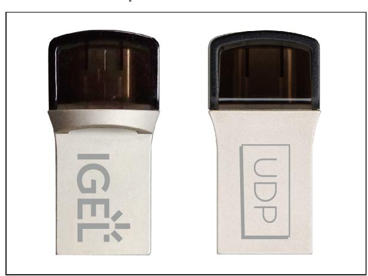

## Requirements for the Endpoint

See Devices Supported by IGEL OS 12 (see page 5) and Devices Supported by IGEL OS 11 (see page 31)

## System

| Operating system | IGEL OS 12 or IGEL OS 11                             |
|------------------|------------------------------------------------------|
| Management       | Universal Management Suite (UMS)                     |
| Memory           | 32 GB (physical capacity; data storing not possible) |

## Interface

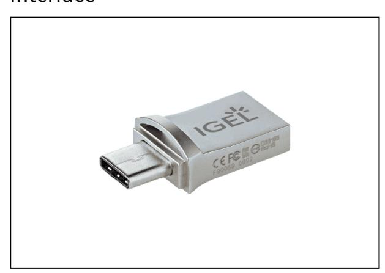

- USB Type-C
- USB 3.0 Gen 1 Type-A (backward compatible with USB 2.0)

Hardware 51 / 90


## Dimensions and Weight

| Device (DxWxH), vertical      | 8.6 x 14.3 x 28.6 mm |
|-------------------------------|----------------------|
| Device weight                 | 3 g                  |
| Packaging (DxWxH), horizontal | 50 x 75 x 15 mm      |

## **Operating Conditions**

| Operating temperature | 0 °C – 70 °C, 32 °F – 158 °F |
|-----------------------|------------------------------|
| Operating humidity    | 0 % – 95 %                   |

Hardware 52 / 90


## **Regulatory Compliance Information**

## **FCC Compliance Statement**

This equipment has been tested and found to comply with the limits for a Class B digital device, pursuant to Part 15 of the FCC rules. These limits are designed to provide reasonable protection against harmful interference in a residential installation. This equipment generates, uses and can radiate radio frequency energy and if not installed and used in accordance with the instructions, may cause harmful interference to radio communications. However, there is no guarantee that interference will not occur in a particular installation. If this equipment does cause harmful interference to radio or television reception, which can be determined by turning the equipment off and on, the user is encouraged to try to correct the interference by one or more of the following measures:

- Reorient or relocate the receiving antenna.
- Increase the separation between the equipment and receiver.
- Connect the equipment into an outlet on a circuit different from that to which the receiver is connected.
- Consult the dealer or an experienced radio/TV technician for help.

Shielded interface cables must be used in order to comply with emission limits.

Changes or modifications not expressly approved by the party responsible for compliance could void the user's authority to operate the equipment.

#### **WEEE Note**

In accordance with EU directive 2012/19/EU on Waste Electrical and Electronic Equipment (WEEE), customers and manufacturers are responsible for returning and recycling their old equipment and batteries. IGEL now offers a convenient free Collection Service. The Customer is obliged to delete personal and business data on the devices before using this Collection Service.

To request a collection of the old IGEL units, fill out the RMA form on https://support.igel.com/csm. An IGEL service employee will contact you then to arrange a collection date.

IGEL WEEE number: DE 79295479

Hardware 53/90


## **Hardware How-Tos**

- Attaching Thin Client to Monitor (VESA Mount) (see page 55)
- Attaching Rubber Feet to UD Housing (see page 56)
- COM Port Power Supply on M350C and H860C Devices (see page 58)
- UD3 Model M350C: Multistream Transport (see page 60)
- UD7 Model H860C: Multistream Transport (MST) / Monitor Daisy Chaining (see page 66)
- VESA Mount for M250C, M350C, and H860C (see page 71)

Hardware 54 / 90


Attaching Thin Client to Monitor (VESA Mount)

Hardware 55 / 90


## Attaching Rubber Feet to UD Housing


The following instructions are valid for UD2, UD3, UD5/6, and UD7. The schematic illustrations are provided for the previous IGEL design ID (based on the UD3) and for the newest IGEL design ID (based on the UD2). The relevant properties, e.g. the relative positions of the power button, are the same for all housings.

You can use IGEL UD2, UD3, UD5/6, and UD7 devices in a horizontal position. For this purpose, you must attach rubber feet to the housing.


For safe operation, use only the rubber feet provided by IGEL Technology GmbH.

The following description shows you how to mount the rubber feet on the device's housing.

1. Tilt the housing to the left so that the power button is on the left-hand side.

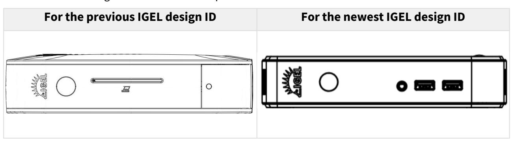

- 2. Remove the rubber feet from their protective foil.
- 3. Stick the feet on the bottom part of the housing near the border of the ventilation slots area.

Hardware 56/90


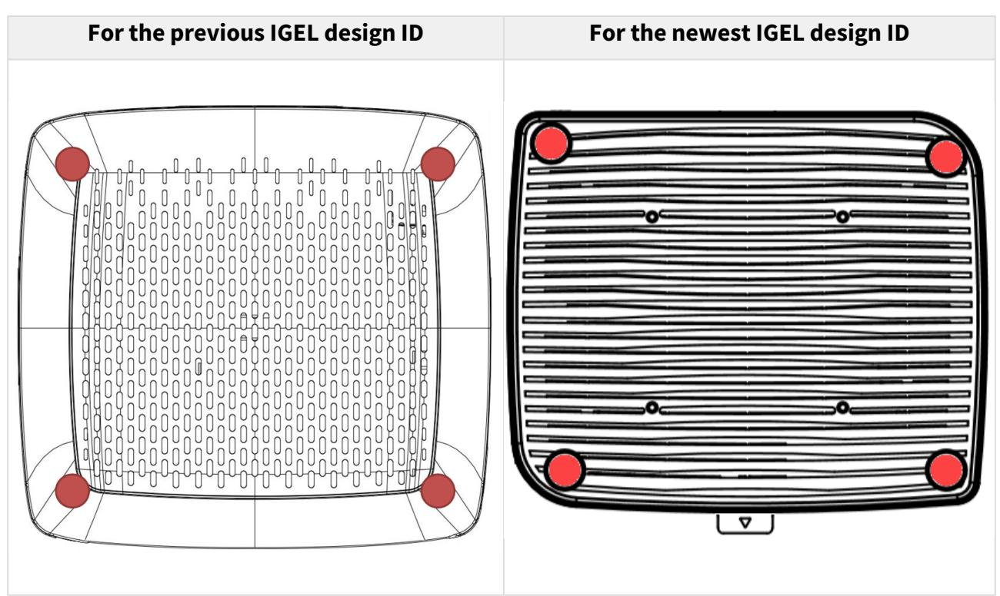

4. Put the housing on its feet as shown below.

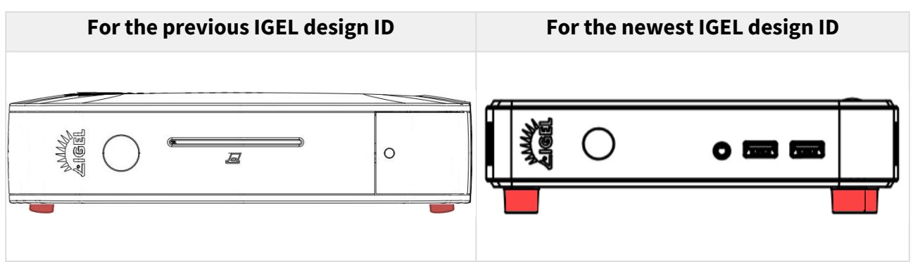

Make sure that the upper ventilation slots are not covered!

Hardware 57 / 90


## COM Port Power Supply on M350C and H860C Devices

If you connect devices to your UD3 model M350C or UD7 model H860C that require a serial (COM) port and a power supply of 5 V, you can activate the corresponding option in BIOS to spare the usage of an additional power supply unit.

To enable the 5 V power supply option for the COM port, proceed as follows:

- 1. Turn on or restart the IGEL device.
- 2. During boot, hold the [DEL] key until you see the **Front Page** menu.

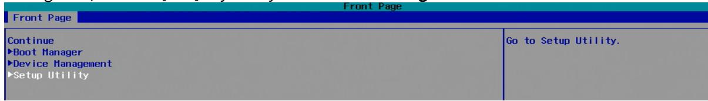

- 3. Using the arrow keys, navigate to the option **Setup Utility** and press [ENTER]. The **InsydeH20 Setup Utility** opens.
- 4. Using the arrow keys, move to the tab **Power**. You will find **COM Port Power Supply** set to **<Disabled>**.

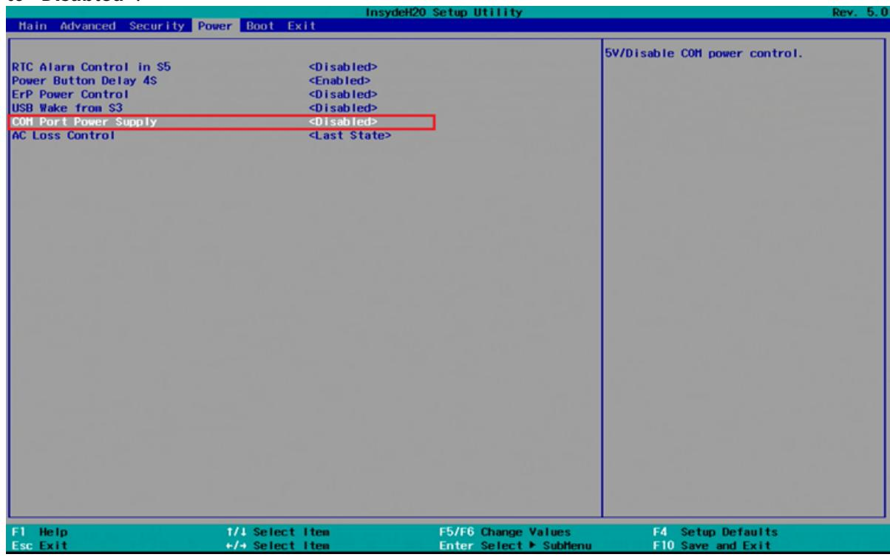

Hardware 58 / 90


5. Change **COM Port Power Supply** to **<5V>** and press [ENTER].

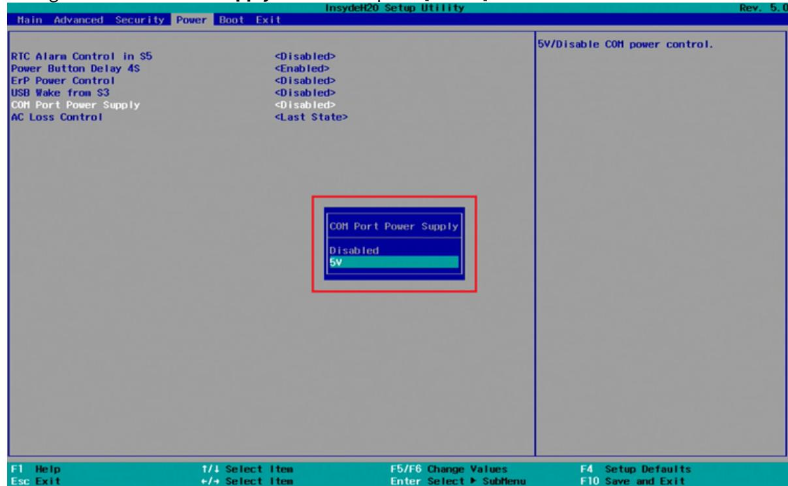

6. Press [F10] to save the changes and exit.


Hardware 59 / 90


## UD3 Model M350C: Multistream Transport

This how-to explains how to configure multistream transport (MST) on an M350C device.

## **Prerequisites**

- IGEL UD3 model M350C
- IGEL OS 11.03.100 and higher
- DisplayPort multistream transport hub (DP MST hub) with 2x DisplayPort 1.2.
- For the testing, LINDY 2 Port DP Expander Splitter / MST Hub<sup>10</sup> was used.
- Max. Supported Resolution when Using a DP MST Hub
  The max. total resolution of the monitors connected via a DP MST hub cannot exceed 4K, see Graphics on IGEL Devices (see page 86).

Thus, the max. supported resolution on an M350C device is:

- max. 1x 4K on the first DP port and
- max. 4K divided between the monitors connected to the second DP port of the M350C device via the DP MST hub

## **Connecting Monitors**

This is how you can connect three monitors to your M350C device - one monitor to the first DP port on the device and the other two monitors with a DP MST hub to the device's second DP port:

1. Connect one monitor to the first DP port on your device.

Hardware 60/90

\_

<sup>10.</sup> https://www.lindy-international.com/DisplayPort-1-2a-Splitter-2-Port.htm?websale8=ld0101.ld020102&pi=38402&ci=20


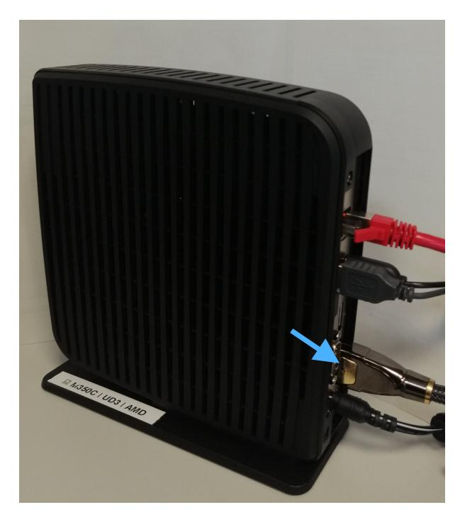

2. Connect the other two monitors to the  ${\bf Out~1}$  and  ${\bf Out~2}$  outputs on the DP MST hub.

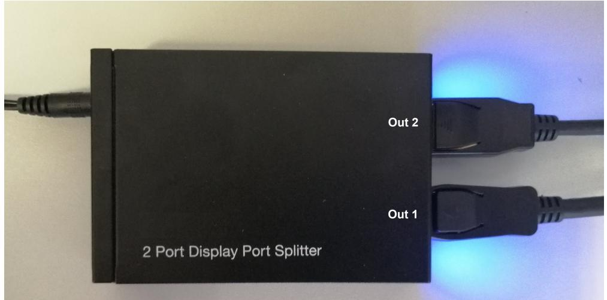

3. Connect the DP MST hub to the other DP port on the device.

Hardware 61/90


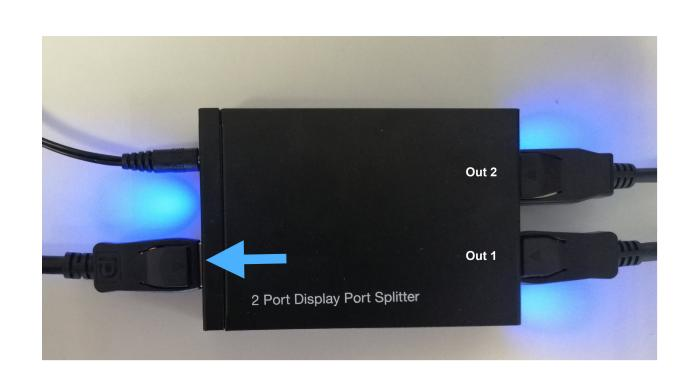

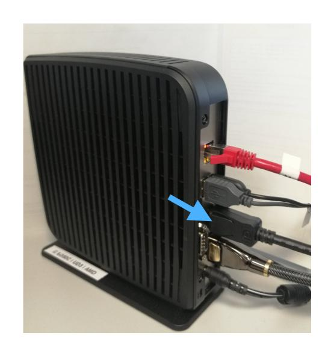

- 1 It is irrelevant which DP port on your M350C device will be chosen for the connection of the DP MST hub.
- If hotplug was not successful, disconnect the DP MST hub from the device and connect it again.

Now it is necessary to configure the connected monitors. You have two options:

- Automatic screen configuration. In this case, the firmware recognizes and applies the screens automatically by default. See also IGEL OS > IGEL OS Articles > Desktop and Display > Multimonitor > Automatic Configuration
- Manual screen configuration. If the automatic configuration does not suit your needs, you can also configure screens manually. See also IGEL OS > IGEL OS Articles > Desktop and Display > Multimonitor > Manual Configuration
- 1 It is strongly recommended to use the automatic screen configuration.

## **Automatic Configuration**

- 1. In IGEL Setup, go to **User Interface > Display**.
- 2. Under Number of screens, select 3.
- 1 If **Number of screens** is set to "1", the same content will be displayed on all three monitors.
  - 3. Choose the screen under **Selected screen** or by clicking it with a mouse.
  - 4. Adjust the **Screen resolution** as required for each screen.
- **6** Screen resolution has to be set manually: **Autodetect** does not function with more than 2 monitors.

Hardware 62 / 90


- 5. Under Advanced..., enable Detetect refresh rate automatically for each screen.
- 6. For each screen, select **Card 1** under **Graphic card**.
- 7. For each screen, select **Automatic** under **Monitor**.

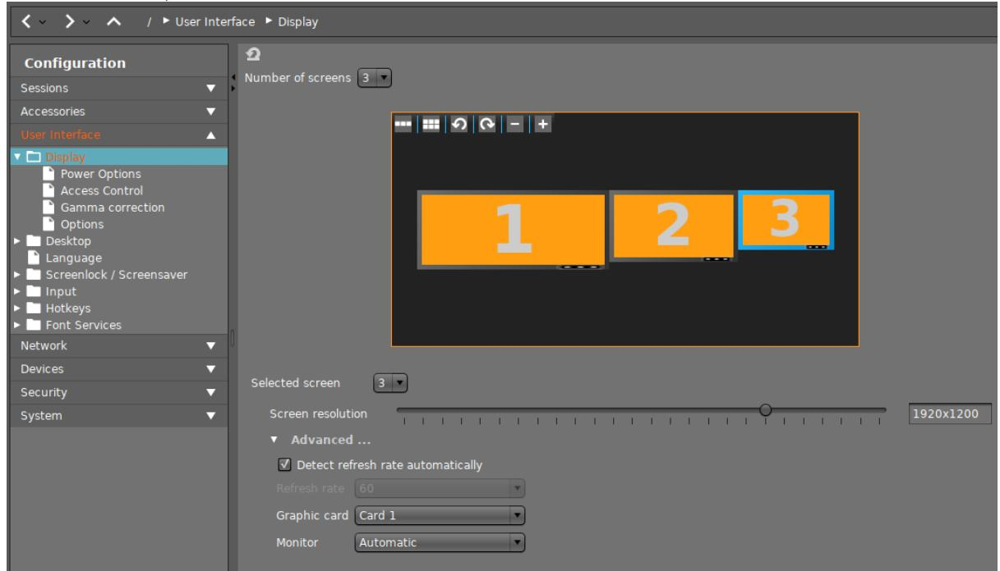

8. Click **Apply** or **OK** to save the settings.

8

After the screen configuration process has been completed, do not unplug your monitors, DP MST hub or its power supply cable. After the hotplug, the proper functioning is not guaranteed. To restore the functionality in this case, repeat the steps for the automatic screen configuration.

## **Manual Configuration**

- 1. In IGEL Setup, go to **User Interface > Display**.
- 2. Under Number of screens, select 3.
- if **Number of screens** is set to "1", the same content will be displayed on all three monitors.
  - 3. Choose the screen under **Selected screen** or by clicking it with a mouse.
  - 4. Adjust the **Screen resolution** as required for each screen.
- 3 Screen resolution has to be set manually: **Autodetect** does not function with more than 2 monitors.
  - 5. Under **Advanced...**, you can disable **Detect refresh rate automatically** and specify the desired **Refresh rate** for each screen.
  - 6. For each screen, select Card 1 under Graphic card.
  - 7. Under **Monitor**, select:

Hardware 63/90


• For monitor 1 (connected without the DP MST hub):

• **DisplayPort** if you have connected the monitor to the DP port 1 (**D1**; nearest to the power jack); see the picture below:

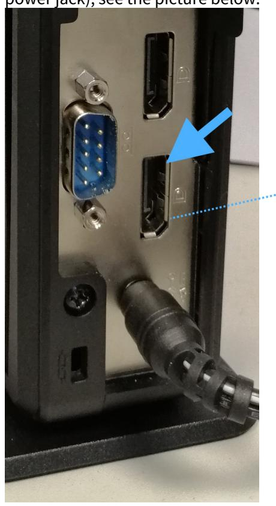

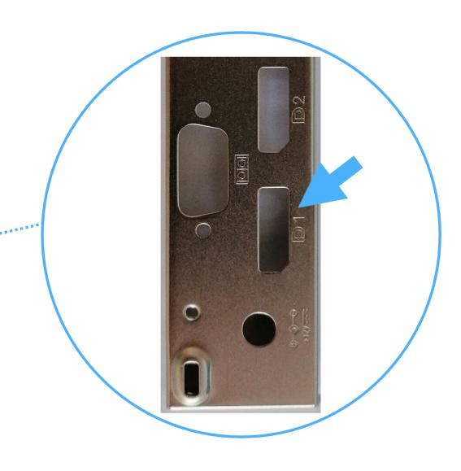

or

• **DisplayPort (II)** if you have connected the monitor to the DP port 2 (**D2**; farthest from the power jack); see the picture below:

Hardware 64 / 90


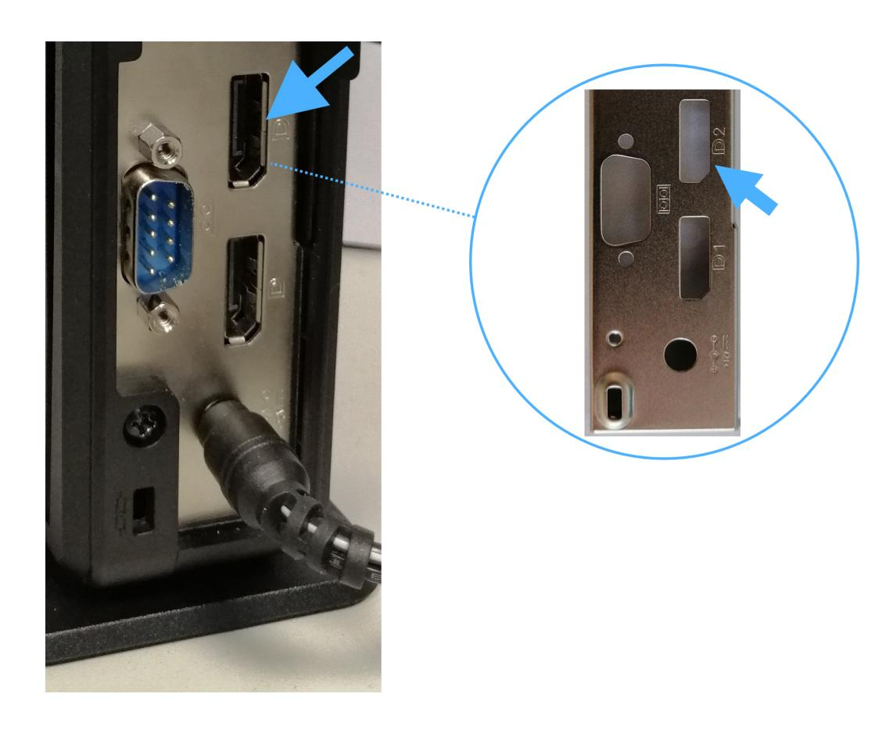

- For monitor 2 (connected with the DP MST hub, DP Out 1): **DisplayPort (IV)**.
- For monitor 3 (connected with the DP MST hub, DP Out 2): **DisplayPort (V)**.
- 8. Click **Apply** or **OK** to save the settings.
- After the screen configuration process has been completed, do not unplug the DP MST hub, its power supply cable or the both monitors connected to the hub. After the hotplug, the actual order of DP ports does not correspond anymore to the order defined in the IGEL Setup. To restore the functionality and clean up the screen configuration in this case, select **Automatic** for each monitor under IGEL Setup > **User Interface > Display > Monitor** and save the settings. After that, you can configure the screens manually again.

Hardware 65 / 90


# UD7 Model H860C: Multistream Transport (MST) / Monitor Daisy Chaining

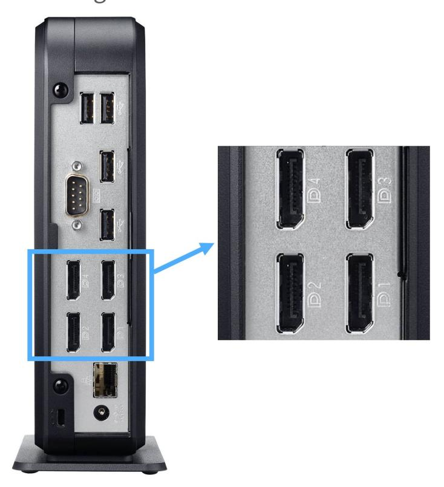

### **Prerequisites**

- IGEL UD7 model H860C
- IGEL OS 11.05.100 and higher
- Up to max. 4 monitors


#### Maximum Supported Resolution

- The max. total resolution of the monitors connected to the H860C device is 4x 4K @60 Hz.
- The max. total resolution of the monitors in the daisy chain cannot exceed 4K, i.e. max. 4K is divided between all monitors in the daisy chain, incl. the initial monitor connected to the H860C device.

Hardware 66 / 90


### USB Type-C Alternate Mode

- If a monitor is connected to the USB-C port (no matter directly or via a USB-to-DisplayPort adapter), DP 4 (**D4**) is disabled.
- After unplugging the monitor from the USB-C port, a monitor connected to DP 4 (**D4**) has to be replugged for the display to be detected again.

## **Connecting Monitors**

To create a configuration with two monitors connected to DP 1 and DP 2 and two daisy-chained monitors connected via DP 3:

- 1. Connect the first monitor to DP 1 (**D1**).
- 2. Connect the second monitor to DP 2 (**D2**).
- 3. Connect the third monitor to DP 3 (D3).
- 4. Connect the fourth monitor to the monitor connected via DP 3.

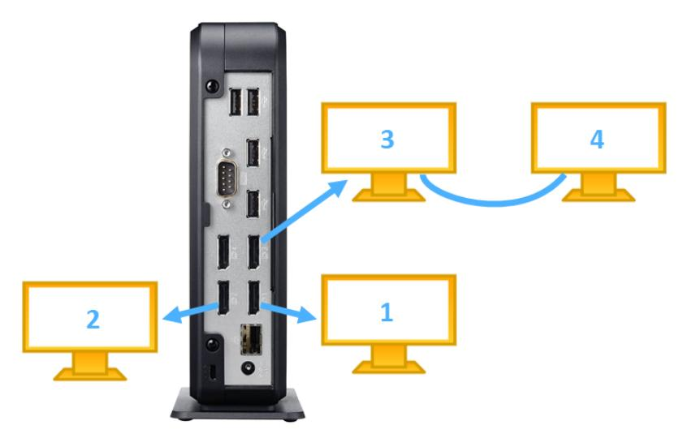


All monitors in the daisy chain **except for the last monitor** must have DP mode enabled. You can usually enable the DP mode in the on-screen display (OSD) menu of your monitor.

Now it is necessary to configure the connected monitors. You have two options:

- Automatic screen configuration. In this case, the firmware recognizes and applies the screens automatically by default. See also Automatic Configuration<sup>11</sup>.
- Manual screen configuration. If the automatic configuration does not suit your needs, you can also configure screens manually. See also Manual Configuration<sup>12</sup>.

Hardware 67/90

<sup>11.</sup> https://kb.igel.com/en/igel-os/11.10.270/automatic-configuration

<sup>12.</sup> https://kb.igel.com/en/igel-os/11.10.270/manual-configuration


It is strongly recommended to use the automatic screen configuration.

## **Automatic Configuration**

- 1. In IGEL Setup, go to User Interface > Display.
- 2. Under Number of screens, select "4".
- if Number of screens is set to "1", the same content will be displayed on all four monitors.
  - 3. Choose the screen under **Selected screen** or click the corresponding screen symbol.
  - 4. Adjust the **Screen resolution** as required for each screen.
- Screen resolution has to be set manually: Autodetect does not function with more than 2 monitors.
  - 5. Under Advanced..., enable Detetect refresh rate automatically for each screen.
  - 6. For each screen, select **Card 1** under **Graphic card**.
  - 7. For each screen, select **Automatic** under **Monitor**.
  - 8. Click **Apply** or **OK** to save the settings.

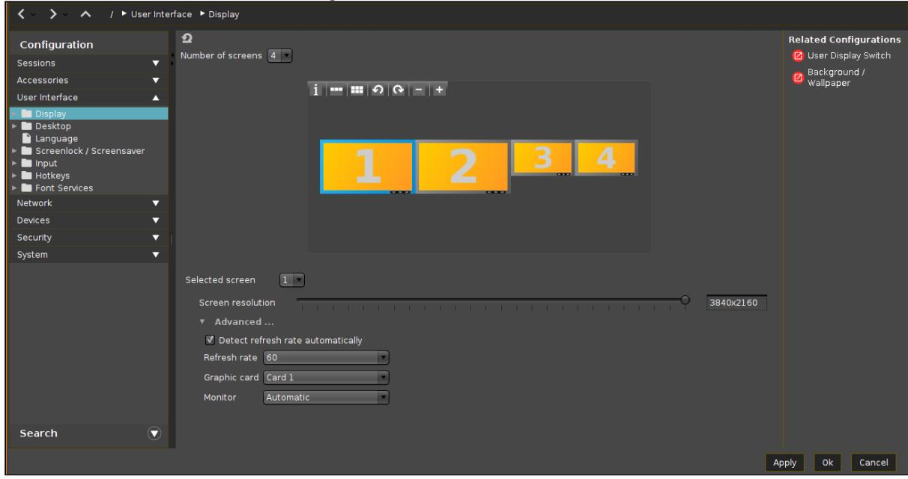


After the screen configuration process has been completed, do not unplug your monitors. After a hotplug, proper functioning is not guaranteed. To restore the functionality in this case, repeat the steps for automatic configuration.

Hardware 68/90


## **Manual Configuration**

- 1. In IGEL Setup, go to **User Interface > Display**.
- 2. Under Number of screens, select "4".
- 1 If **Number of screens** is set to "1", the same content will be displayed on all four monitors.
  - 3. Choose the screen under **Selected screen** or click the correspondent screen symbol.
  - 4. Adjust the **Screen resolution** as required for each screen.
- 3 Screen resolution has to be set manually: **Autodetect** does not function with more than 2 monitors.
  - 5. Under **Advanced...**, you can disable **Detect refresh rate automatically** and specify the desired **Refresh rate** for each screen.
  - 6. For each screen, select **Card 1** under **Graphic card**.
  - 7. Under **Monitor**, select:
    - For monitor 1 (connected to **D1**): **DisplayPort**
    - For monitor 2 (connected to **D2**): **DisplayPort (II)**
    - For monitor 3 (connected to D3): DisplayPort (V)
    - For monitor 4 (connected to monitor 3): DisplayPort (VI)

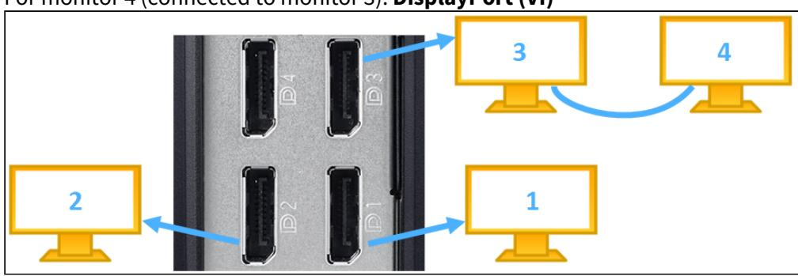

## 1 DP Number to Be Used for the "Monitor" Setting

- For monitors that are NOT included in the daisy chain: The DP number must be the same as on the device.
- For the first monitor in the daisy chain, the DP numbering always starts with "5", i.e. **DisplayPort (V)**. For the further monitors in the daisy chain, the DP numbering continues with "6" and so on (max. up to "8", i.e. **DisplayPort (VIII)**).
- 8. Click **Apply** or **OK** to save the settings.

Hardware 69/90


This image shows a red circle with a bold white 'X' in the center, commonly used as a symbol for 'error', 'close', or 'incorrect'. There is no text content present in the image.

After the screen configuration process has been completed, do not unplug the monitors or their power supply cables. After the hotplug, the actual order of DP ports does not correspond anymore to the order defined in the IGEL Setup. To restore the functionality and clean up the screen configuration in this case, select **Automatic** for each monitor under IGEL Setup > **User Interface > Display > Monitor** and save the settings. After that, you can configure the screens manually again.

Hardware 70 / 90


## VESA Mount for M250C, M350C, and H860C

These instructions apply to UD2 model M250C, UD3 model M350C, and UD7 model H860C.

With the IGEL VESA mount, you can mount the thin client on the back of your monitor to free up space on your desk. IGEL VESA mount fits to all flat-panel monitors, complying with the VESA75 or VESA100 standard.


Do not use the IGEL VESA for mounting a thin client horizontally, e.g. at the underside of a desk! This would lead to overheating due to insufficient ventilation.

### Components

The IGEL VESA mount consists of:

- two metal plates
- 4 x M3XL8 screws and 4 x gaskets for the thin client plate
- 4 x M4XL8 screws for the monitor plate

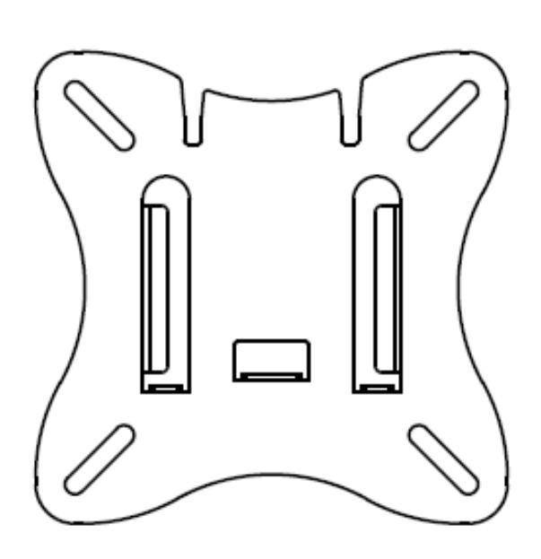


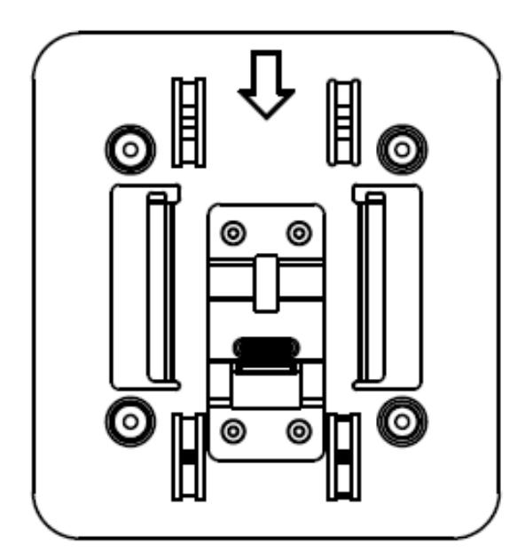

Thin Client Plate


On delivery, the two plates are placed together. To separate them, push the monitor plate with a light raising movement in the direction of the arrow.

## Mounting the Monitor Plate

→ Attach the VESA mount monitor plate with the screws to the back of your monitor, noting the correct alignment.

Hardware 71/90


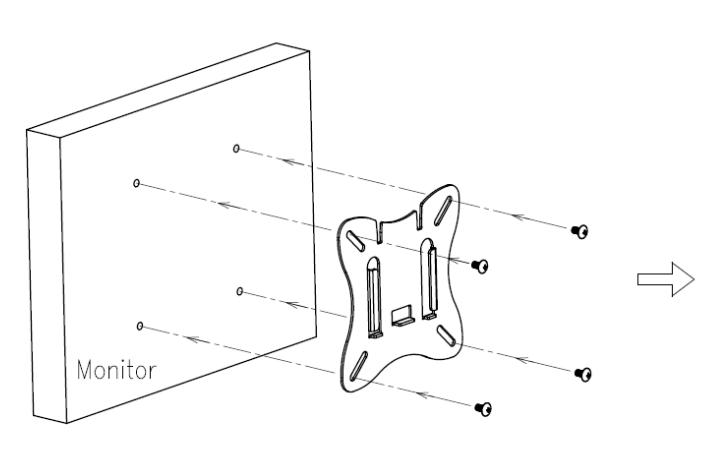

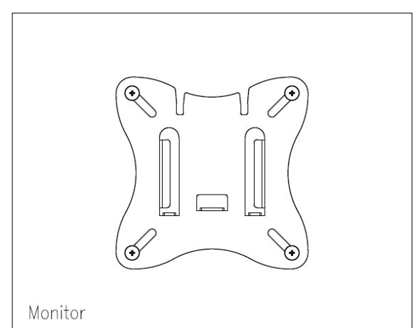

## Mounting the Thin Client Plate

→ At the back side of the thin client plate, place the gaskets as shown on the picture:

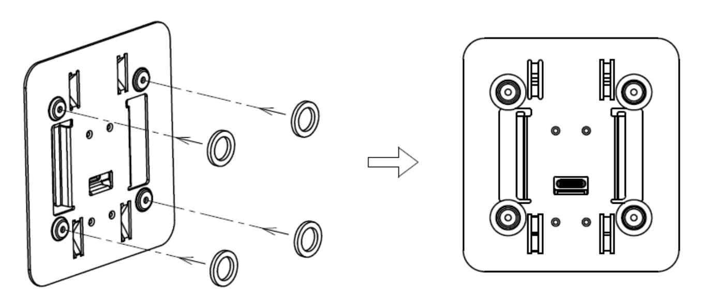

 $\,\rightarrow\,$  Insert the enclosed screws through the designated holes.


Use only the original screws. If you use longer screws, components in the housing can be damaged. If you use shorter screws, the VESA mount will not be fixed properly on the thin client.

Hardware 72 / 90


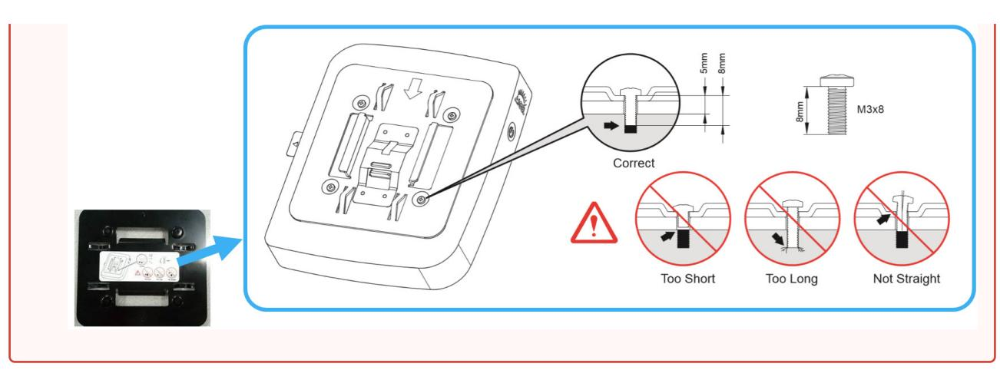

 $\,\rightarrow\,$  Screw them into the screw threads in the plastic wall of the thin client.


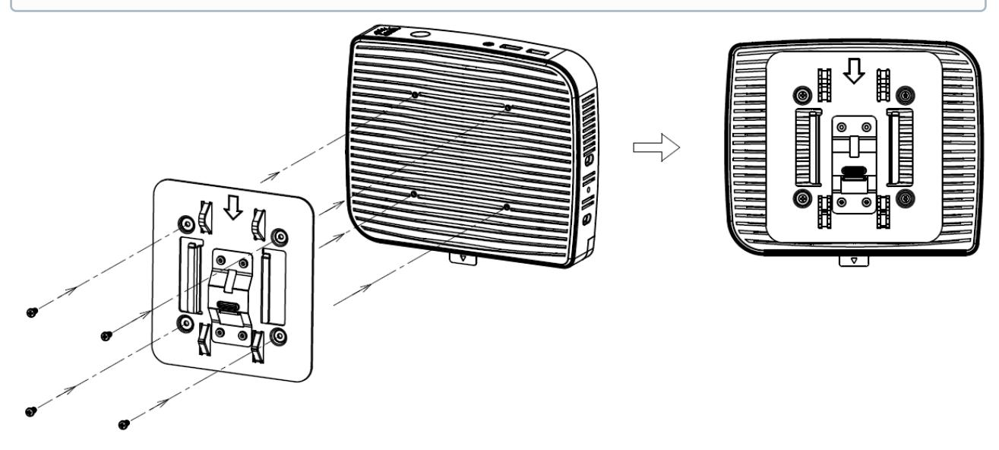

## Pushing the Plates Together

- → Plug in all cables before mounting the thin client to the monitor.
- → Turn the thin client around so that the power button is facing upwards.

Hardware 73 / 90


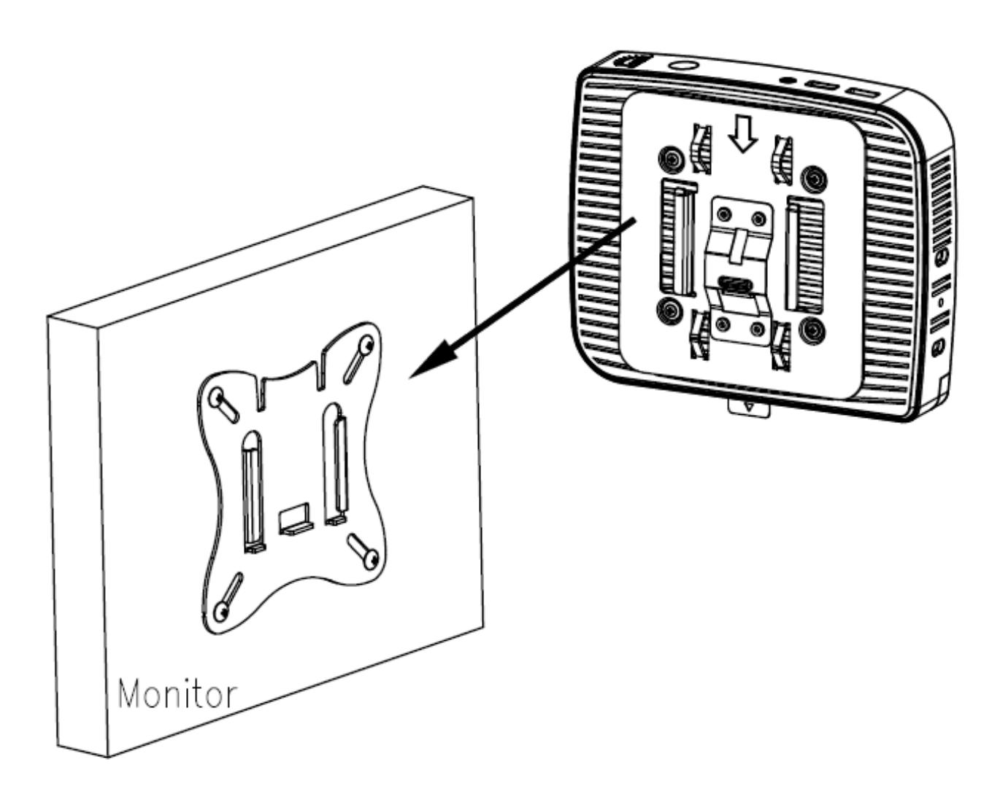

 $\rightarrow$  Slide the plate with the thin client from top to bottom in the guide slots of the monitor plate.

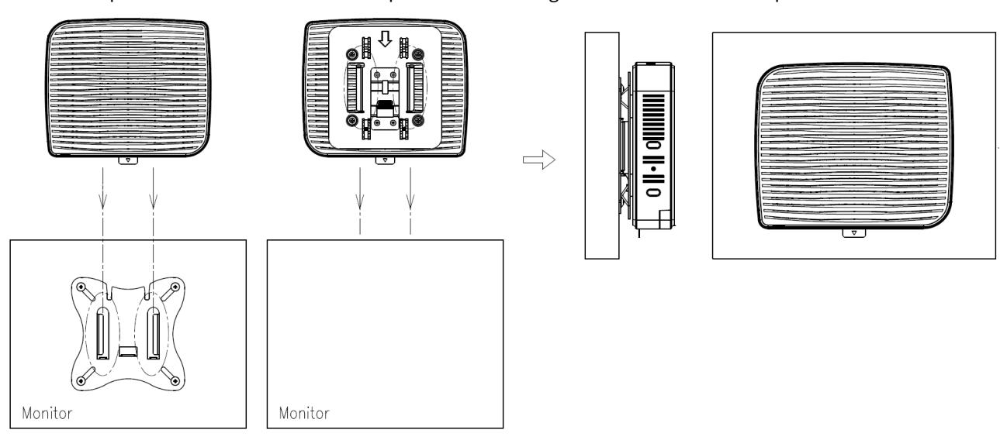

Hardware 74 / 90


To take the thin client off again, push it up gently. Be careful that you do not press the client against the monitor, otherwise the plates will not detach.

Hardware 75 / 90


## **Hardware FAQs**

- Finding Out the IGEL Device Model (see page 77)
- Breakdown of IGEL Devices' Serial Number (see page 81)
- How Can I Update the BIOS Version? (see page 83)
- Defining MIME Types on Microsoft IIS to Distribute IGEL Firmware Updates (see page 84)
- Dual-Monitor Session for XenDesktop 7 (see page 85)
- Graphics on IGEL Devices (see page 86)

Hardware 76 / 90


## Finding Out the IGEL Device Model

This is how you can find out the model of your IGEL UD device.

## Option 1: On the Physical Device

→ Pull out the black label holder located at the rear of the device. The device model is specified under "Model Name".

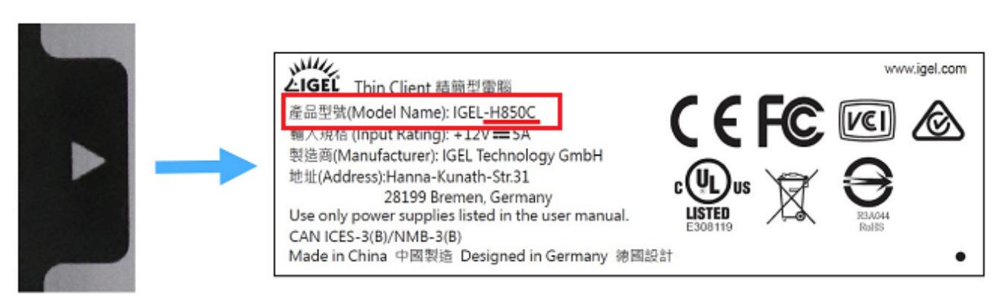

## Option 2: Locally in IGEL OS

1. Open the **About** window, accessible via the i-icon in the IGEL menu or in the IGEL OS > IGEL OS Reference Manual > The IGEL OS Desktop > Application Launcher

Hardware 77 / 90


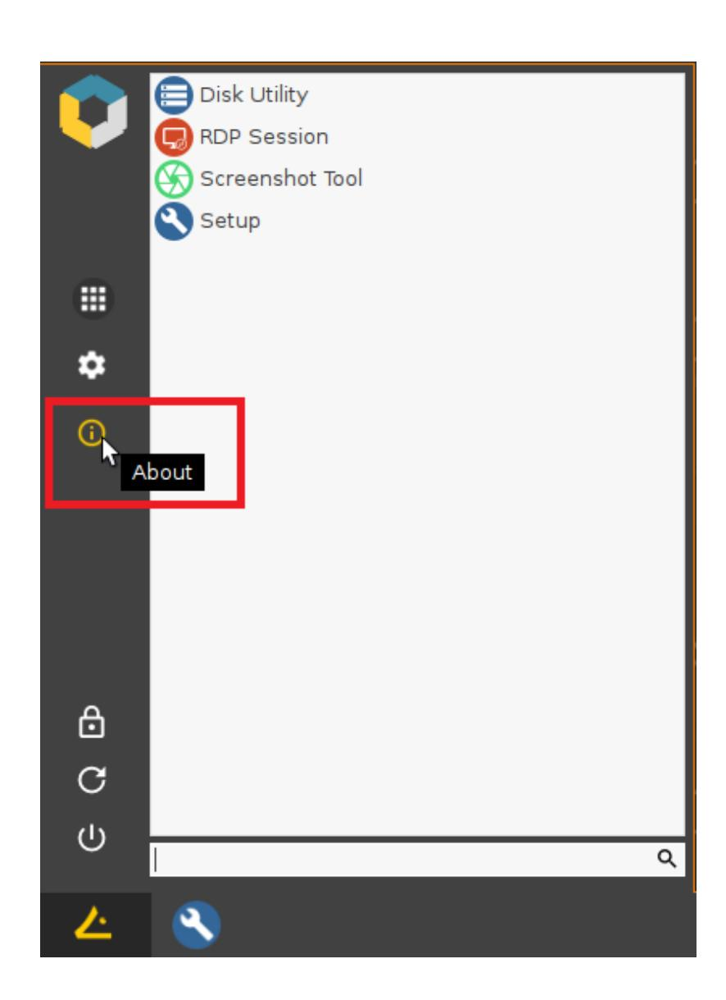

2. Scroll to the section **Hardware > Device Type**.

Hardware 78 / 90


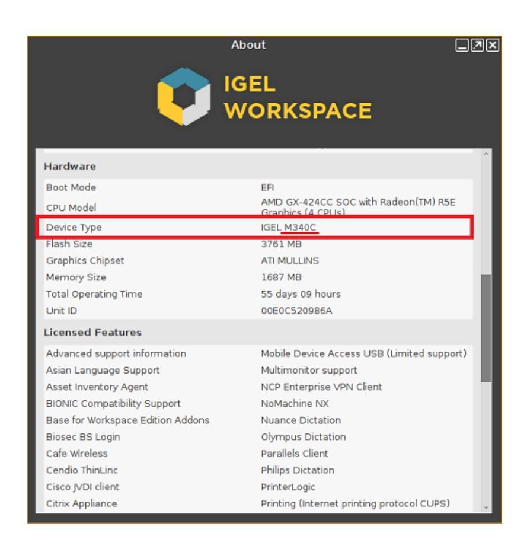

## Option 3: Via the IGEL UMS

1. In the UMS Console, go to **Devices** and select the required device.

2. Under **Advanced System Information**, find the **Device Type** row.

Hardware 79/90


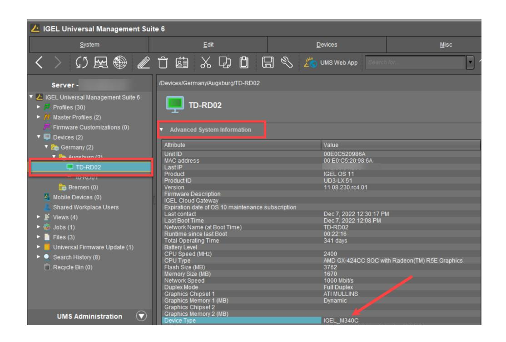

Hardware 80/90


### Breakdown of IGEL Devices' Serial Number

This overview of the serial number scheme is applicable to the new IGEL UD generation of devices: UD2  $M250C^{13}$ , UD3  $M350C^{14}$ , and UD7  $H860C^{15}$ .

#### Serial Number Breakdown

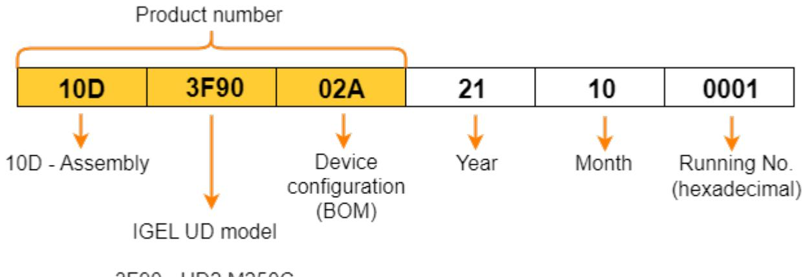

3F90 - UD2 M250C 3G10 - UD3 M350C 3G50 - UD7 H860C

## How Can I Find Out the Serial Number of My IGEL Device?

You can find the serial number of your IGEL device

• on the device label located at the rear of the device:

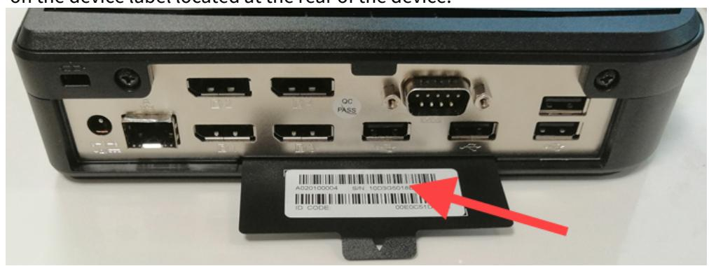

Hardware 81/90

<sup>13.</sup> https://kb.igel.com/knowledge-base-archive/current/

<sup>14.</sup> https://kb.igel.com/knowledge-base-archive/current/

<sup>15.</sup> https://kb.igel.com/knowledge-base-archive/current/


• in the UMS Console: Go to **Devices**, select the required device, and expand **Advanced System Information**. At the bottom, you will see **Device Serial Number** field:

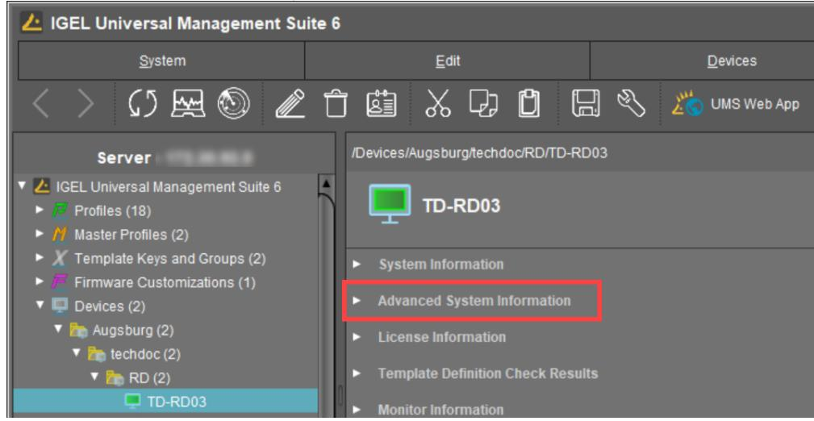

• in the BIOS in the **System Information** window: Press the [Del] key repeatedly during the reboot to access the BIOS, select **SCU** / **Setup Utility**, and press [F9].

```
System Information

Hanufacturer Name : IGEL Technology GmbH

Product Name : H860C

Serial Number : 10D3G5016B20450BA5
```

via the local terminal with the command cat /sys/devices/virtual/dmi/id/ product\_serial

```
Local Terminal

login as "user" or "root": root
root@TD-RD03:~# cat /sys/devices/virtual/dmi/id/product_serial
```

Hardware 82 / 90


## How Can I Update the BIOS Version?

## Question

How can I update the BIOS version on my IGEL device?

#### Answer

If you do not have the required BIOS version and need to update your BIOS, please contact IGEL Support: https://support.igel.com<sup>16</sup>. The IGEL support team will provide you with all necessary information.

16. https://support.igel.com/

Hardware 83 / 90


## Defining MIME Types on Microsoft IIS to Distribute IGEL Firmware **Updates**

## Symptom

You are using Microsoft Internet Information Services IIS to provide firmware updates via HTTP for your IGEL devices (Windows or Linux based). When starting an update process, you receive an error message such as "File not available "or" File is not an archive ", and the update process terminates unsuccessfully.

#### **Problem**

IIS does not offer files with unknown MIME types for the download and blocks the request coming from the device.

#### Solution

Make sure all files provided in the firmware update are added to the list of MIME types in IIS. Proceed as described in this Microsoft support document<sup>17</sup>.

Add a new MIME type for files of extension (wildcard) '\*' with a type of 'application/octet-stream'. This will provide a default MIME type for all files that have not already had one and bypass the blocking.


For security reasons, Microsoft does not recommend setting a wildcard that enables IIS to send out any kind of files. You may add every single file extension of your firmware update files to the list of MIME types instead.

Hardware 84/90

---

<sup>17.</sup> http://technet.microsoft.com/en-us/library/cc725608%28v=ws.10%29.aspx


## Dual-Monitor Session for XenDesktop 7

## **Symptom**

XenDesktop 7 Windows desktop system or Windows server system only shows up on one display although you are using a dual-monitor setup.

### **Problem**

By default, the StoreFront server is configured to start the VDI on one display only. This is by design but you should be able to maximize to both monitors after the session has started.

#### Solution

You need to edit the file web.config in the "StoreWeb" directory on your StoreFront server.

The default directory is:

INSTALLDIR\inetpub\wwwroot\citrix\Storeweb\

→ Set showDesktopViewer=false

After saving, your published desktop should expand over both screens.

Hardware 85 / 90


## **Graphics on IGEL Devices**

This document provides an overview of the graphics-related characteristics of IGEL devices.

|                                       | UD2                                                                                      | UD3                                                                                                             | UD7                                                                                                                          |
|---------------------------------------|------------------------------------------------------------------------------------------|-----------------------------------------------------------------------------------------------------------------|------------------------------------------------------------------------------------------------------------------------------|
|                                       | M250C18                                                                                  | M350C19                                                                                                         | H860C20                                                                                                                      |
| Chipset                               | Intel HD Graphics                                                                        | AMD Radeon™ Vega 3 Graphics                                                                                     | AMD Radeon™ Vega 8 Graphics                                                                                                  |
| Video RAM                             | Dynamic shared memory<br>64 MB / 128 MB / 256 MB / 512 MB<br>BIOS default option: 256 MB | Dynamic shared memory<br>256 MB / 512 MB / 1024 MB / 2048 MB / "auto"<br>BIOS default option: "auto" (= 512 MB) | Dynamic shared memory<br>1024 MB / 2048 MB / 4096 MB<br>BIOS default option: 2048 MB                                         |
| Additional graphics card              | -                                                                                        | -                                                                                                               | -                                                                                                                            |
| Ports                                 | 2x DisplayPort 1.1a                                                                      | 2x DisplayPort 1.2                                                                                              | 4x DisplayPort 1.2<br>1x DP 1.4 via USB 3.2 Gen 2 Type-C™<br>(Note: DP 4 is disabled when Type-C™ is connected to a monitor) |
| Max. supported resolutions (standard) | 2560 x 1600 @60 Hz (dual view)                                                           | 2x 4K @60 Hz                                                                                                    | 4x 4K @60 Hz incl. audio support<br>(DP 1 – DP 4)                                                                            |

Hardware 86 / 90

<sup>18.</sup> https://kb.igel.com/knowledge-base-archive/current/

<sup>19.</sup> https://kb.igel.com/knowledge-base-archive/current/

<sup>20.</sup> https://kb.igel.com/knowledge-base-archive/current/


|                                                                           | UD2                                                   | UD3                                                                                                                                                      | UD7                                                                                                 |
|---------------------------------------------------------------------------|-------------------------------------------------------|----------------------------------------------------------------------------------------------------------------------------------------------------------|-----------------------------------------------------------------------------------------------------|
| Max. supported resolutions<br>(incl. hardware-accelerated video decoding) | 2x WUXGA (1920 x 1200)<br>or<br>1x WQHD (2560 x 1440) | 2x 4K<br>(Note: In case of the configured Multistream Transport (MST), the total resolution of the monitors connected via a DP MST hub cannot exceed 4K) | 4x 4K<br>(Note: For optimal 4K video decoding, you can set the VRAM in BIOS to 4 GB; default: 2 GB) |
| Supported video compression standard                                      | H.264<br>H.265 (HEVC)                                 | H.264<br>H.265 (HEVC)                                                                                                                                    | H.264<br>H.265 (HEVC)                                                                               |
| Multistream support (daisy chain)                                         | -                                                     | optional with a DP MST hub<br>(for up to 3 monitors operated at the same time)                                                                           |                                                                                                     |
| Type of DisplayPort-to-DVI adapter                                        | active                                                | (see page 87)*                                                                                                                                           | (see page 87)**                                                                                     |

- ✅

#### 🖸 Tip

For UD3 devices M350C, IGEL recommends the following adapters:

- for connecting a monitor that requires a DVI port:
  - Mini DisplayPort to 2 Port DVI-D MST Hub from LINDY<sup>21</sup> in combination with the DisplayPort to Mini DisplayPort Adapter from LINDY<sup>22</sup>
  - DisplayPort to HDMI Active Adapter from Plugable<sup>23</sup> (requires an additional HDMI-to-DVI adapter cable)
- for configuring multistream transport (MST):
  - DisplayPort 1.2a Splitter 2 Port from LINDY<sup>24</sup>

At lower resolutions (up to 1920 x 1200 @60 Hz), a passive DisplayPort-to-DVI adapter can also be used.

87 / 90 Hardware

\*\*

<sup>21.</sup> https://www.lindy-international.com/Mini-DisplayPort-to-2-Port-DVI-D-MST-Hub.htm? websale8=ld0101.ld020102&pi=41731&ci=20

<sup>22.</sup> https://www.lindy-international.com/Mini-DP-to-DP-Adapter.htm?websale8=ld0101.ld020102&pi=41089&ci=80

<sup>23.</sup> https://plugable.com/products/dp-hdmi/

<sup>24.</sup> https://www.lindy-international.com/DisplayPort-1-2a-Splitter-2-Port.htm?websale8=ld0101.ld020102&pi=38402&ci=20


#### **☑** Tip

For UD7 devices H860C, IGEL recommends the following adapters:

- for connecting a monitor that requires a DVI port:
  - Mini DisplayPort to 2 Port DVI-D MST Hub from LINDY<sup>25</sup> in combination with the DisplayPort to Mini DisplayPort Adapter from LINDY<sup>26</sup>
  - DisplayPort to HDMI Active Adapter from Plugable<sup>27</sup> (requires an additional HDMI-to-DVI adapter cable)

At lower resolutions (up to 1920 x 1200 @60 Hz), a passive DisplayPort-to-DVI adapter can also be used.

For graphics-related characteristics of legacy IGEL devices, see Graphics on Legacy IGEL Devices<sup>28</sup>.

Hardware 88 / 90

<sup>25.</sup> https://www.lindy-international.com/Mini-DisplayPort-to-2-Port-DVI-D-MST-Hub.htm? websale8=ld0101.ld020102&pi=41731&ci=20

<sup>26.</sup> https://www.lindy-international.com/Mini-DP-to-DP-Adapter.htm?websale8=ld0101.ld020102&pi=41089&ci=80

<sup>27.</sup> https://plugable.com/products/dp-hdmi/

<sup>28.</sup> https://kb.igel.com/knowledge-base-archive/current/


## **Hardware Troubleshooting**

In the below articles you can find solutions to hardware related problems when the devices are used with IGEL.

• Troubleshooting: Headphone Does Not Record through Back of the HP Elite t660 in IGEL OS 12 (see page 90)

Hardware 89 / 90


## Troubleshooting: Headphone Does Not Record through Back of the HP Elite t660 in IGEL OS 12

You are running on IGEL OS 12 and insert the 3.5mm headphone jack on the back of the HP Elite t660 device. The microphone does not record.

#### Problem

The rear connection on the HP Elite t660 is line-out by default. The connection needs to be changed to line-in for recording.

#### Solution

→ To switch the rear side line-out to a line-in, enable the registry parameter **Switch back jack to line-in** under  $system. sound\_driver. snd\_hda\_intel.hp\_t660\_back\_microphone.$ 


You need to reboot the device to activate the setting.

Hardware 90/90