<!-- Source: How to Start with IGEL.pdf -->
<!-- Converted with marker-pdf + Azure OpenAI LLM -->

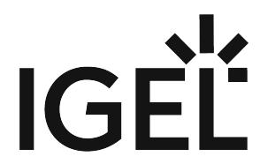

How to Start with IGEL

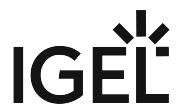

IGEL provides an End User Computing platform that includes IGEL's endpoint operating system, management software for the secure remote administration of your endpoint devices, and cloud services.

How to Start with IGEL 2 / 232


### Introduction

The operating system IGEL OS 12 fully separates the IGEL OS base system and IGEL OS apps. With this modular principle, you can install and update single applications like Citrix, Chromium browser, etc. individually and independently from the IGEL OS base system and have maximum flexibility.

The IGEL platform comprises:

- IGEL Universal Management Suite (UMS) for managing IGEL OS 12 and IGEL OS 11 devices.
- IGEL OS 12
- The IGEL Cloud Services:
  - IGEL Customer Portal (see page 4) which is a doorway to the IGEL Cloud Services listed below. Here, you register your company account to invite other users and assign them specific roles (see page 23), e.g. for opening support cases. In the IGEL Customer Portal, you can also raise and view support requests, make necessary configurations for IGEL Onboarding Service, etc.
  - IGEL App Portal where you can find all applications currently available for IGEL OS 12
  - IGEL App Creator Portal that enables you to create your custom applications for IGEL OS 12
  - IGEL Onboarding Service (see page 58) which allows your users to easily onboard IGEL OS 12 devices using only their corporate e-mail
  - IGEL Insight Service (see page 217) which collects analytical and usage data to improve IGEL products and services and provide a better customer experience
  - IGEL License Portal (see page 168) where you can manage licenses for your IGEL OS devices

In this guide, you will find the first steps with the IGEL platform, IGEL OS 12, and UMS 12. Please read this guide fully, without skipping any steps.


Information about data storage of personal data can be found in the IGEL privacy policy<sup>1</sup>.


### **Further Resources**

For more information on the IGEL platform, check IGEL Academy<sup>2</sup> and IGEL Community<sup>3</sup>. You may also find it useful to check the community docs:

- HOWTO IGEL<sup>4</sup>
- Cheatsheet IGELCommunity<sup>5</sup>.

How to Start with IGEL 3 / 232

<sup>1.</sup> https://www.igel.com/privacy-policy/

<sup>2.</sup> https://learn.igel.com/

<sup>3.</sup> https://videos.igelcommunity.com/

<sup>4.</sup> https://igel-community.github.io/IGEL-Docs-v02/Docs/HOWTO-COSMOS/

<sup>5.</sup> https://igel-community.github.io/IGEL-Docs-v02/Docs/Cheatsheet-IGELCommunity/


# **Using the IGEL Customer Portal**

IGEL Customer Portal<sup>6</sup> is the doorway to IGEL product-related services. Registering your company account here is the first step to using IGEL products. After registration, you can also use the IGEL Customer Portal to submit and manage support cases.

### Registering for the IGEL Customer Portal

To register for the IGEL Customer Portal:

1. Open the IGEL Customer Portal<sup>7</sup> and click **Register** in the upper right corner of the menu bar:

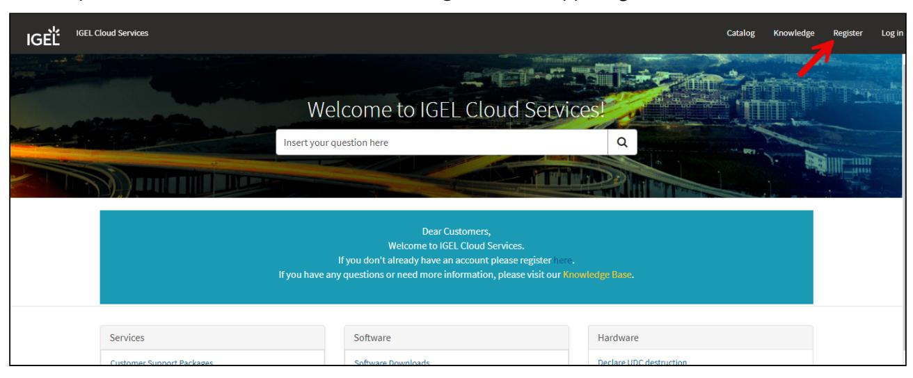

The IGEL Customer & Account Registration form opens.

2. Enter your user data.

How to Start with IGEL 4 / 232

<sup>6.</sup> https://support.igel.com/csm

<sup>7.</sup> https://support.igel.com/csm


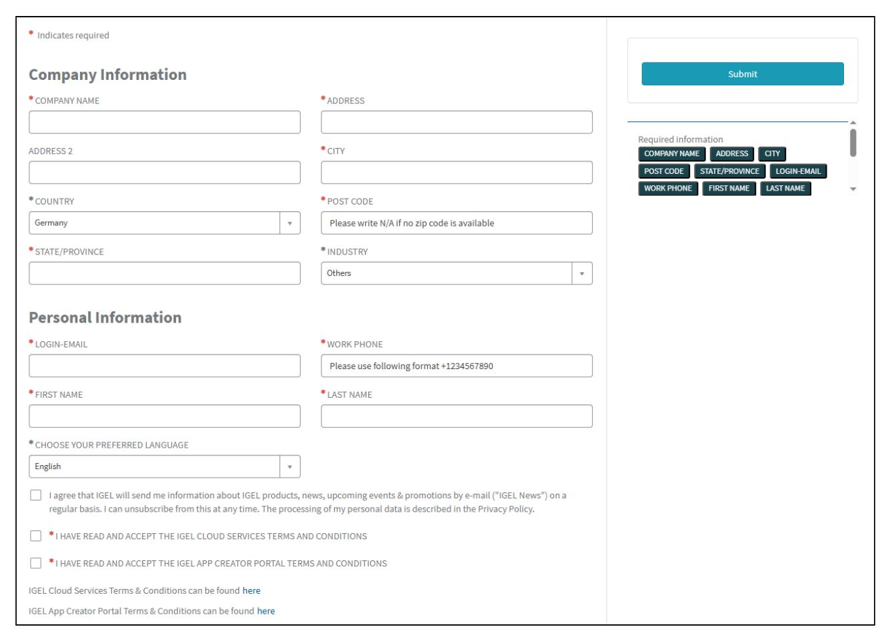

Required information is marked with an asterisk (\*) and is displayed in the right pane at the same time. When you have entered all the information, you will no longer see a reference to the required information in the right pane.


#### **IGEL Company Account Requirements**

- Your name and email address
- Must be a business email address with your company domain
- No personal email addresses (solely B2B)
- No generic contact details or email addresses, e.g. (info@company.tld)
- No shared (multi-user) accounts (e.g. support-team@company.tld)
- Free email provider domains are not allowed (e.g. gmail.com, http://yahoo.com, etc.)

#### 3. Click Submit.

A confirmation email will be sent to you.

How to Start with IGEL 5 / 232


4. Check your mailbox and confirm your registration by clicking on the appropriate link. If you have not received the email, please check your spam folder.

Your user data will now be internally checked. When your registration has been approved, you will receive an email confirmation containing your username and one-time password. As soon as you log in for the first time, you will be prompted to change your password. The registration approval process usually takes no more than 24 hours.


To ensure communication related to your registration is delivered, make sure your IT organisation does not block noreply@id.igel.com<sup>8</sup>. If you have registered, and your registration has been approved, please make sure the welcome email containing your password is not in your spam folder, and has not been quarantined by your organisation's email system.

5. To log in to the IGEL Customer Portal, click the button **Log in** in the received email.


Please remember your login email address. It will be used as Super Admin credentials, with which you can later invite new users and assign them specific roles, see Managing Users and Roles in the IGEL Customer Portal (see page 23).

### Enabling Multi-Factor Authentication (MFA) for the IGEL Customer Portal

It is recommended to add multi-factor authentication (MFA) to your IGEL Customer Portal account.

The following methods are available:

- Authenticator app; the supported apps are:
  - Google Authenticator
  - Microsoft Authenticator
  - Authv
- Email verification

### **Authenticator App**

1. In the IGEL Customer Portal, open the user menu and select My IGEL ID Profile.

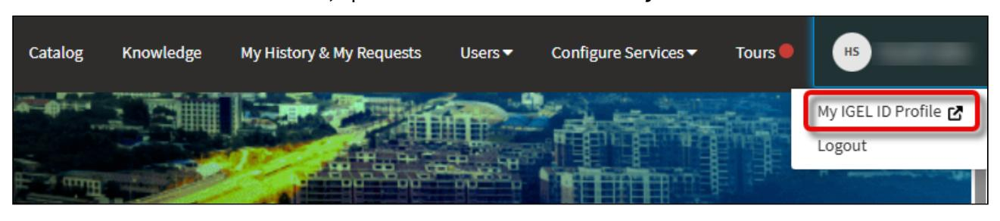

8. mailto:noreply@id.igel.com

How to Start with IGEL 6 / 232


You are taken to the **IGEL ID Profile Management** site in a separate browser tab or browser window.

2. Select MFA Settings.

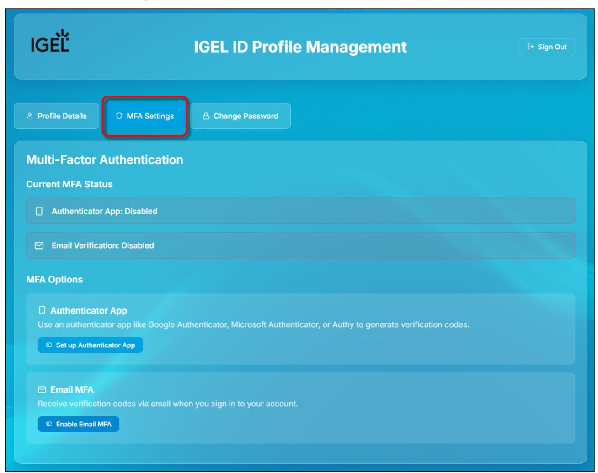

3. Click **Set up Authenticator App**.

How to Start with IGEL 7 / 232

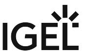

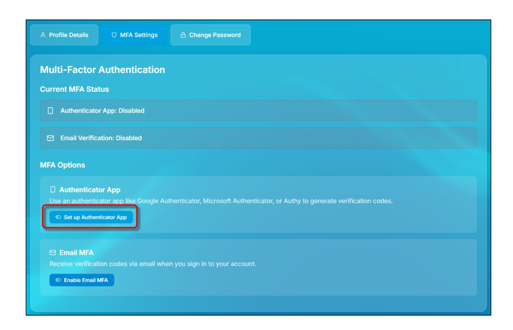

4. Scan the QR code with your authenticator app or enter the secret key manually.

How to Start with IGEL 8 / 232


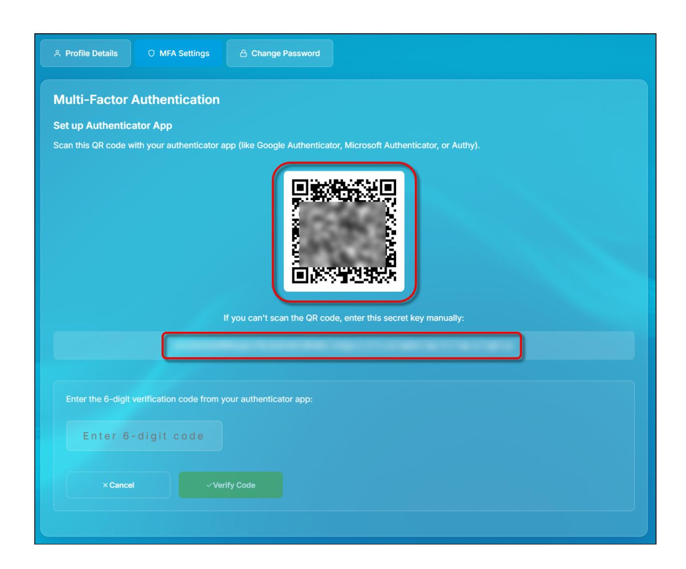

5. Enter the 6-digit verification code from your authenticator app and verify it.

How to Start with IGEL 9 / 232


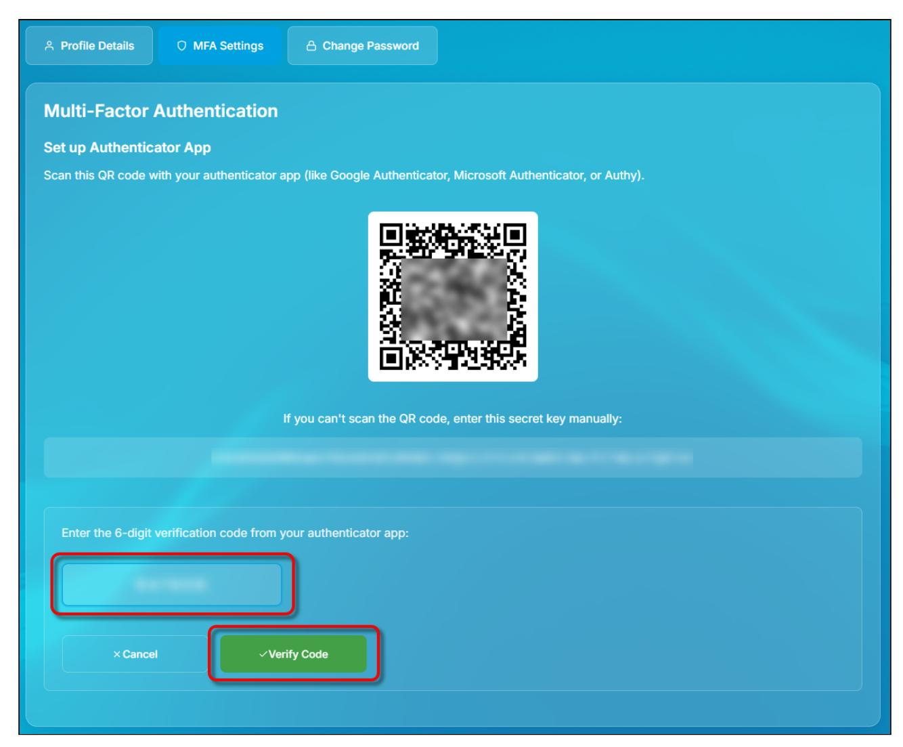

When you log in to the IGEL Customer Portal, you will be prompted to enter the current verification code from your authenticator app.

### **Email Verification**

1. In the IGEL Customer Portal, open the user menu and select My IGEL ID Profile.

How to Start with IGEL 10 / 232


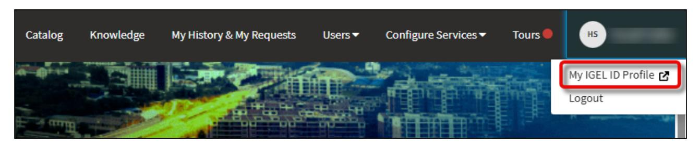

You are taken to the **IGEL ID Profile Management** site in a separate browser tab or browser window.

### 2. Select MFA Settings.

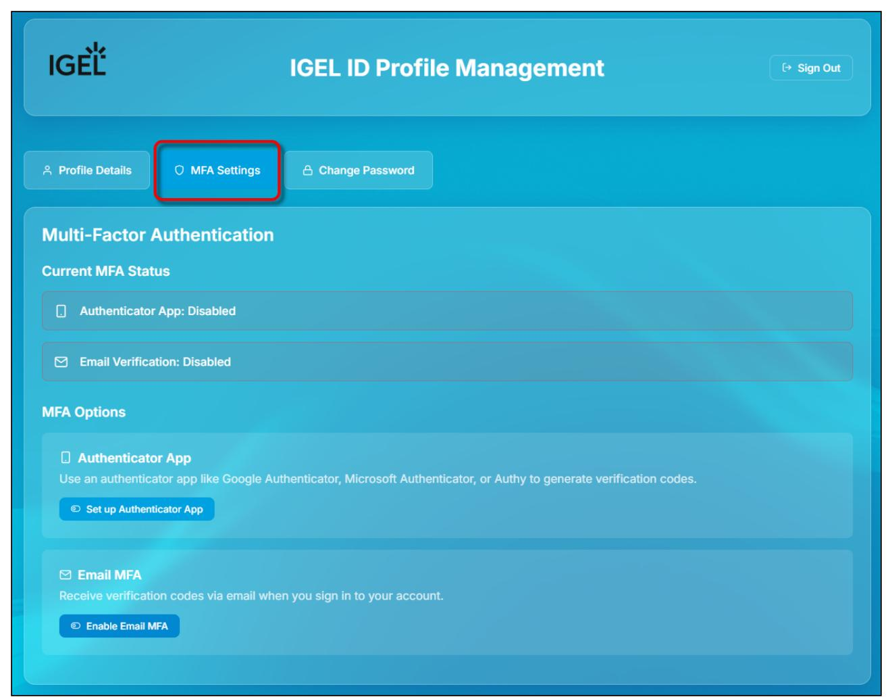

#### 3. Click Enable Email MFA.

How to Start with IGEL 11 / 232


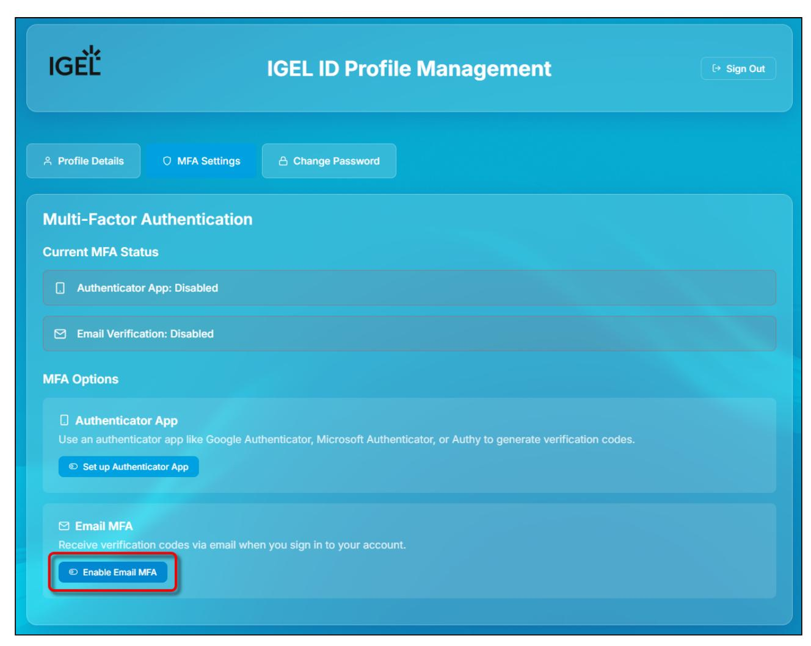

When you log in to the IGEL Customer Portal, you will be prompted to enter the one-time authentication code sent to you via email.

# Changing Your Personal Information in the IGEL Customer Portal

1. In the IGEL Customer Portal, open the user menu and select My IGEL ID Profile.

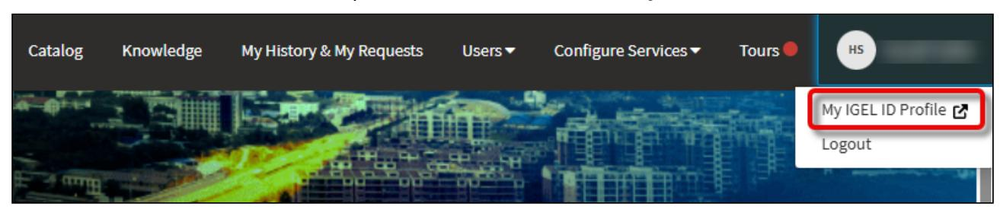

How to Start with IGEL 12 / 232


You are taken to the **IGEL ID Profile Management** site in a separate browser tab or browser window.

2. Ensure that **Profile Details** is active and click **Edit**.

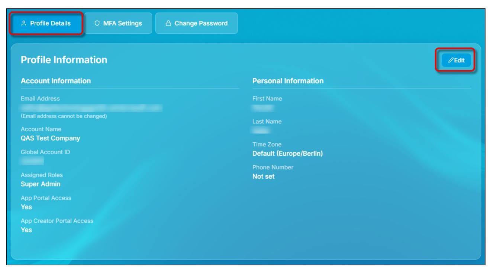

3. Edit your personal information as desired and click **Save**.

- Please note the following about the phone number:
  - When you set/edit your phone number, a text message is sent to that number for verification purposes.
  - Your phone number will be used to send a verification code for password reset (see Login Credentials Forgotten? (see page 17)). If you have not provided a phone number, your email address will be used instead.

How to Start with IGEL 13 / 232


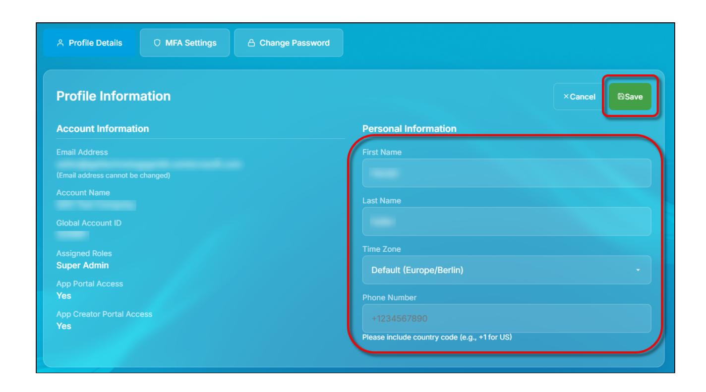

# Changing Your Password in the IGEL Customer Portal

1. In the user menu, click My IGEL ID Profile.

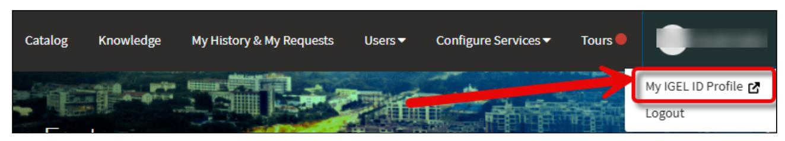

You are taken to the IGEL ID Profile Management site in a separate browser tab or browser window.

2. Click Change Password.

How to Start with IGEL 14 / 232


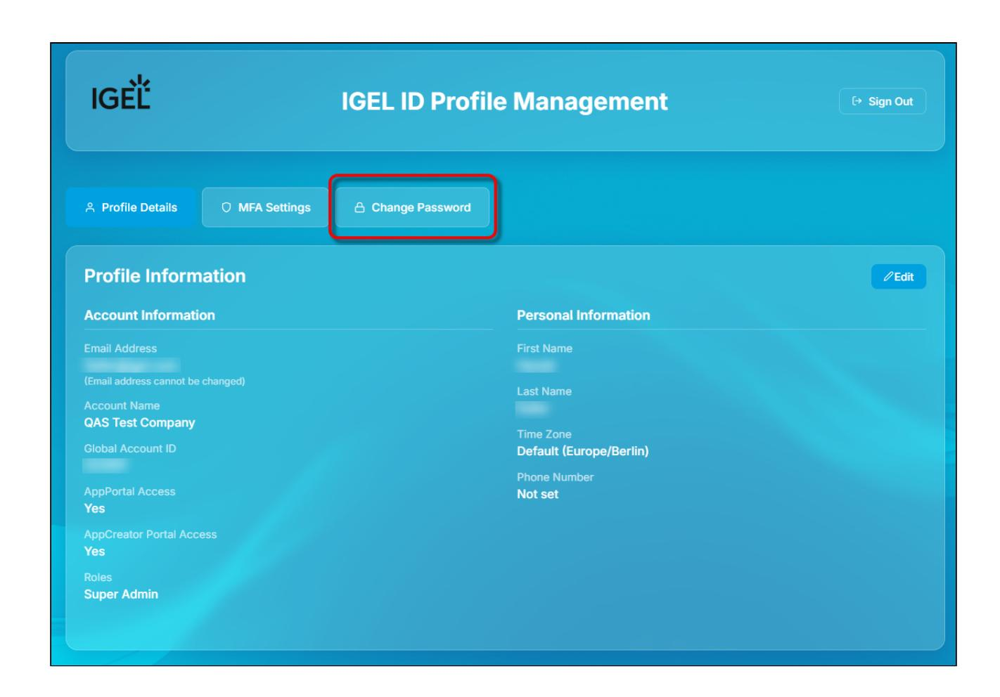

3. Enter your current password and the new password, and confirm with **Change Passwort**. Please note the password requirements.

How to Start with IGEL 15 / 232


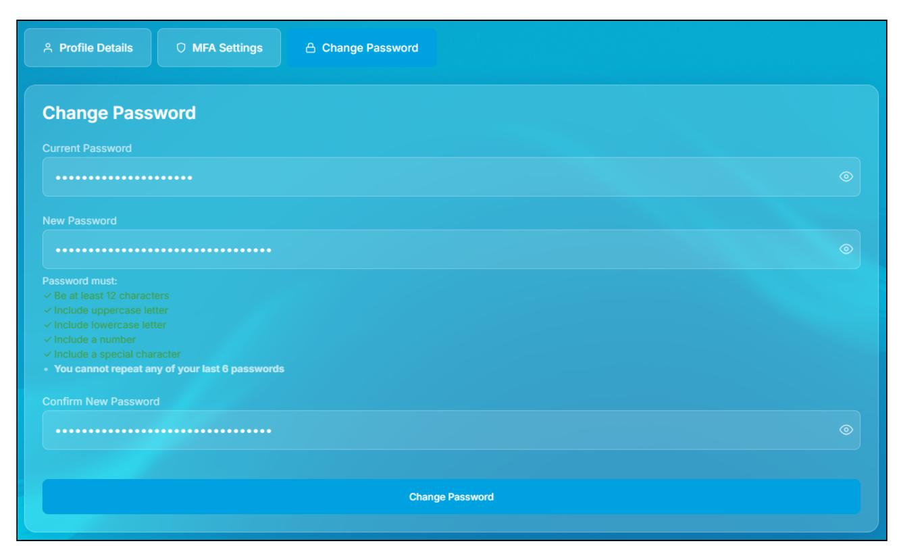

A confirmation message will be displayed briefly.

# Logging in to the IGEL Customer Portal

1. Open the IGEL Customer Portal<sup>9</sup> and click **Login**.

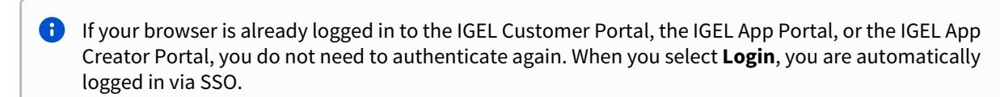

2. Enter the credentials you used to register with IGEL and click **Sign in**.

9. https://support.igel.com/

How to Start with IGEL 16 / 232


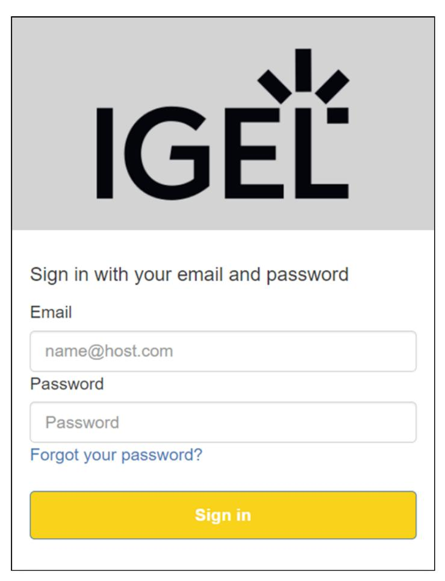

The IGEL Customer Portal opens. If you have configured MFA, you must enter a verification code first.

### Login Credentials Forgotten?

- 1. Open the IGEL Customer Portal<sup>10</sup> and click **Login**.
- 2. Click Forgot your password? to reset a password.

A dialog for requesting a new password opens.

10. https://support.igel.com/

How to Start with IGEL 17 / 232


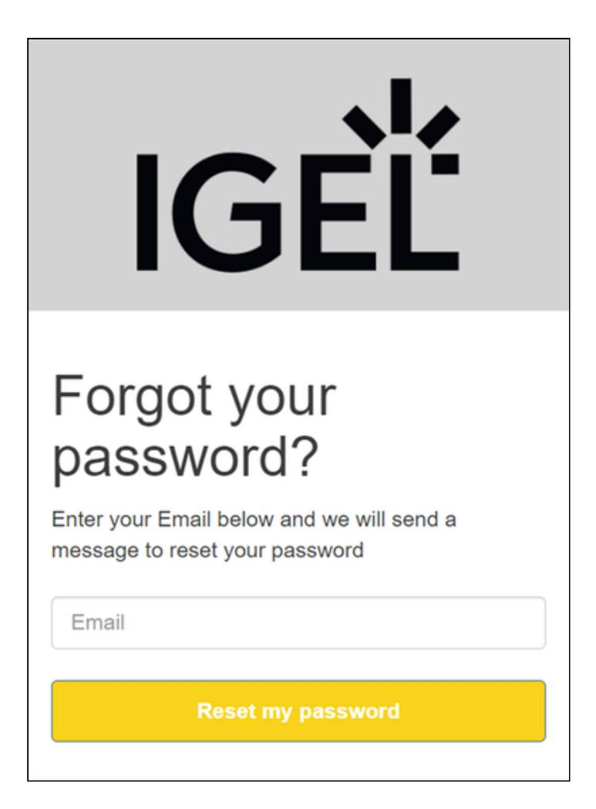

- 3. Enter the email address to which the verification code should be sent and click **Reset my password**.
- 4. Check your email inbox for the email with the code. If you have not received the email, please check your spam folder.
- 5. Provide the code you received under **Code** and set a new password.

How to Start with IGEL 18 / 232


**IGEL**We have sent a password reset code by email to a\*\*\*@a\*\*\*. Enter it below to reset your password.

| Code                     |  |
|--------------------------|--|
| New Password             |  |
| Enter New Password Again |  |

**Change Password**6. Confirm by clicking **Change Password**.

With the verified user data and the new password, you can now log in to the IGEL Customer Portal.

How to Start with IGEL 19 / 232

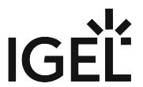

# IGEL Support Information on the IGEL Customer Portal

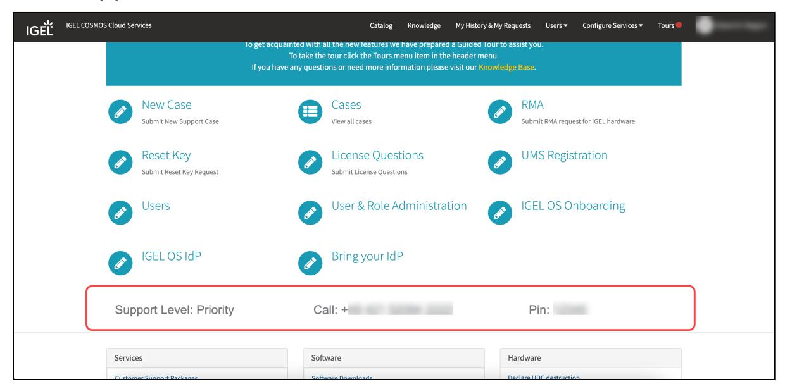

If you have Priority or Plus support, you can find the following support information on the landing page after login:

### • Support Level

The level of support you have. You can find more information on support levels at https://www.igel.com/support/.

- Call
  - Regional support number.
- PIN

The PIN that you use for authentication during a support call.


### **Changes in Support Contact Information**

Starting from 12 August 2024 a new phone system is introduced at IGEL Support. As a result, the following will change:

- New phone number to contact IGEL Support.
- New 8 digit authentication PIN. The new PINs are assigned to individual users and not to customer accounts and they will change periodically.

You will find the new information after login under Call and PIN.

### Creating Support Cases in the IGEL Customer Portal for Different Environments

When submitting a new case, you need to select the type of your environment under **Is this a production environment?**.

How to Start with IGEL 20 / 232


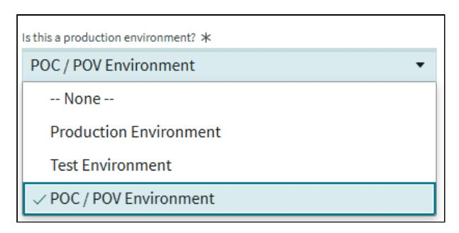

Select one of the three options using the drop-down menu:

- **Production Environment** Your case is connected to a production environment. A production environment is a real-time setting where users are working with the software.
- Test Environment Your case is connected to a test environment. A test environment is an internal environment, used to test, check, and validate new technology. The system is not used in production.
- POC/POV Environment Your case is connected to an IGEL supported Proof of Concept (POC) or Proof of Value (POV) environment, where IGEL Presales and you are in touch.

### Creating an RMA Request in the IGEL Customer Portal

You can submit a Return Material Authorization (RMA) request after registering for the IGEL Customer Portal.


The RMA request form is for IGEL hardware only. If you would like to request an RMA for hardware produced by an IGEL partner, you need to refer to the vendor's RMA process.

1. Click RMA or Request an RMA.

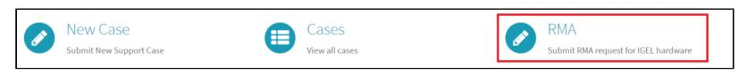

2. Fill out the RMA form with the following information:

Mandatory fields:

- Serial Number
- Complete description
- **Delivery address** (for new, or repaired devices)


The delivery address must be checked as it is not updated automatically and gets taken from the customer's registered details.

Optional fields:

How to Start with IGEL 21/232


- Part Number
- Unit Type
- "MORE THAN ONE DEVICE"

If this drop-down is set to **Yes**, you can insert additional Serial Numbers of endpoints showing a similar issue.

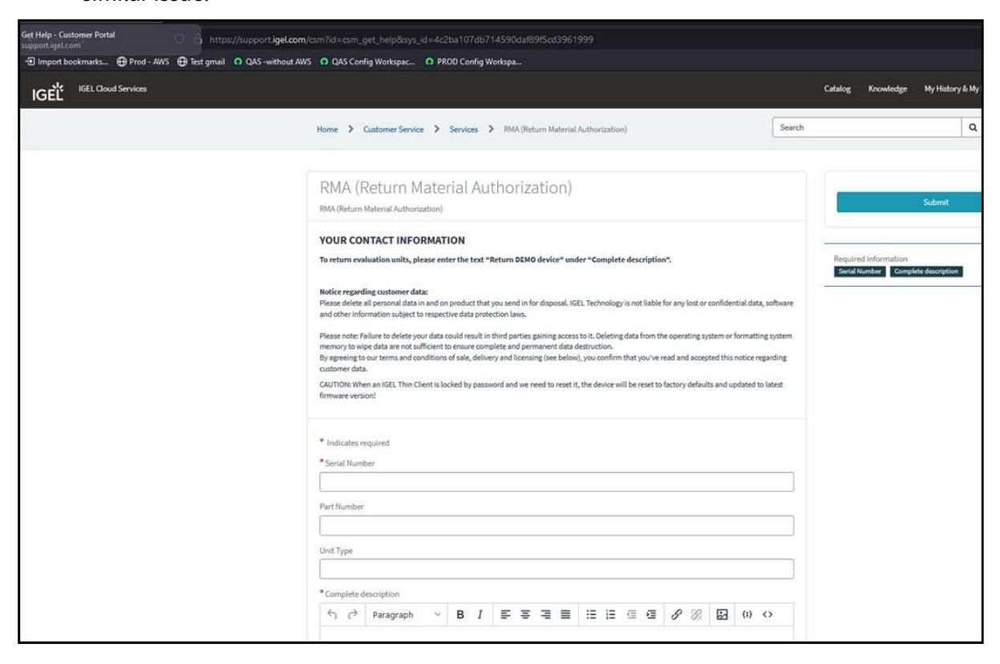

How to Start with IGEL 22 / 232


# **Managing Users and Roles in the IGEL Customer Portal**

This article describes how to invite users, cancel or renew invitations, and add roles to a user or remove roles in the IGEL Customer Portal. Also included is a description of how to use Okta or Ping as federated identity providers (IdP) for logging in to your IGEL Cloud Services accounts.

### **Roles and Permissions**

• Super Admin

In the IGEL Customer Portal, you can find the following roles:

the IGEL Customer Portal, you can find the following roles:

The first account you register in the IGEL Customer Portal<sup>11</sup> > Register is your Super Admin account. For details on registration, see Using the IGEL Customer Portal (see page 4).

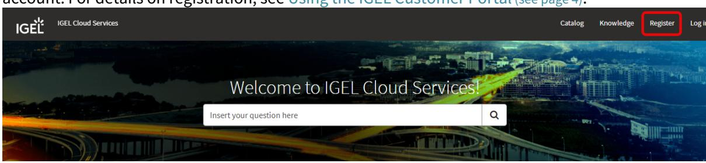

The Super Admin is the first user to register any new account.

- Account Admin
- OBS Admin
- UMS Admin
- App Creator
- Customer Support Account Manager

The users with these roles have the following permissions:

|                                                                                         | Super<br>Admin     | Account<br>Admin   | OBS<br>Admin | UMS<br>Admin | App<br>Creator | Customer<br>Support<br>Account<br>Manager |
|-----------------------------------------------------------------------------------------|--------------------|--------------------|--------------|--------------|----------------|-------------------------------------------|
| <b style="background-color:#dbeeff;">Account Management</b>                             |                    |                    |              |              |                |                                           |
| View account                                                                            | Image: [checkmark] | Image: [checkmark] |              |              |                |                                           |
| <b style="background-color:#dbeeff;">User Management</b>                                |                    |                    |              |              |                |                                           |
| View users                                                                              | Image: [checkmark] | Image: [checkmark] |              |              |                |                                           |
| Invite users                                                                            | Image: [checkmark] | Image: [checkmark] |              |              |                |                                           |
| Add / remove user roles                                                                 | Image: [checkmark] | Image: [checkmark] |              |              |                |                                           |
| <b style="background-color:#dbeeff;">OBS IdP (Onboarding Service Identity Provider)</b> |                    |                    |              |              |                |                                           |
|                                                                                         | Super Admin        | Account Admin      | OBS Admin    | UMS Admin    | App Creator    | Customer Support Account Manager          |
| Register IGEL OS IdP                                                                    | ✓                  |                    | ✓            |              |                |                                           |
| Use OBS instance                                                                        | ✓                  |                    | ✓            |              |                |                                           |
| IGEL OS Onboarding                                                                      |                    |                    |              |              |                |                                           |
| Register OBS instances                                                                  | ✓                  |                    | ✓            |              |                |                                           |
| View OBS attributes                                                                     | ✓                  |                    | ✓            |              |                |                                           |
| Use OBS attributes                                                                      | ✓                  |                    | ✓            |              |                |                                           |
| Create OBS attributes                                                                   | ✓                  |                    | ✓            |              |                |                                           |
| Add / change OBS attributes                                                             | ✓                  |                    | ✓            |              |                |                                           |
| UMS Management                                                                          |                    |                    |              |              |                |                                           |
| View UMS instances                                                                      | ✓                  |                    |              | ✓            |                |                                           |
| Use UMS instances                                                                       | ✓                  |                    |              | ✓            |                |                                           |
| Create UMS instances                                                                    | ✓                  |                    |              | ✓            |                |                                           |
| Add / change UMS instances                                                              | ✓                  |                    |              | ✓            |                |                                           |
| App Creator Portal                                                                      |                    |                    |              |              |                |                                           |
| Create apps via the IGEL App Creator Portal                                             | ✓                  |                    |              |              | ✓              |                                           |
| Support / Case Management                                                               |                    |                    |              |              |                |                                           |
| View support cases                                                                      | ✓                  |                    |              |              |                | ✓                                         |
| Submit support cases                                                                    | ✓                  |                    |              |              |                | ✓                                         |
| View RMA cases                                                                          | ✓                  |                    |              |              |                | ✓                                         |
| Submit an RMA case                                                                      | ✓                  |                    |              |              |                | ✓                                         |
| Submit reset key cases                                                                  | ✓                  |                    |              |              |                | ✓                                         |
| Submit license question cases                                                           | ✓                  |                    |              |              |                | ✓                                         |

11. https://support.igel.com

How to Start with IGEL 23 / 232


How to Start with IGEL 24 / 232


# Inviting a User and Assigning a Role

In the following example, we will invite a new user and make this user an OBS administrator.

1. Open the IGEL Customer Portal<sup>12</sup>, log in to your admin account, and select **Users > User & Role**Administration.

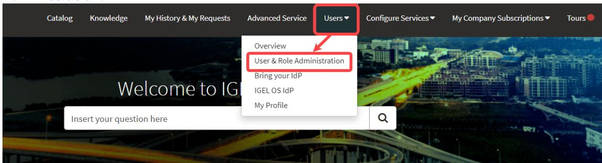

2. Select Invite new user.

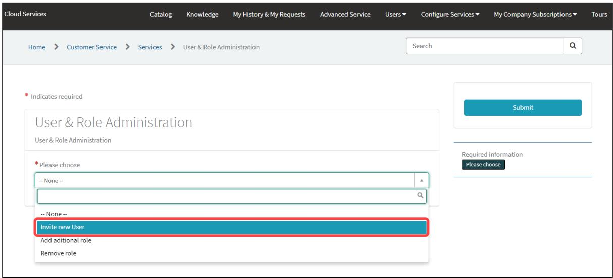

- 3. Provide the data of the new user:
  - First name: First name of the user
  - Last name: Last name of the user
  - **E-mail** (required): E-mail address of the user
  - Language: Preferred language for the user

How to Start with IGEL 25 / 232

<sup>12.</sup> https://support.igel.com


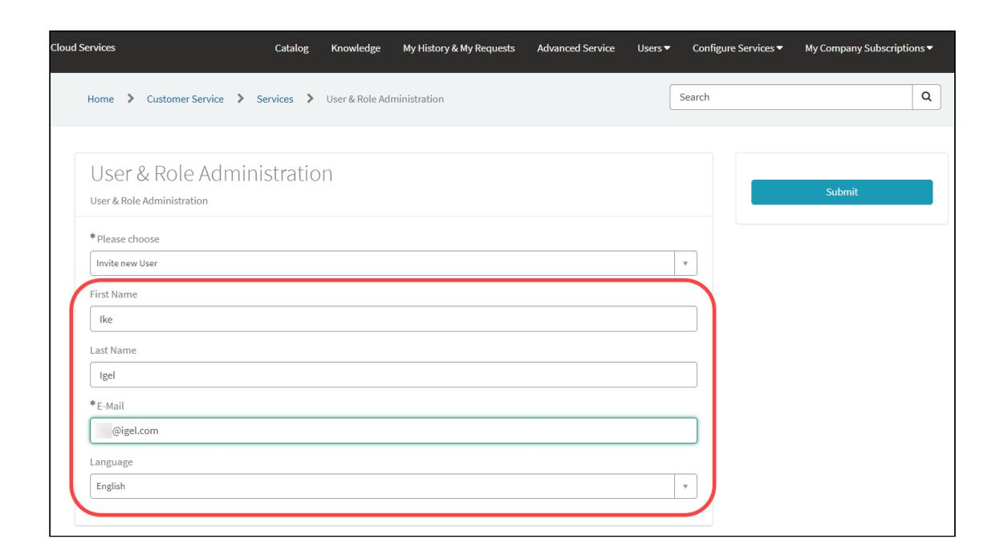

4. Select **OBS Admin** as the role and click **Submit**.

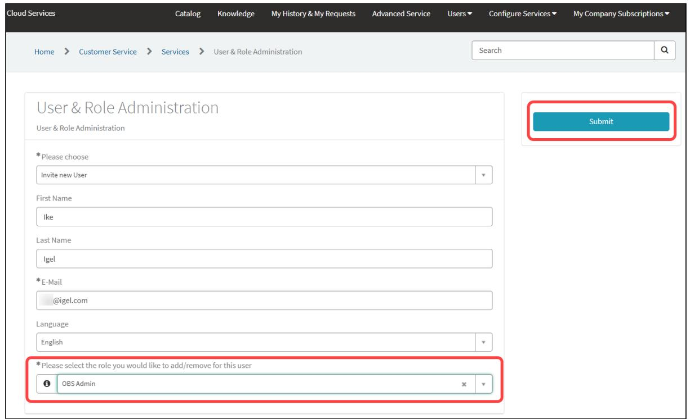

The invitation mail is sent to the user.

The list of users is displayed; it includes the newly added user.

How to Start with IGEL 26 / 232


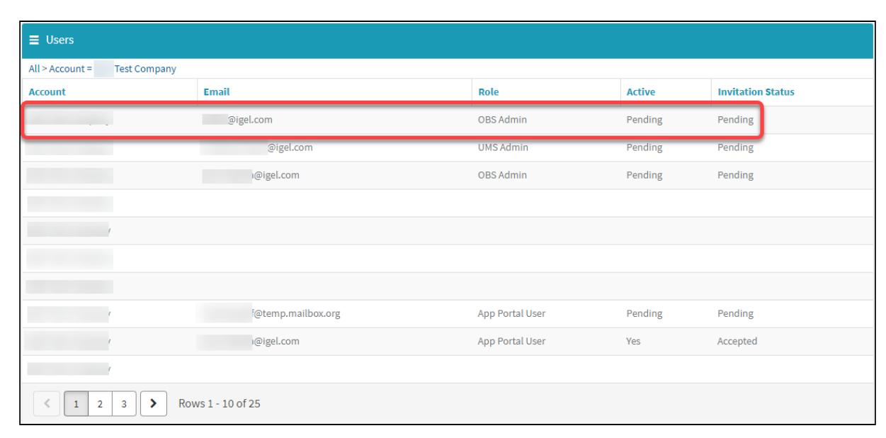

When the user accepts the invitation, the account is created, and the role is assigned. (If the user declines, the account is not created.)

The Super Admin receives a confirmation e-mail.

### **Canceling and Resending Invitations**

You can cancel or resend pending invitations if you have one of the following roles:

- Super Admin
- Account Admin

Pending invitations older than 30 days will be deleted automatically. If an invitation has been deleted, you can create a new one.

1. Open the IGEL Customer Portal<sup>13</sup>, log in to your admin account, and select **Users > Overview**.

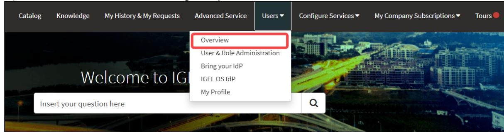

The users are listed.

2. Find the relevant user and click on **Resend** or **Cancel**, as appropriate.

13. https://support.igel.com

How to Start with IGEL 27 / 232


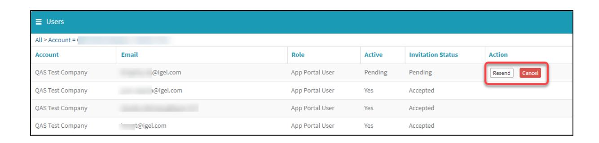

# Adding a Role to an Existing User

1. Open the IGEL Customer Portal<sup>14</sup>, log in to your admin account, and select **Users > User & Role**Administration.

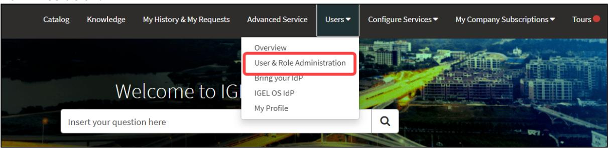

2. Select Add additional role.

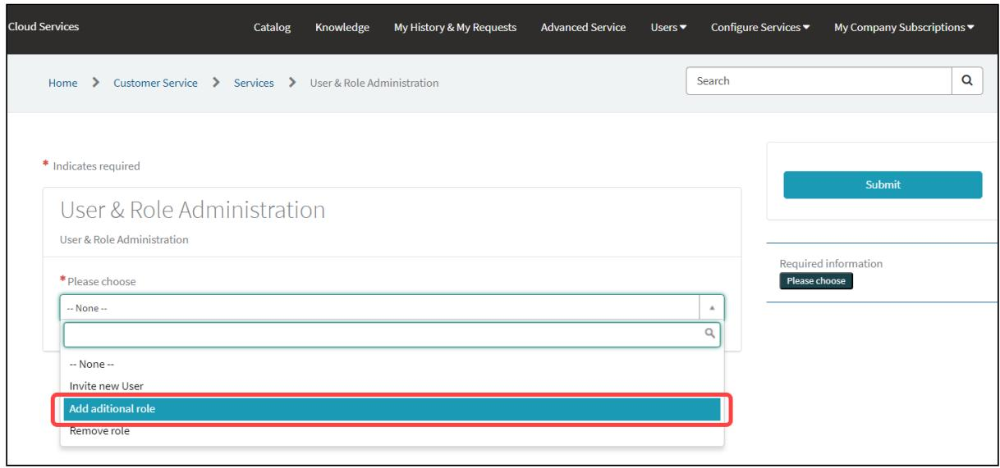

3. Select one or more users that should be assigned the role.

14. https://support.igel.com

How to Start with IGEL 28 / 232


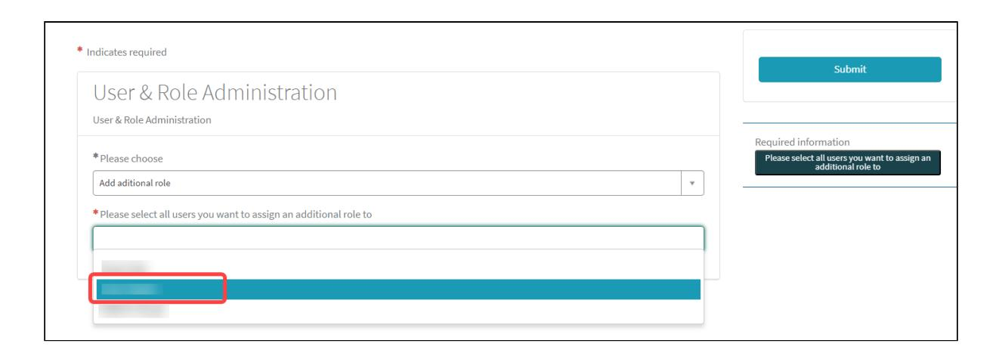

4. Select **OBS Admin** as the additional role and click **Submit**.

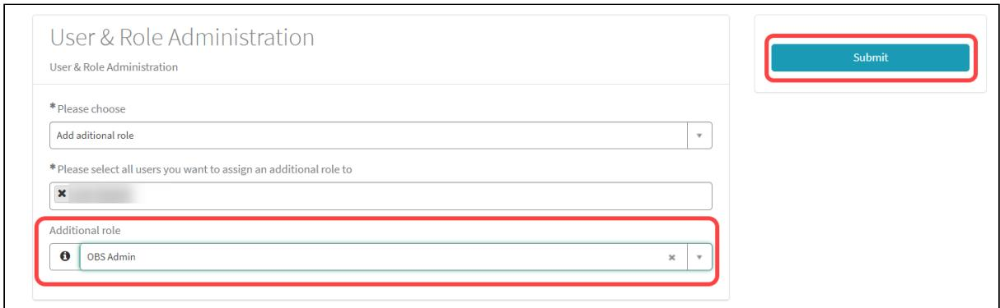

The updated list of users is displayed.

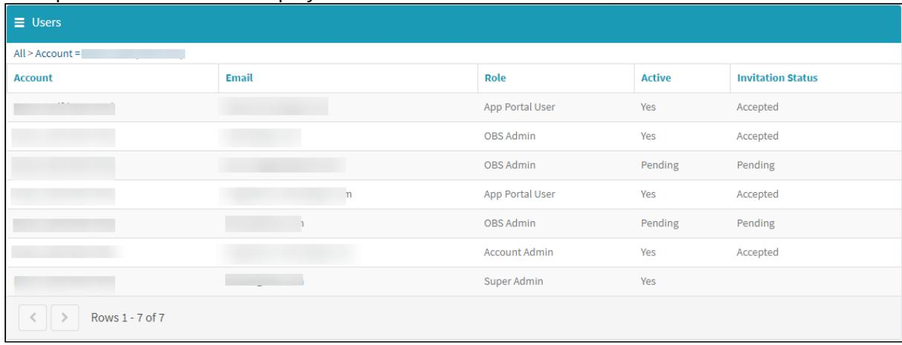

### Removing a Role / Deactivating a User

You can remove one or more rules from a user. If you deactivate a user, the account is deleted. No e-mails will be sent to this account anymore.

How to Start with IGEL 29 / 232


1. Open the IGEL Customer Portal, log in to your admin account, and select **Users > User & Role Administration**.

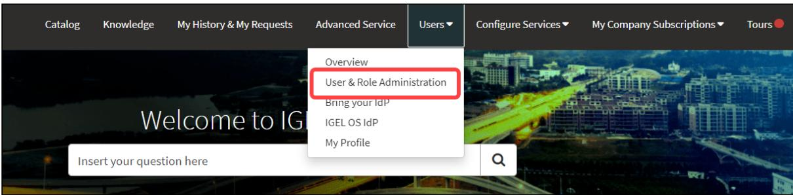

2. Select Remove role.

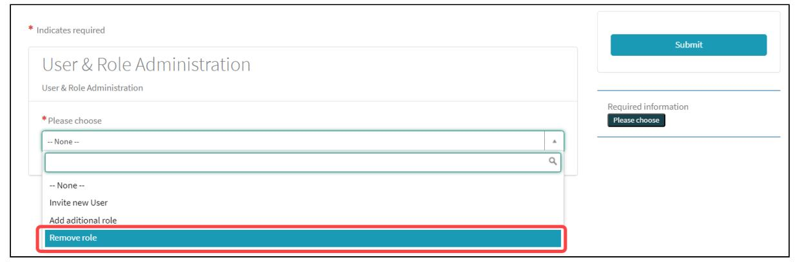

3. Select the user from whom you want to remove a role.

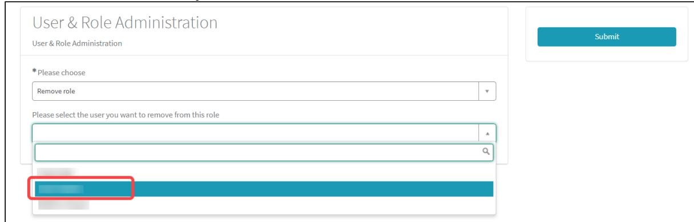

4. Select the role you want to remove from the user.

How to Start with IGEL 30 / 232


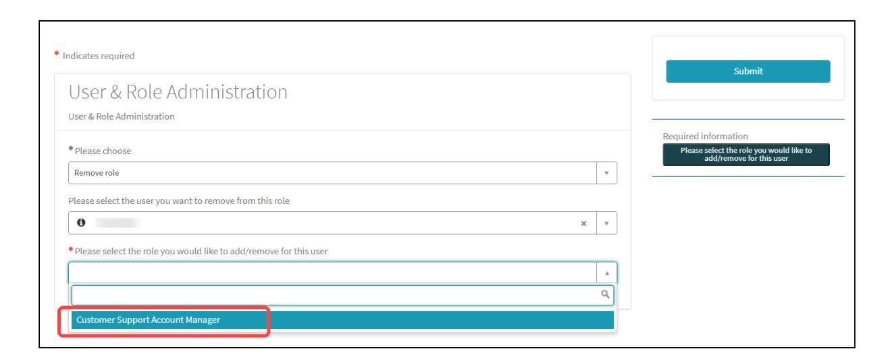

5. Click **Submit** to confirm the change.

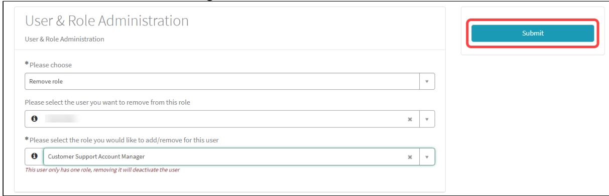

# Using Okta as Federated Identity Provider

### Setting Up an App Integration in Okta

For federating identities from Okta to Azure Active Directory (AAD), which is used in IGEL Cloud Services, you must set up an application integration in your Okta tenant. For this purpose, we will create a SAML 2.0 application.

1. Log in to your administrator account at Okta, go to **Applications**, and click **Create App integration**.

How to Start with IGEL 31/232


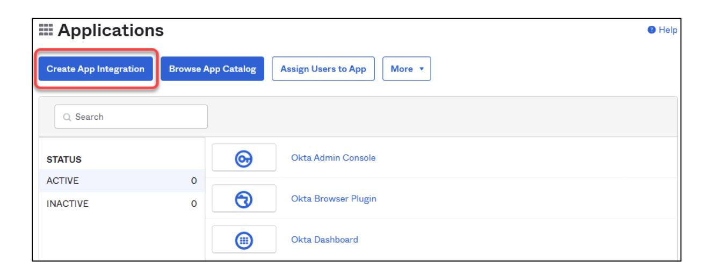

2. Select SAML 2.0 and click Next.

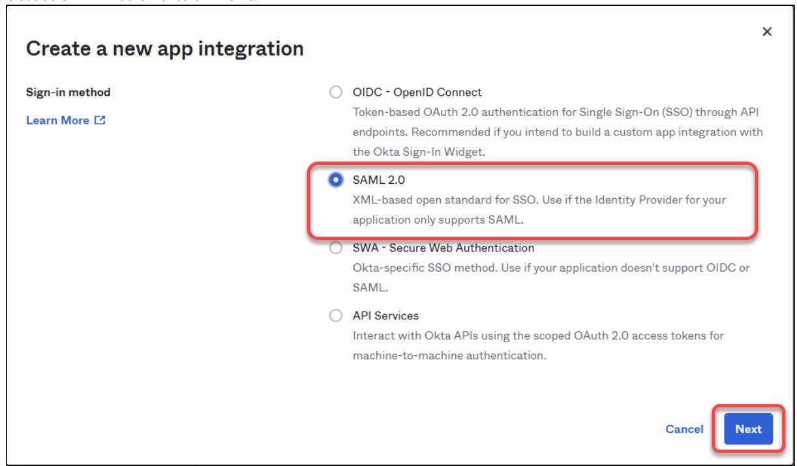

3. Define an **App name** and, optionally, an **App logo**, and click **Next**.

How to Start with IGEL 32 / 232


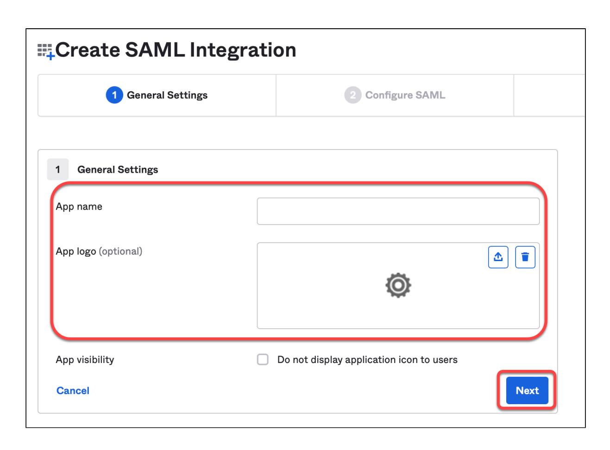

- 4. Edit the SAML connection details as follows:
  - Single sign on URL: Enter https://login.microsoftonline.com/login.srf
  - Use this for Recipient URL and Destination URL: Activate this checkbox.
  - Audience URI (SP Entity ID): Enter urn: federation: MicrosoftOnline
  - Application username: Set this to Email.

How to Start with IGEL 33 / 232


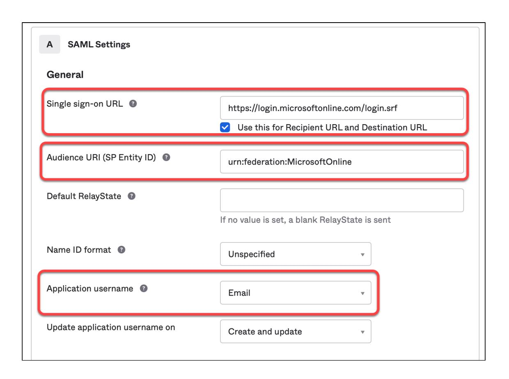

### 5. Add the following attributes:

- Name: http://schemas.xmlsoap.org/ws/2005/05/identity/claims/emailaddress; Value: user.email
- Name: NameID Format; Value: urn:oasis:names:tc:SAML:2.0:nameid-format:persistent

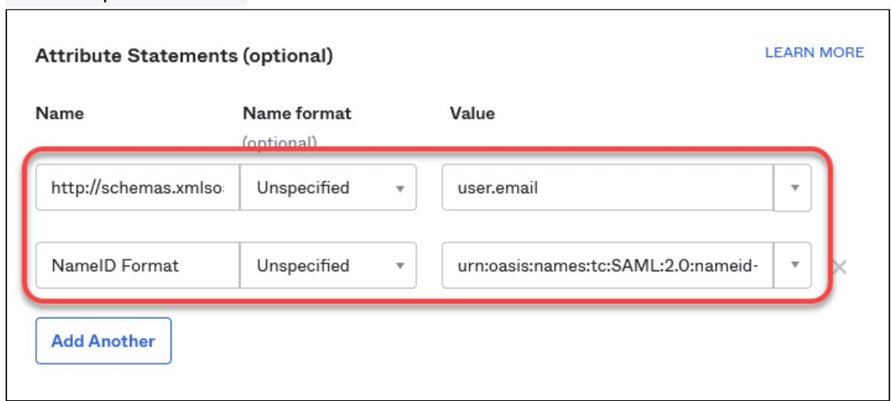

How to Start with IGEL 34 / 232


6. Finish your app integration.

### Extracting the SAML 2.0 Connection Data

In this step, we will extract the connection data which will be used for creating an external identity that will be used for the IGEL Onboarding Service (OBS).

1. Open the settings for your application and select **Sign On**.

How to Start with IGEL 35 / 232


2. Click on the link Identity Provider metadata to download the data we will use afterward for configuring the IGEL Onboarding Service (OBS). The data is contained in an XML file. Also, note down the URL from this link, as we will need it later on. Example metadata file:

How to Start with IGEL 36 / 232


```
-<md:EntityDescriptor entityID="http://www.okta.com/">
-<md:IDP$SODescriptor WantAuthnRequestsSigned="false" protocolSupportEnumeration="urn oasis.names.tc.SAML.2.0 protocol">
-<md:KeyInfo>
-<ds:X699Data>
-<ds:X699Certificate>

</ds:X699Data>
-<ds:X699Data>
-<ds:X699Data>
-<ds:X699Data>
-<ds:X699Data>
-<ds:X699Data>
-<md:KeyInfo>
</md:KeyDescriptor>

-/md:KeyDescriptor>
-/md:KeyDescriptor>
-/md:MameIDFormat>
-/md:NameIDFormat>
-/md:NameIDFormat>
-/md:NameIDFormat>
-/md:NameIDFormat>
-/md:NameIDFormat>
-/md:NameIDFormat>
-/md:NameIDFormat>
-/md:NameIDFormat>
-/md:NameIDFormat>
-/md:NameIDFormat>
-/md:NameIDFormat>
-/md:NameIDFormat>
-/md:NameIDFormat>
-/md:NameIDFormat>
-/md:NameIDFormat>
-/md:NameIDFormat>
-/md:NameIDFormat>
-/md:NameIDFormat>
-/md:NameIDFormat>
-/md:NameIDFormat>
-/md:NameIDFormat>
-/md:NameIDFormat>
-/md:NameIDFormat>
-/md:NameIDFormat>
-/md:NameIDFormat>
-/md:NameIDFormat>
-/md:NameIDFormat>
-/md:SingleSignOnService Binding="urn oasis names tc:SAML.2.0 bindings:HTTP-POST" Location="https:// okta.com/app/ __igelsso_1
-/md:SingleSignOnService Binding="urn oasis names tc:SAML.2.0 bindings:HTTP-Redirect" Location="https:// okta.com/app/ __igelsso_1
-/md:IDP$SODescriptor>
-/md:IDP$SODescriptor>
```

### Configuring Okta as Your Federated IdP

1. Open the IGEL Customer Portal<sup>15</sup>, log in to your admin account, and select **Users > Bring your IdP**.


- 2. Enter the following data from your metadata file:
  - Issuer URI: Value of the attribute entityID of the

element <md:EntityDescriptor>

```
-<md:EntityDescriptor entityID=nttp://www.okta.com/
-<md:IDP$SODescriptor Wantaumnrequestssigned= laise protocolsupportEnumeration="urn:oasis;names:tc:SAML:2.0:protocol">
-<md:KeyDescriptor use="signing">
-<ds:KeyInfo>
-<ds:X509Data>
-<ds:X509Certificate>
```

15. https://support.igel.com

How to Start with IGEL 37 / 232


• Passive authentication endpoint: Enter the value of the Location attribute of the <md:SingleSignOnService> element.


- **Metadata URL**: Enter the URL of the link **Identity Provider metadata** you have used before to download the metadata file.
- **Domain name of federating IdP**: The part of **Passive authentication endpoint** before the /app/ without the https://.Example: mycompanydomain.okta.com


3. Under **Associated Domains**, add the domains that will be associated with your federate IdP.

How to Start with IGEL 38 / 232


4. Under **Certificate**, paste the content of the <ds:X509Certificate> element and then click **Submit**.


How to Start with IGEL 39 / 232


### Assigning the Application to the Users

In the final step, we will assign the relevant users to the application we have created. When this is done, these users will be able to onboard their devices to the UMS in their company network.

You can assign groups of users or single users.

1. In your Okta application, select **Assignments**.

How to Start with IGEL 40 / 232


2. Assign the users to our new application.

### Using Ping as Federated Identity Provider

### Setting Up an App Integration in Ping

For federating identities from Ping to Azure Active Directory (AAD), you must set up an application integration in your Ping tenant. For this purpose, we will create a SAML 2.0 application.

1. Log in to your account at Ping, go to **Connection > Applications**, and then add an application.

How to Start with IGEL 41 / 232


2. Enter an **Application Name**, select **SAML Application** as the application type, and then click **Configure**.

How to Start with IGEL 42 / 232


- 3. In the **SAML Configuration** dialog, select **Manually Enter** and enter the following data:
  - ACS URLs: Enter https://login.microsoftonline.com/login.srf

How to Start with IGEL 43 / 232


• **Entity ID**: Enter the prefix https://login.microsoftonline.com/ followed by the Azure Active Directory tenant ID.


- 4. Create the application.
- 5. Edit/create the following attribute mappings:
  - Map saml\_subject to User ID.
  - Create the identifier http://schemas.xmlsoap.org/ws/2005/05/identity/claims/emailaddress and mapitto Email Address.

How to Start with IGEL 44 / 232


6. Finish the application setup.

### Obtaining the SAML 2.0 Connection Data

In this step, we will get the connection data which will be used for creating an external identity that will be used for the IGEL Onboarding Service (OBS).

 $\rightarrow$  Open the settings for your application and select Configuration. The relevant data is shown and can be copied to the clipboard.

How to Start with IGEL 45 / 232


How to Start with IGEL 46 / 232


How to Start with IGEL 47 / 232


### Configuring Ping as Your Federated IdP

1. Open the IGEL Customer Portal<sup>16</sup>, log in to your admin account, and select **Users > Bring your IdP**.

16. https://support.igel.com

How to Start with IGEL 48 / 232


- 2. Enter the following data from your metadata file:
  - Issuer URI: The Issuer ID from the Ping Configuration page.
  - Passive authentication endpoint: The value of Single Signon Service from the Ping Configuration page.
  - Metadata URL: The IDP Metadata URL from the Ping Configuration page.
  - **Domain name of federating IdP**: Enter the domain name that is associated with your Ping account.

How to Start with IGEL 49 / 232


# **Installing / Upgrading to IGEL UMS 12**

This article describes how to install IGEL Universal Management Suite (UMS) 12 or upgrade your existing UMS installation and provides information on what should be considered before and during the installation / update.

### Before Installation / Upgrade

### **UMS Licensing**

The feature-based licensing model for the IGEL UMS is released with UMS version 12.07.100. With the feature-based license model, UMS features are activated based on the deployed UMS License. For details, see IGEL Software Licenses for IGEL OS and IGEL UMS<sup>17</sup>.


The IGEL UMS can be installed without a technical license, providing access to features of the Essential UMS License. You need a UMS License to unlock Standard and Enterprise features of the UMS. For details, see IGEL OS Editions<sup>18</sup>.

### **Update Requirements**

You can update to UMS version 12.01.110 or higher from UMS 6.x

If you participated in the program for validation and testing of IGEL OS 12, you can also update to UMS 12.01.110 from

- UMS 12.00.900
- UMS 12.01.x

Before the update, it is always recommended to make a backup of your current system. For details on how to create backups, see Creating a Backup of the IGEL UMS<sup>19</sup>.

### IGEL Cloud Gateway (ICG) with IGEL OS 12 and IGEL OS 11 Devices

If you exclusively manage IGEL OS 12 devices, you may not need an IGEL Cloud Gateway (ICG) between your UMS 12 and your devices, regardless of whether the devices are inside or outside the company network. Whether an ICG is required or not depends on your particular use case or policy. See IGEL Cloud Gateway vs. Reverse Proxy for the Communication between UMS 12 and IGEL OS Devices<sup>20</sup>. If you manage remote IGEL OS 11 devices and want to manage also your remote IGEL OS 12 devices via ICG, ICG 12 is required.

If you manage your remote IGEL OS 12 devices without ICG and your remote IGEL OS 11 devices with ICG, you can use ICG 12 or ICG 2.x.


Note the following, especially if you use any special policies or other components between the devices and the IGEL Universal Management Suite (UMS) or the IGEL Cloud Gateway (ICG):

- 17. https://kb.igel.com/en/igel-subscription-and-more/current/igel-software-licenses-for-igel-os-and-igel-ums
- 18. https://kb.igel.com/en/igel-subscription-and-more/current/igel-os-editions
- 19. https://kb.igel.com/en/universal-management-suite/current/creating-a-backup-of-the-igel-ums
- 20. https://kb.igel.com/en/universal-management-suite/current/igel-cloud-gateway-vs-reverse-proxy-for-the-commun

How to Start with IGEL 50 / 232


- IGEL OS 12 devices use TLS 1.3
- IGEL OS 11 devices use TLS 1.2

The hardware requirements for ICG 12 are the same as for ICG 2.x with the exception that ICG 12 requires 4 GB of RAM instead of 2 GB, see Prerequisites for Installing IGEL Cloud Gateway<sup>21</sup>.

# Installing / Upgrading the IGEL UMS

- 1. Download IGEL UMS 12 from the IGEL Download Server<sup>22</sup>.
- 2. Consider the installation requirements, see Sizing Guidelines for IGEL UMS 12 and IGEL OS 12<sup>23</sup> and Installation Requirements for the IGEL UMS<sup>24</sup>.
  - If you are going to upgrade your existing UMS installation, see also IGEL UMS Update<sup>25</sup>.
- 3. Install / update the UMS. Depending on your needs, you can install standard UMS, Distributed UMS, or UMS High Availability.
  - When selecting the installed components, include the UMS Web App and the UMS Console into the installation both of them are currently required for the management of your UMS installation and devices.

How to Start with IGEL 51 / 232

<sup>21.</sup> https://kb.igel.com/en/igel-cloud-gateway/current/prerequisites-for-installing-igel-cloud-gateway

<sup>22.</sup> https://www.igel.com/software-downloads/

<sup>23.</sup> https://kb.igel.com/en/universal-management-suite/current/sizing-guidelines-for-igel-ums-12-and-igel-os-12

<sup>24.</sup> https://kb.igel.com/en/universal-management-suite/current/installation-requirements-for-the-igel-ums

<sup>25.</sup> https://kb.igel.com/en/universal-management-suite/current/igel-ums-update


#### **Detailed Instructions**

Detailed information on how to install the UMS can be found under:

Windows: IGEL UMS Installation under Windows<sup>26</sup>

Linux: IGEL UMS Installation under Linux<sup>27</sup>

Post Installation Configurations: Post-Installation Configuration of the IGEL UMS Server<sup>28</sup>


⚠ During the installation / update on Linux, you have to confirm or enter the IP address of the UMS Server. If you do not adjust the IP address, the web certificate of your UMS Server may contain the wrong IP, which results in problems with device registration. See Troubleshooting Invalid Web Certificate and Errors by Device Registration after the Installation of the IGEL UMS 12 on Linux<sup>29</sup>.

How to Start with IGEL 52 / 232

<sup>26.</sup> https://kb.igel.com/en/universal-management-suite/current/igel-ums-installation-under-windows

<sup>27.</sup> https://kb.igel.com/en/universal-management-suite/current/igel-ums-installation-under-linux

<sup>28.</sup> https://kb.igel.com/en/universal-management-suite/current/post-installation-configuration-of-the-igel-ums-se

<sup>29.</sup> https://kb.igel.com/en/universal-management-suite/current/troubleshooting-invalid-web-certificate-and-errors


Detailed information on how to upgrade the UMS can be found under:

Windows: Updating the IGEL UMS under Windows<sup>30</sup> **Linux**: How to Update the IGEL UMS under Linux<sup>31</sup>


Only if you have a Distributed UMS installation: During the update installation, it will be checked whether only one UMS Server is running and the others are stopped. If not, stop all UMS Servers except one and proceed with the update; otherwise, you risk losing data. After the update on this server is complete, you can update the remaining UMS Servers, either simultaneously or one after another. But see also Known Issues UMS 12.01.110<sup>32</sup>.


It is recommended to check your rights since UMS 12 has new permissions, e.g. UMS Console > System > Administrator accounts > New / Edit > General - WebApp > App Management for managing IGEL OS Apps. See General Administrator Rights in IGEL UMS<sup>33</sup>. See also User Management and IdP Management in the IGEL UMS Web App<sup>34</sup>.

# Network Changes - UMS 12 Communication Ports

If you are going to make network changes, consider the following ports and paths:

- For IGEL OS 12 devices, TCP 8443 /device-connector/\* is required. SSL can be terminated at the reverse proxy / external load balancer (see Configure the UMS to Integrate Reverse Proxy with SSL Offloading<sup>35</sup>) or at the UMS Server.
- For importing IGEL OS 12 Apps to the UMS from the IGEL App Portal, the URL https://app.igel.com/ (TCP 443) is required.

How to Start with IGEL 53 / 232

<sup>30.</sup> https://kb.igel.com/en/universal-management-suite/current/updating-the-igel-ums-under-windows

<sup>31.</sup> https://kb.igel.com/en/universal-management-suite/current/how-to-update-the-igel-ums-under-linux

<sup>32.</sup> https://kb.igel.com/en/universal-management-suite/current/known-issues-ums-12-01-110

<sup>33.</sup> https://kb.igel.com/en/universal-management-suite/current/general-administrator-rights-in-igel-ums

<sup>34.</sup> https://kb.igel.com/en/universal-management-suite/current/user-management-and-idp-management-in-the-igel-ums

<sup>35.</sup> https://kb.igel.com/en/universal-management-suite/current/configure-the-ums-to-integrate-reverse-proxy-with-


- For the UMS Web App, TCP 8443 /webapp/\* and /wums-app/\* are required.
- For the UMS Console, the root is required, i.e. TCP 8443 /\*
- For IGEL OS 11 devices, TCP 30001 and TCP/UDP 30005 are required.

For more information on UMS ports, see IGEL UMS Communication Ports<sup>36</sup>.


The web server port (default: 8443) can be changed under UMS Administrator > Settings. If you do not configure the Cluster Address, it is recommended to change the port before registering any IGEL OS 12 devices. This is due to the fact that the already registered IGEL OS 12 devices won't be manageable anymore after the change of the web server port if no Cluster Address is configured. In this case, you will have to register these devices anew.


1 The FQDN and port of your external load balancer / reverse proxy must be specified in the UMS Console under UMS Administration > Global Configuration > Server Network Settings > Cluster Address. Information on the Cluster Address can be found under Server Network Settings in the IGEL  $\mathsf{UMS}^{37}$ .

How to Start with IGEL 54 / 232

<sup>36.</sup> https://kb.igel.com/en/universal-management-suite/current/igel-ums-communication-ports

<sup>37.</sup> https://kb.igel.com/en/universal-management-suite/current/server-network-settings-in-the-igel-ums


# **Registering the UMS**

To authenticate your IGEL Universal Management Suite (UMS) to the IGEL Cloud Services and the IGEL License Portal (ILP), you must register your UMS. This involves uploading the UMS ID, essentially a certificate of your UMS, to the IGEL Customer Portal and the ILP.

### Exporting the UMS ID

To upload the UMS ID, we must export it from the UMS. For details, see How to Export the UMS ID<sup>38</sup>.

### Registering the UMS in the IGEL License Portal (ILP)

For a step-by-step guide, see How to Register the UMS ID in ILP<sup>39</sup>.

# Registering the UMS in the IGEL Customer Portal

- The registration of the UMS is required if you manage IGEL OS 12 devices. If you manage IGEL OS 11 devices only, the registration of the UMS is recommended, but not obligatory.
  - 1. Open the IGEL Customer Portal<sup>40</sup> in your browser and log in to your admin account.
  - 2. From the Configure Services menu, select UMS Registration.


3. Click Register a new UMS Instance.

How to Start with IGEL 55 / 232

<sup>38.</sup> https://kb.igel.com/en/universal-management-suite/current/how-to-export-the-ums-id

<sup>39.</sup> https://kb.igel.com/en/igel-subscription-and-more/current/how-to-register-the-ums-id-in-ilp

<sup>40.</sup> https://support.igel.com/


#### 4. Edit the data as follows:

- UMS Name: Display name for your UMS
- Comments: Optional comment
- **Enable App Portal**: Must be activated to enable access to the App Portal by the UMS. Technically, this option allows the App Portal to request the UMS ID.
- **Enable Insight Service**: Allows the Insight Service to collect analytical and usage data for further improvement and inform you about available updates. For details, see IGEL Insight Service (see page 217).
- **Required Upload**: Upload the certificate file (UMS ID) of your UMS. Make sure that the certificate file has the extension .cer, .crt, or.pem


How to Start with IGEL 56 / 232


#### 5. Click Submit.


After a few seconds, the new UMS is registered. If you toggle the sorting by **Updated**, your newly registered UMS should be displayed on top.


How to Start with IGEL 57 / 232


# **Initial Configuration of the IGEL Onboarding Service (OBS)**

For onboarding your users and devices, IGEL Cloud Services need to know your UMS and your users. The UMS is identified and authenticated by its fully qualified domain name (FQDN) or IP address and its root certificate. The users are authenticated by an external identity provider (IdP). For that, we are using the OpenID Standard to obtain user information and the standardized OAuth 2.0 authorization protocols. Please follow our instructions to register the OBS as an app in your Microsoft Entra ID, Ping Identity, Okta, or other IdP.

If you want to register your remote IGEL OS 12 devices via IGEL Onboarding Service and you use IGEL Cloud Gateway (ICG), you need to connect the IGEL Onboarding Service not with the UMS, but with the ICG. The ICG version 12.01 or higher is required.

The configuration of the Onboarding Service is done in the following steps:

- 1. Activating the Onboarding Service (OBS) (see page 58)
- 2. Configuring the Identity Provider (see page 58)
- 3. Downloading the Root Certificate Chain of the UMS / ICG (see page 59): The root certificate chain is needed for defining the route to the appropriate UMS / ICG.
- 4. Creating the Record Set for the OBS Routing (see page 62): Define the route to the appropriate UMS / ICG. This includes linking our Microsoft Entra ID user to the UMS / ICG.

### Activating the Onboarding Service (OBS)


The activation of the Onboarding Service (OBS) is required once and must be performed by one person from the company account. Once activated, the OBS can be managed by every user with the appropriate rule.

- 1. Log in to the IGEL Customer Portal<sup>41</sup>.
- 2. From the menu, select Activate IGEL OS Onboarding.

### Configuring the Identity Provider

For the instructions on how to register the OBS as an app in your Microsoft Entra ID, Ping Identity, or Okta, see:

- Microsoft Entra ID (see page 71)
- Okta (see page 94)
- Ping Identity (see page 106)
- Other Identity Provider (see page 118)

41. https://support.igel.com/

How to Start with IGEL 58 / 232


# Downloading the Root Certificate Chain

If your UMS is to be connected directly to your endpoint devices, you download the certificate chain of the UMS; see Of the UMS (see page 59). If your UMS is to be connected via ICG, you download the certificate chain of the ICG; Of the ICG (see page 60).

### Of the UMS

1. Open the IGEL UMS Web App, go to **Network** and open the **Settings**.


2. Select the tab **IGEL OS Onboarding** and copy **UMS Hostname** and **UMS Port**.

How to Start with IGEL 59 / 232


3. Click **Download Certificate Chain**.

The certificate file is downloaded to your file system. In the following step, we will use it for the OBS routing.

### Of the ICG (Required Only If the OBS Is Used with the ICG)

1. Open the IGEL UMS Web App, go to **Network**, and select the ICG server to which you want to connect the OBS under **IGEL Cloud Gateway**.

if you have multiple ICG servers, it is possible to direct the OBS routing to one server only.

2. Copy the data from the fields **External Address** and **External Port**.

How to Start with IGEL 60 / 232


**IGEL Cloud Gateway Details**

| Process ID                      | 5fe722ec-be52-4020-9665-0febd6050163 |
|---------------------------------|--------------------------------------|
| Last Change                     | April 5, 2023                        |
| Cluster ID                      | UMS-CLUSTER--58326-1648642724597-2-0 |
| Operating System                | Debian GNU/Linux 8 (jessie)          |
| Host Name                       |                                      |
| Process Type                    | ICG                                  |
| Port                            | 8443                                 |
| Version                         |                                      |
| External Address                | icg                                  |
| External Port                   | 8443                                 |
| Root Cert. Fingerprint - Part 1 |                                      |
| Root Cert. Fingerprint - Part 2 |                                      |
| Root Cert. Fingerprint - Part 3 |                                      |
| Root Cert. Fingerprint - Part 4 |                                      |

- 3. In the UMS Console, go to **UMS Administration > Global Configuration > Certificate Management > Cloud Gateway**.
- 4. Export each certificate of the ICG's chain except for the end certificate: Right-click the certificate and select **Export certificate** in the context menu.


5. Copy the contents of each exported certificate in one file (the order of the certificates does not matter) and save the file as icg\_chain.crt .
Example:

How to Start with IGEL 61 / 232


-----BEGIN CERTIFICATE-----

| MIIFPTCCAyWgAwIBAgIFAIGKvrEwDQYJKoZIhvcNAQELBQAwVzEkMCIGA1UEAwwbSUQtLTQ5NzE2 |
|------------------------------------------------------------------------------|
| LTE20DE5NzkyNDEw0TYt0C0wMQ0wCwYDVQQKDARJR0VMMRMwEQYDVQQHDAoxNDAx0DM          |
| 1MDYyMQsw                                                                    |
| .....................................                                        |
| jqzhUGI+dZyTguXkzM2T4ACJUVm7G3mWDSCuMpt5laaE8kGEB2J6cbY9qV4QA5giCKFO1PgJ6mQZ |
| 3kDHoNX9DlKSyJtAWS6CJaaGWMWX0wtuyEQ5sZ81UhGKnQ==                             |

-----END CERTIFICATE-----

-----BEGIN CERTIFICATE-----

| MIIFMDCCAxigAwIBAgIFAPAz/                                                 |
|---------------------------------------------------------------------------|
| aEwDQYJKoZIhvcNAQELBQAwVzEkMCIGA1UEAwwbSUQtLTQ5NzE2                       |
| LTE20DE5NzkyNDEw0TYt0C0wMQ0wCwYDVQQKDARJR0VMMRMwEQYDVQQHDAoxNDAx0DM       |
| 1MDYyMQsw                                                                 |
| ..............................                                            |
| wy/                                                                       |
| 0Y3S4LVHhWtAiT1dBza97uWk9zKL65HbwPFwwZ021Pjb2NaWJPL+0EAHPpk5eamCmFzJeUQqe |
| 0pwHv6AgvJyfEuxsMHURs98psMhW                                              |

-----END CERTIFICATE-----

# Creating the Record Set for the OBS Routing

1. Change to the IGEL Customer Portal and select Configure Services > IGEL OS Onboarding.


2. Click **Register IGEL OS Onboarding** to create a new routing data record.

How to Start with IGEL 62 / 232


### 3. Enter the following data:

- **Display Name**: Display name for the UMS to which our user's device will be routed.
- UMS Hostname: Hostname (Fully Qualified Domain Name) or IP address of the UMS; this is the hostname or IP address by which the UMS can be reached by the endpoint devices. If your endpoint devices are connected via the ICG, use the External Address of the ICG as described above (see page 60). Please note that the UMS hostname is case-sensitive and should be written exactly as in the UMS.
- **UMS Port**: Port under which the UMS can be reached. The default port of the UMS web server is 8443. For details on the ports used by the UMS, see IGEL UMS Communication Ports<sup>42</sup>.

If your endpoint devices are connected via the ICG, use the External Port of the ICG as described above (see page 60).

How to Start with IGEL 63 / 232

<sup>42.</sup> https://kb.igel.com/en/universal-management-suite/current/igel-ums-communication-ports


- 4. Proceed by adding individual users or one or more domains that include all e-mail addresses of these domains.
  - To add an individual user, click **Add** in the area **Mapped Users**.

How to Start with IGEL 64 / 232


• To add a domain, click **Add** in the area **Mapped Domains**.

How to Start with IGEL 65 / 232


- 5. In the dialog, enter the e-mail address of the user we have created in Microsoft Entra ID or the relevant domain and click **Add**.
- 6. Click **Required Upload** to upload the UMS root certificate chain.

  If you want to use the OBS with the ICG, use here the file icg\_chain.crt you obtained as described above (see page 60).

How to Start with IGEL 66 / 232


7. Choose the certificate file on your file system. The certificate file is uploaded.

How to Start with IGEL 67 / 232


8. Click **Submit** to create the OBS routing data record.


After a few seconds, the new data record is ready.

How to Start with IGEL 68 / 232


9. If you want to review the record or make changes, just click somewhere in the record.


The details are displayed.


You can update the certificate and update/add associated e-mails.

How to Start with IGEL 69 / 232


The user can now be onboarded. The onboarding process from the user's view is described under (en) Onboarding IGEL OS 12 Devices .

How to Start with IGEL 70 / 232


### Configuring Microsoft Entra ID as Identity Provider

To configure Microsoft Entra ID as the identity provider, you need to do the following:

- 1. Creating a Microsoft Entra Web Application That Will Serve as Identity Provider (see page 71): We register an application in Microsoft Entra ID to use its services as an external identity provider.
- 2. Registering Our Microsoft Entra Application in the IGEL Customer Portal (see page 77): This will enable IGEL Cloud Services to use our Microsoft Entra Application as the external identity provider.
- 3. Creating a User in the Microsoft Entra App (see page 91): We create a user account in our application. These user credentials, consisting of an e-mail address and a password, will be entered by the user when onboarding his device.
- 4. Configuring roles (see page 93): We make the user role information accessible for the Default Directory Rules<sup>43</sup> feature of the UMS.

### Creating a Web Application That Will Serve as Identity Provider

1. Log in to your Microsoft Entra account and select the Microsoft Entra ID resource.


<sup>43.</sup> https://kb.igel.com/en/universal-management-suite/current/default-directory-rules

How to Start with IGEL 71 / 232


2. Click **App Registrations** and then **new registration** to register a new app.


- 3. Edit the data as follows and then click **Register**:
  - Name: Display name of the app
  - **Supported account types**: Set the permissions according to your requirements.
  - **Redirect URI (optional)**: For our purposes, this setting is not optional but required. Set the first field to **Web** and, in the second field, provide the URI of the onboarding service. This is "https://obs.services.igel.com/".

How to Start with IGEL 72 / 232


The application is created.

When you are creating the user accounts for onboarding, consider the following note:

How to Start with IGEL 73 / 232


4. Click Token configuration and then Add optional claim.

How to Start with IGEL 74 / 232


5. In the **Add optional claim** window, select **ID** under **Token type** and activate:

- email
- preferred\_username

6. Click Add.

How to Start with IGEL 75 / 232


7. Activate Turn on the Microsoft Graph email permission and click Add.


The token configuration is completed:

How to Start with IGEL 76 / 232


8. Leave the browser tab open as we will need some of the data in the following steps.

### Registering Our Entra App in the IGEL Customer Portal

1. Open the IGEL Customer Portal<sup>44</sup> in your browser, log in to your admin account, and select **Users** > IGEL OS IdP.


2. Click Register IGEL OS IdP.

How to Start with IGEL 77 / 232

<sup>44.</sup> https://support.igel.com/


3. Enter a **Display name**. This is the name under which your identity provider app will be displayed.


4. Change to the tab with your Entra app (overview) and click **Endpoints**.

How to Start with IGEL 78 / 232


The endpoints for the app are shown. We will use the first 2 endpoints.

5. Copy the **OAuth 2.0 authorization endpoint (v2)** to the clipboard.


6. Change to the IGEL Customer Portal (**IGEL OS Identity Provider (IdP) Registration**) tab and paste the authorization endpoint into the field **Authorization Endpoint URL**.

How to Start with IGEL 79 / 232


7. Change to the tab with your Entra app (**Endpoints**) and copy the **OAuth 2.0 token endpoint** (v2) to the clipboard.

How to Start with IGEL 80 / 232


8. Change to the IGEL Customer Portal (**IGEL OS Identity Provider (IdP) Registration**) tab and paste the token endpoint into the field **Token Endpoint URL**.

How to Start with IGEL 81 / 232


9. Change to the tab with your Entra app, go to **Overview**, and copy the **Application (client) ID** to the clipboard.

How to Start with IGEL 82 / 232


10. Change to the IGEL Customer Portal (**IGEL OS Identity Provider (IdP) Registration**) tab and paste the token endpoint into the field **Client ID**.

How to Start with IGEL 83 / 232


11. Change to the tab with your Entra app (Overview) and click Add a certificate or secret.

How to Start with IGEL 84 / 232


You are taken to the **Certificates & secrets** page.

#### 12. Click New client secret.


How to Start with IGEL 85 / 232


13. IMPORTANT! Make sure you have a safe and secure location to store the client secret; it can only be read out once. If you lose it, you must change it.

14. Enter a description and then click **Add**.


How to Start with IGEL 86 / 232


15. Copy the client secret to the clipboard.


16. Change to the IGEL Customer Portal (**IGEL OS Identity Provider (IdP) Registration**) tab and paste the client secret into the field **Client secret**.

How to Start with IGEL 87 / 232


- 17. Change to the tab with your Entra app and change to the overview of your Entra tenant.
- 18. Copy the **Primary domain** to the clipboard.

How to Start with IGEL 88 / 232


19. Change to the IGEL Customer Portal (**IGEL OS Identity Provider (IdP) Registration**) tab, click **Add**, paste the primary domain from the clipboard into the field **Domain name**, and then click **Add** in the dialog.

How to Start with IGEL 89 / 232


### 20. Click **Submit**.

How to Start with IGEL 90 / 232


### The data record is created.


# Creating a User in the Entra App

1. Change to the Entra (tenant overview) tab and click **Users**.

How to Start with IGEL 91 / 232


2. From the New user menu, select Create a new user.


- 3. Provide the necessary data and then click **Create**:
  - User name: A valid e-mail address.
  - Name: Display name
  - Let me create the password: For our purposes, you can use this option.
  - Initial password: Password to be used for the first login.

How to Start with IGEL 92 / 232


### **Assigning Roles to Users**

- Create roles and assign users.
   For information, see: https://learn.microsoft.com/en-us/entra/identity-platform/howto-add-app-roles-in-apps
- 2. You can then use the configured roles to create default directory rules in the UMS to automatically classify devices into specific directories during registration. For details, see Default Directory Rules<sup>45</sup> and How to Automate the Rollout Process in the IGEL UMS<sup>46</sup>.

How to Start with IGEL 93 / 232

<sup>45.</sup> https://kb.igel.com/en/universal-management-suite/current/default-directory-rules

<sup>46.</sup> https://kb.igel.com/en/universal-management-suite/current/how-to-automate-the-rollout-process-in-the-igel-um


### Configuring Okta as Identity Provider

To configure Okta as the identity provider, you need to do the following:

- 1. Creating an Okta Application That Will Serve as Identity Provider: We register an application in Okta to use the service as an external identity provider.
- 2. Registering Our Okta Application in the IGEL Customer Portal (see page 98): This will enable IGEL Cloud Services to use our Okta Application as the external identity provider.
- 3. Configuring roles (see page 105): We make the user role information accessible for the <u>Default Directory Rules</u><sup>47</sup> feature of the UMS.

### Creating an Okta Application That Will Serve as Identity Provider

Log in to Okta with your admin account, and from the Applications menu, select Applications >
 Create App Integration.


How to Start with IGEL 94 / 232

<sup>47.</sup> https://kb.igel.com/en/universal-management-suite/current/default-directory-rules


- 2. Edit the settings as follows and then click **Next**.
  - Set Sign-in method to OIDC.
  - Set Application type to Web Application.


- 3. Edit the settings as follows and then click **Save**.
  - Under **App integration name**, enter a name for your application, e.g. "IGEL Onboarding Service".
  - Make sure that as the **Grant type**, the option **Authorization Code** is selected.
  - Under Sign-in redirect URIs, enter " https://obs.services.igel.com/ ".

How to Start with IGEL 95 / 232


**New Web App Integration**General Settings

| App integration name | IGEL Onboarding Service |
|----------------------|-------------------------|
| Logo (Optional)      |                         |

Grant type

Learn More

| Client acting on behalf of itself | □ Client Credentials |
|-----------------------------------|----------------------|
| Client acting on behalf of a user | ☑ Authorization Code |
|                                   | □ Refresh Token      |
|                                   | □ Implicit (hybrid)  |

Sign-in redirect URIs

| Allow wildcard * in sign-in URI redirect.                                                        | □                             |
|--------------------------------------------------------------------------------------------------|-------------------------------|
| Okta sends the authentication response and ID token for the user's sign-in request to these URIs | https://obs.services.igel.com |

Learn More

+ Add URI• Under **Assignments**, depending on your company policy, either allow everyone or select an existing group configured under **Directory > Groups**. You can change this configuration after creating the app integration under the **Assignments** tab of the application.

**Assignments**

| <b>Controlled access</b> |  |
|--------------------------|--|
|--------------------------|--|

Select whether to assign the app integration to everyone in your org, only selected group(s), or skip assignment until after app creation.

| <span>Allow everyone in your organization to access</span> |  |
|------------------------------------------------------------|--|
| <span>Limit access to selected groups</span>               |  |
| <span>Skip group assignment for now</span>                 |  |

Save CancelThe app integration is created.

4. Select the **General** tab and then click **Edit**.

How to Start with IGEL 96 / 232


5. Under Client authentication, select Client secret and make sure that under Proof Key for Code Exchange (PKCE), Require PKCE as additional verification is enabled. Afterward, click Save.

How to Start with IGEL 97 / 232


The client secret will be created.

6. Leave the browser tab open as we will need some of the data in the following steps.

### Registering Our Okta Application in the IGEL Customer Portal

1. Open the IGEL Customer Portal<sup>48</sup> in your browser, log in to your admin account, and select **Users** > IGEL OS IdP.


48. https://support.igel.com/

How to Start with IGEL 98 / 232


2. Click **Register IGEL OS IdP**.


3. Enter a **Display name**. This is the name under which your identity provider app will be displayed.


4. Change to the tab with your Okta app, go to the **General** tab and copy the **Client ID**.

How to Start with IGEL 99 / 232


5. Change to the IGEL Customer Portal (**IGEL OS Identity Provider (IdP) Registration**) tab and paste the client ID into the field **Client ID**.

How to Start with IGEL 100 / 232


6. Change to the tab with your Okta app, go to the **General** tab and copy the **Client Secret**.

How to Start with IGEL 101 / 232


7. Change to the IGEL Customer Portal (**IGEL OS Identity Provider (IdP) Registration**) tab and paste the client secret into the field **Client secret**.

How to Start with IGEL 102 / 232


8. To get the **Authorization Endpoint URL** and **Token Endpoint URL** enter into your browser: https://<your0kta0rg>/.well-known/openid-configuration Example: https://dev-xxxxxx-admin.okta.com/.well-known/openid-configuration

```
"issuer": "https:// .okta.com/oauth2/default",

"authorization_endpoint": "https:// .okta.com/oauth2/default/v1/token",

"token_endpoint": "https:// .okta.com/oauth2/default/v1/token",

"userinfo_endpoint": "https:// .okta.com/oauth2/default/v1/userinfo",

"registration_endpoint": "https:// .okta.com/oauth2/v1/clients",
```

9. Copy and paste the values into the **Authorization Endpoint URL** and **Token Endpoint URL** fields one by one.

How to Start with IGEL 103 / 232


10. To add a domain, click **Add**, enter the **Domain name**, and then click **Add** in the dialog.

How to Start with IGEL 104 / 232


#### 11. Click Submit.

The data record is created.

# **Configuring Roles**

For information, see: https://developer.okta.com/docs/guides/customize-tokens-returned-from-okta/main/

How to Start with IGEL 105 / 232


# Configuring Ping as Identity Provider

To configure Ping as the identity provider, you need to do the following:

- 1. Creating a Ping Application That Will Serve as Identity Provider (see page 106): We register an application in Ping Identity to use the service as an external identity provider.
- 2. Registering Our Ping Application in the IGEL Customer Portal (see page 109): This will enable IGEL Cloud Services to use our Ping Application as the external identity provider.
- 3. Configuring roles (see page 117): We make the user role information accessible for the (12.04.120) Default Directory Rules feature of the UMS.

### Creating a Ping Application That Will Serve as Identity Provider

1. Log in to Ping with your admin account, and on the **Connections > Applications** page add a new application.


- 2. Edit the settings as follows and then click **Next**.
  - Under **Application Name**, enter a name for your application, e.g. "OBS".
  - Set Application Type to OIDC Web Application.

How to Start with IGEL 106 / 232


- 3. Edit the settings under **Edit Configuration** as follows and then click **Save**.
  - Under **Response Type**, make sure **Code** is selected.
  - Make sure that as the **Grant Type**, the option **Authorization Code** is selected and that the **Proof Key for Code Exchange (PKCE) Enforcement** is set to **S256\_REQUIRED**.
  - Under Redirect URIs, add " https://obs.services.igel.com/ ".

How to Start with IGEL 107 / 232


• Under **Token Endpoint Authentication Method** make sure **Client Secret Post** is selected.


4. By default, access is granted for all users. To configure access, open the Edit Access page from the Access button and use group access by choosing an existing Group configured under Identities > Groups.

How to Start with IGEL 108 / 232


The app integration is created.

### Registering Our Ping Application in the IGEL Customer Portal

1. Open the IGEL Customer Portal<sup>49</sup> in your browser, log in to your admin account, and select **Users** > IGEL OS IdP.


2. Click Register IGEL OS IdP.

49. https://support.igel.com

How to Start with IGEL 109 / 232


3. Enter a **Display name**. This is the name under which your identity provider app will be displayed.


4. Change to the tab with your Ping app, go to the **Overview** tab and copy the **Client ID**.

How to Start with IGEL 110 / 232


5. Change to the IGEL Customer Portal (**IGEL OS Identity Provider (IdP) Registration**) tab and paste the client ID into the field **Client ID**.

How to Start with IGEL 111 / 232


6. Change to the tab with your Ping app, go to the **Overview** tab and copy the **Client Secret**.

How to Start with IGEL 112 / 232


7. Change to the IGEL Customer Portal (**IGEL OS Identity Provider (IdP) Registration**) tab and paste the client secret into the field **Client secret**.

How to Start with IGEL 113 / 232


8. To get the **Authorization Endpoint URL** and **Token Endpoint URL**, change to the tab with your Ping app and go to the **Configuration** tab.

How to Start with IGEL 114 / 232


9. Copy and paste the values into the **Authorization Endpoint URL** and **Token Endpoint URL** fields one by one.

How to Start with IGEL 115 / 232


10. To add a domain, click **Add**, enter the **Domain name**, and then click **Add** in the dialog.

How to Start with IGEL 116 / 232


#### 11. Click Submit.

The data record is created.

# **Configuring Roles**

### **Configuring Roles**

How to Start with IGEL 117 / 232


### **Configuring Other Identity Providers**

If you are using a different Identity Provider that supports the OpenID Standard, you will need to add an Application Integration with the following parameters:

- Type: Web Application
- **Proof Key for Code Exchange**: Authorisation code flow with PKCE grant
- Redirect URI: https://obs.services.igel.com
- The following scope and claim values must be supported:
  - openid
  - profile

The following Claim Values need to be requested by profile:

- name
- preferred\_username
- email

The following Claim Values need to be requested by email:

• email

For the detailed description of scope and claim values, see the relevant section of the OpenID Connect Basic Client Implementer's Guide at https://openid.net/specs/openid-connect-basic-1\_0.html#Scopes.

With this configured on your Application Integration, you provide the following information in our IGEL Customer Portal<sup>50</sup>:

• Authorization Endpoint

The URL to initiate the authentication

• TOKEN Endpoint

URL to request a token from

• CLIENT ID

ID of the registered application in the IdP

• CLIENT SECRET

Secret of the registered application in the IdP

50. https://support.igel.com/

How to Start with IGEL 118 / 232


# **IGEL App Portal**

With IGEL OS 12, the modular principle is introduced – you can install and update single applications like Citrix or AVD client, Chromium browser, etc. individually. All applications currently available for IGEL OS 12 can be found in the IGEL App Portal<sup>51</sup>, along with the relevant changelogs / release notes.

### Access to the IGEL App Portal

To import apps from the IGEL App Portal, your Universal Management Suite (UMS) must be registered in the IGEL Customer Portal<sup>52</sup>. If your UMS is not registered yet, refer to Registering the UMS. Please note that you must have an account with the role **UMS Admin** or **Super Admin** to register a UMS. For details, see Managing Users and Roles in the IGEL Customer Portal.


Depending on how you access the App Portal, you can perform different actions on the selected apps. For example, if you access the portal from the UMS Web App, you can import apps to the UMS.

### Local Access on IGEL OS 12

If the device is not managed with the UMS, downloading apps is possible through local access but NOT for the devices with a Starter license. For more information on licenses, see Licensing.

You can reach the App Portal locally on the device via the **App Portal** application.


With this method, you can install or uninstall apps locally on the device. For more information, see Installing IGEL OS Apps Locally on the Device.

How to Start with IGEL 119 / 232

<sup>51.</sup> https://app.igel.com/

<sup>52.</sup> https://now.igel.com/


### Access through the UMS Web App

You can click the **App Portal** sidebar button. The IGEL App Portal opens in a new browser tab.


With this method, you can import apps to the UMS Web App to then deploy them to your devices. For more information, see How to Import IGEL OS Apps from the IGEL App Portal<sup>53</sup> and IGEL UMS 12: App Update<sup>54</sup>.

How to Start with IGEL 120 / 232

<sup>53.</sup> https://kb.igel.com/en/universal-management-suite/current/how-to-import-igel-os-apps-from-the-igel-app-porta 54. https://kb.igel.com/en/how-to-start-with-igel/current/igel-ums-12-app-update


### Direct Access through Login

By logging in directly, you can access the App Portal without a direct connection between the IGEL UMS/OS and the App Portal.

How to Start with IGEL 121 / 232

<sup>55.</sup> https://kb.igel.com/en/universal-management-suite/current/important-information-for-the-igel-ums-web-app


With this access method, you can download app packages to manually import them to the UMS Web App. This is used in environments with limited internet access. For more information, see How to Install OS 12 Apps in a UMS Environment with Limited or No Internet Access<sup>56</sup>.

#### For direct access:

1. Open the IGEL App Portal<sup>57</sup>.

The App Portal opens in Explore mode. Here, you can get a general overview of all the available apps even without logging in.


2. Click Login.


3. Enter the **user name** and **password** that you used to register on the IGEL Customer Portal and click **Sign in**. For more information on registration, see Using the IGEL Customer Portal.

How to Start with IGEL 122 / 232

<sup>56.</sup> https://kb.igel.com/en/universal-management-suite/current/how-to-install-os-12-apps-in-a-ums-environment-wit 57. https://app.igel.com/


### User Interface - Browsing the IGEL App Portal


On the left side of the portal, you can find the following tabs:

- **Applications**: Here you can find all apps available for IGEL OS 12.
  - In the area **Apps in Spotlight**, new IGEL OS 12 apps or important app updates are highlighted.
- **Software**: Here you can download the latest software versions of the IGEL UMS, IGEL OS Creator and other IGEL software products.

Older and new software versions are also available at https://www.igel.com/software-downloads/.

Under **Applications**, you have the filter and search options for easier browsing of the apps.

How to Start with IGEL 123 / 232


If you access the portal from the UMS, you can use the following filter buttons:

- All: All apps
- Available: All new apps and apps to be updated
- **Imported**: All apps that have already been imported to the UMS. In the UMS Web App, the imported apps are displayed under **Apps**.

If you access the portal from the OS, you can use the following filter buttons:

- All: All apps
- Available: All new apps and apps to be updated
- Installed: All apps that have already been installed on the device

You can modify the sorting of the listed apps according to your needs, and if you are looking for a specific app, you can also use the **Search** bar.

Under **Categories**, you can find category groups that collect apps according to their functions for an easier overview.


### **IGEL** Ready Apps

In the category **IGEL Ready**, you can find applications developed by IGEL Ready partners. For more information, visit the IGEL Ready page at https://www.igel.com/ready/showcase-categories/software-and-applications/.

How to Start with IGEL 124 / 232


### **Actions on Cards**

The applications that correspond to the selected category/given search criteria are shown as cards. You can click the action button on the card to perform the action for the latest version of the app. The available action depends on the access mode, see the description above.


### App Details View

You can click the card to open the details view of the app. Here you can find the basic information under **Description** and the changelog under **History**.

How to Start with IGEL 125 / 232


### Dark Mode and Light Mode

You can use the App Portal in light or dark mode. The default setting is light mode. To switch from light to dark mode, click the button in the top right corner.


The mode setting is saved locally, meaning a refresh of the browser page will keep the setting active. To go back to light mode, click the button again.


How to Start with IGEL 126 / 232


### **Useful Links**

At the bottom of the portal, you can find links to IGEL social media sites and other useful links, like Terms & Conditions.

How to Start with IGEL 127 / 232


# **IGEL UMS 12: Basic Configuration**

IGEL UMS 12 uses a web-based user interface to administer IGEL OS devices, see IGEL UMS Web App<sup>58</sup>.

To log in to the UMS Web App, you can use the credentials of the UMS superuser (if not changed under **UMS Administrator > Datasource > UMS superuser**, the same as the **User Credentials for DB-connect** you set when installing the UMS with the embedded database); see How to Log In to the IGEL UMS Web App<sup>59</sup>.

### First Steps in the IGEL UMS

It is recommended to consider the following settings before onboarding / registering your devices. These settings are made in the IGEL UMS Console.

You can log in to the UMS Console using the credentials you set under **User Credentials for DB-connect** when installing the UMS with the embedded database; for more information, see Connecting the UMS Console to the IGEL UMS Server<sup>60</sup>.

### **System Configuration**

- 1. Activate logging under UMS Administration > Global Configuration > Logging.
- 2. Under **UMS Administration > Administrative tasks**, create the following administrative tasks:
  - Create backup (for the embedded database only. If you use an external database, see Creating a Backup of the IGEL UMS<sup>61</sup>.
  - Delete logging data
  - Other tasks to automatically clean up logs (job execution data, execution data of administrative tasks, process events, asset information history)
- 3. If you want to activate the naming convention for your devices, go to **UMS Administration > Global Configuration > Device Network Settings**. For more information, see How to Rename IGEL OS Devices<sup>62</sup>.

#### **Administrator Accounts**

In the IGEL UMS, you can import administrative accounts from your existing Active Directory (AD). If you want to do this, you have to link the UMS Server to the existing AD, see Active Directory / LDAP in the IGEL UMS<sup>63</sup>.

After that, you can import users or user groups from your AD under **UMS Console > System > Administrator Accounts > Import**.

How to Start with IGEL 128 / 232

<sup>58.</sup> https://kb.igel.com/en/universal-management-suite/current/igel-ums-web-app

<sup>59.</sup> https://kb.igel.com/en/universal-management-suite/current/how-to-log-in-to-the-igel-ums-web-app

<sup>60.</sup> https://kb.igel.com/en/universal-management-suite/current/connecting-the-ums-console-to-the-igel-ums-server

<sup>61.</sup> https://kb.igel.com/en/universal-management-suite/current/creating-a-backup-of-the-igel-ums

<sup>62.</sup> https://kb.igel.com/en/universal-management-suite/current/how-to-rename-igel-os-devices

<sup>63.</sup> https://kb.igel.com/en/universal-management-suite/current/active-directory-ldap-in-the-igel-ums


If you do not want to adopt the Active Directory structure, you can create local administrators and groups manually: **UMS Console > System > Administrator Accounts > New**.

Permission settings are performed in the same way for both groups and individual administrators.


Each administrator / group can be granted specific permissions with regard to objects in the structure tree:

→ Right-click an object in the structure tree and select **Access control** in the context menu to set object permissions.


For more information on UMS administrator accounts and access rights, refer to Administrator Accounts in the IGEL UMS <sup>64</sup> and User Management and IdP Management in the IGEL UMS Web App <sup>65</sup>.

How to Start with IGEL 129 / 232

<sup>64.</sup> https://kb.igel.com/en/universal-management-suite/current/how-to-create-administrator-accounts-in-the-igel-u 65. https://kb.igel.com/en/universal-management-suite/current/user-management-and-idp-management-in-the-igel-ums


For permissions required for the UMS Web App, incl. for managing apps, see Important Information for the IGEL UMS Web  ${\sf App}^{\sf 66}$ .

# Optional: Preconfiguring Your Devices Before Onboarding

1. In the UMS Web App, click **App Portal** to import IGEL OS Apps.


Select an app and the required version and click Import.
 After accepting the End User License Agreement (EULA), the selected app version will be imported into the UMS.


66. https://kb.igel.com/en/universal-management-suite/current/important-information-for-the-igel-ums-web-app

How to Start with IGEL 130 / 232


*No text is present in the image, only an icon.*

🛕 If you want to create profiles configuring IGEL OS Base System settings (e.g. SSO, accesories, etc.) before any of your IGEL OS 12 devices is registered with the UMS, import the IGEL OS Base System app. The latest app version is recommended. Alone for the purpose of profile creation, the subsequent assignment of the IGEL OS Base System app to a device / device directory is NOT necessary.

3. In the UMS Web App, go to **Apps** to view the imported app. To quickly configure the desired settings for this app, select the app and click Create new profile. Save the changes.


4. In order for your devices to be placed automatically in the specific directory according to certain rules during the onboarding:

1) In UMS Web App > Devices, create a device directory. For more information, see Creating a Directory Structure in the IGEL UMS Web App<sup>67</sup>.


How to Start with IGEL 131 / 232

<sup>67.</sup> https://kb.igel.com/en/universal-management-suite/current/creating-a-directory-structure-in-the-igel-ums-web


2) In the UMS Console, go to **UMS Administration > Global Configuration > Default Directory Rules** and create the desired rule. For details, see Default Directory Rules<sup>68</sup>.


5. In the **UMS Web App > Devices**, assign the created profile to the device directory. Apply the changes.

The app will be assigned to the devices via this profile (so-called "implicit app assignment") and will be installed on the devices. Exception: IGEL OS Base System app By default, apps / app versions assigned to the device will be automatically activated at the next reboot. If the background app update has been activated, an **Update** command must be sent, instead. For details, see How to Configure the Background App Update in the IGEL UMS Web App<sup>69</sup>.


How to Start with IGEL 132 / 232

<sup>68.</sup> https://kb.igel.com/en/universal-management-suite/current/default-directory-rules

<sup>69.</sup> https://kb.igel.com/en/universal-management-suite/current/how-to-configure-the-background-app-update-in-the-


All implicitly assigned apps, i.e. apps assigned to devices via a profile, are displayed directly under the profile that contains them under **Assigned Objects**.

For more information, see How to Assign Apps to IGEL OS Devices via the UMS Web App<sup>70</sup>.


Configuring corporate design settings is easier not via profiles, but via Corporate Identity Customizations (CICs). See How to Use Corporate Identity Customizations in IGEL UMS Web App<sup>71</sup>.

# Importing IGEL OS Apps from the IGEL App Portal

To manage IGEL OS 12 devices, you need to import IGEL OS Apps of your choice from the IGEL App Portal:

1. In the UMS Web App, click App Portal.

How to Start with IGEL 133 / 232

<sup>70.</sup> https://kb.igel.com/en/universal-management-suite/current/how-to-assign-apps-to-igel-os-devices-via-the-ums-

<sup>71.</sup> https://kb.igel.com/en/universal-management-suite/current/how-to-use-corporate-identity-customizations-in-ig


2. Select the app and the required version and click **Import**.


- 3. Accept the End User License Agreement (EULA) and wait for the import to be finished.
- 4. In the UMS Web App, go to **Apps** to view the imported app.

How to Start with IGEL 134 / 232


**3** App Management permission is required to access the Apps area. You can set the permission under UMS Web App > User Management (see User Management and IdP Management in the IGEL UMS Web App<sup>72</sup>) or under UMS Console > System > Administrator accounts.

How to Start with IGEL 135 / 232

<sup>72.</sup> https://kb.igel.com/en/universal-management-suite/current/user-management-and-idp-management-in-the-igel-ums


How to Start with IGEL 136 / 232


The results of the app import are also displayed under **Messages**  $\mathfrak{P}$ . For more information on **Messages**, see IGEL UMS Web App User Interface<sup>73</sup>.


i) If you need to delete an app / app version, see How to Delete Apps in the IGEL UMS Web App<sup>74</sup>.

# Creating an OS 12 Profile

As soon as you have imported an app, you can create a profile to configure settings for your IGEL OS 12 device.


#### Implicit App Assignment via Profiles

An app is automatically assigned to a device via a profile which configures this app. Exception: IGEL OS Base System app

An app version selected in the profile will be assigned to a device. The best practice is to use the **Default Version**, see How to Set a Default Version of an App in the IGEL UMS Web App<sup>75</sup>.

An implicit app assignment is overwritten if you assign an app explicitly, i.e. if you select an app as an object in the Assign object dialog.

For more information on the app assignment, see Assignment of Apps and Profiles (see page 142).

There are two methods to create a profile:

• Via Configuration > Profiles > Create new profile (used to configure several apps. A profile configures ALL versions of an app, unless the version is specified.) For details, see How to Create and Assign Profiles in the IGEL UMS Web App<sup>76</sup>.

How to Start with IGEL 137 / 232

<sup>73.</sup> https://kb.igel.com/en/universal-management-suite/current/igel-ums-web-app-user-interface

<sup>74.</sup> https://kb.igel.com/en/universal-management-suite/current/how-to-delete-apps-in-the-igel-ums-web-app

<sup>75.</sup> https://kb.igel.com/en/universal-management-suite/current/how-to-set-a-default-version-of-an-app-in-the-igel


- Via **Apps > Create new profile** (used to quickly configure a profile for the selected app.) See the instructions below.
- For apps that have no configurable parameters (e.g. codecs), it is not possible to create a profile.
- if you need to delete a profile, see How to Use the Recycle Bin in the IGEL UMS Web App<sup>77</sup>.

### Creating a Profile in the "Apps" Tab

To quickly create a profile for an imported app, proceed as follows:

1. Under UMS Web App > Apps, select the required app and click Create New Profile.


2. Enter the **name** of the profile and specify the desired directory for storing the profile under **Location**. If desired, add the **description** for the profile.


How to Start with IGEL 138 / 232

<sup>76.</sup> https://kb.igel.com/en/universal-management-suite/current/how-to-create-and-assign-profiles-in-the-igel-ums-

<sup>77.</sup> https://kb.igel.com/en/universal-management-suite/current/how-to-use-the-recycle-bin-in-the-igel-ums-web-app


3. Optional (for a quicker profile creation): If you do not want to see all app settings available for configuration, but only those relevant for the quick start with the app, leave

### Prefer Quick Setup (automatic session creation) enabled.

Quick Setup mode for the configuration dialog will be opened if available. Note the following:

- Quick Setup mode is currently available for specific apps only.
- Quick Setup mode is available only when creating a new profile, not while editing the existing profile.
- Quick Setup mode is available for OS 12 profiles only.
- Quick Setup mode is displayed only if one app supporting it is selected in the **App Selector**. In case multiple apps or an app not supporting the Quick Setup mode are selected, Advanced Setup with all available app settings will be displayed even if **Prefer Quick Setup** (automatic session creation) is enabled.

#### 4. Click Save.

The profile will be listed under **Configuration > Profiles**.

5. Configure the desired settings.

The configuration dialog shows only those settings that can be configured for the selected app(s). If you want to change the scope of the profile (i.e. redefine which apps should be configured by the profile), click **App Selector**.


The parameter is active and the set value will be configured by the profile.


The parameter is inactive and will not be configured by the profile.

**IMPORTANT**: When you deactivate the parameter, the value will be automatically set back to the default value.

For information on the colored icons for tracking the changes, see Configuration of IGEL OS 12 Device Settings<sup>78</sup>.

How to Start with IGEL 139 / 232

<sup>78.</sup> https://kb.igel.com/en/igel-os-base-system/current/configuration-of-igel-os-12-device-settings


If the Quick Setup mode is displayed, click **Advanced Setup** to show all settings available for configuration or to open **App Selector** for changing the scope of the profile.

Note the following:

- If you navigate from Quick Setup to Advanced Setup, all changes are saved and, if relevant for the selected app, one app session is automatically created.
- If you click **Cancel** while in Quick Setup mode, the profile is permanently deleted straight away.

How to Start with IGEL 140 / 232


- 6. Save the changes.
- 7. Assign the profile to the required device / device directory. See Assignment of Apps and Profiles (see page 142).

### Setting a Default Version of an App

If you have imported several versions of an app, you can define which version will be a **Default Version**.

**Default Version** is a version that will be assigned to a device / device directory if no version is specified during the assignment of an app or during the creation of a profile configuring this app.


The best practice is to use the **Default Version** during the app assignment and profile creation. The use of a specific version during the app assignment and profile creation is recommended for test purposes, e.g. to test app updates. After successful testing, you can change your **Default Version**.

#### To set a Default Version:

1. Under Apps, select the required app and click Set Default Version.

How to Start with IGEL 141 / 232


2. Select the desired default version and save the changes.

# Assignment of Apps and Profiles

In the UMS, there are two methods to assign an app to your devices:

- Implicit app assignment via profiles: An app is automatically assigned to a device via a profile that configures this app. Exception: IGEL OS Base System app

  The app version that will be installed on the device via the implicit assignment if several profiles configure this app (but in different versions) is defined by the priority rules for profiles, see Summary Prioritization of IGEL UMS Profiles<sup>79</sup>.
- Explicit app assignment via the **Assign object** dialog
- An explicitly assigned app ALWAYS overwrites an implicitly assigned app.
- 1 If you need to detach an app from the device, see Detaching Apps from the IGEL OS Device in IGEL UMS Web App<sup>80</sup>.

How to Start with IGEL 142 / 232

<sup>79.</sup> https://kb.igel.com/en/universal-management-suite/current/summary-prioritization-of-igel-ums-profiles

<sup>80.</sup> https://kb.igel.com/en/universal-management-suite/current/detaching-apps-from-the-igel-os-device-in-igel-ums


### Implicit App Assignment via Profiles

To assign profiles to a device / device directory, proceed as follows:

1. Under UMS Web App > Devices, select a device or device directory and click Assign object.


- 2. Select the profile you want to assign to the device / device directory and use the arrow button or drag & drop.
- 3. Save the changes.

Update in the IGEL UMS Web App<sup>81</sup>.

4. Decide when the changes should become effective.
An app assigned via the profile will be downloaded by the device.
By default, apps / app versions assigned to the device will be automatically activated at the next reboot. The user will receive a corresponding notification. If the background app update has been activated, an **Update** command must be sent, instead; see How to Configure the Background App

How to Start with IGEL 143 / 232

<sup>81.</sup> https://kb.igel.com/en/universal-management-suite/current/how-to-configure-the-background-app-update-in-the-


The assigned profile and the app assigned to the device via this profile are displayed under **Devices > Assigned Objects**.


To check the installed apps, go to **Devices > [name of the device] > Installed Apps**; see Checking Installed Apps via the IGEL UMS Web App<sup>82</sup>.

How to Start with IGEL 144 / 232

<sup>82.</sup> https://kb.igel.com/en/universal-management-suite/current/checking-installed-apps-via-the-igel-ums-web-app


### **Explicit App Assignment**

The image contains a blue circle with a lowercase white letter 'i' in the center. No additional text is present.

For the assignment of the IGEL OS Base System app, the permission **Assign Base System / Firmware** Update is required. You can set the permission in the UMS Console via [context menu of a device / device directory] > Access control.


A If various app versions have been assigned to a device (e.g. via direct and indirect assignment), the version that is closer to the device in the directory tree will have the priority and will be installed on the device, see Detaching Apps from the IGEL OS Device in IGEL UMS Web App<sup>83</sup>.

To assign apps to a device / device directory, proceed as follows:

Under UMS Web App > Devices, select a device or device directory and click Assign object.


2. Select the required app (and its specific version, if necessary).

How to Start with IGEL 145 / 232

<sup>83.</sup> https://kb.igel.com/en/universal-management-suite/current/detaching-apps-from-the-igel-os-device-in-igel-ums


- if no version is specified for an app during the assignment, the default version will be used. It is possible to select the version for an app in the Assign Object dialog either under Assignable Objects or under Assignments.
  - 3. Save the changes.
  - 4. Decide when the changes should become effective. The app will be downloaded by the device.
    - By default, apps / app versions assigned to the device will be automatically activated at the next reboot. The user will receive a corresponding notification. If the background app update has been activated, an **Update** command must be sent, instead; see How to Configure the Background App Update in the IGEL UMS Web App84.


The assigned app is displayed in the UMS Web App under **Devices > Assigned Objects**.

To check the installed apps, go to **Devices > [name of the device] > Installed Apps**; see Checking Installed Apps via the IGEL UMS Web App<sup>85</sup>.

You can also observe the desktop of a device via shadowing with VNC, see Remote Access to Devices via Shadowing in the IGEL UMS Web App<sup>86</sup>.

How to Start with IGEL 146 / 232

<sup>84.</sup> https://kb.igel.com/en/universal-management-suite/current/how-to-configure-the-background-app-update-in-the-

<sup>85.</sup> https://kb.igel.com/en/universal-management-suite/current/checking-installed-apps-via-the-igel-ums-web-app

<sup>86.</sup> https://kb.igel.com/en/universal-management-suite/current/remote-access-to-devices-via-shadowing-in-the-igel


# **IGEL UMS 12: App Update**

The update procedure for the IGEL OS base system does not generally differ from the procedure for other apps. The update and downgrade procedures are also the same.


As of IGEL OS 12.7.1, there is a downgrade limit for IGEL OS Base System app, see Downgrade Limit on IGEL OS 12.7.1 or Higher<sup>87</sup>.

The update procedure includes the following steps:

- 1. Checking if the default global update settings under **UMS Web App > Apps > Settings** suit your needs. See Configuring Global Settings for the Update of IGEL OS Apps88.
- 2. Checking if the default update settings under UMS Web App > Apps > [name of the app] > Edit **Update Settings** suit your needs. See How to Configure Update Settings for Apps in the IGEL UMS Web App<sup>89</sup>.
- 3. Checking if the default settings in **IGEL Setup > System > Update** suit your needs. Here, you can configure, for example, the timeout for an automatic reboot after the app installation, forbid the user to postpone the reboot, activate the background app update, or set a bandwidth limit that will be used during the app update (see How to Configure the Background App Update in the IGEL UMS Web App<sup>90</sup>).
- 4. Testing a new app version.
- 5. Updating an app on all the required devices. See How to Trigger the App Update in the IGEL UMS<sup>91</sup>. See also the instructions below.

### **Preconditions**

• You use the default version during the app assignment and profile creation (best practice).


A Never change the default version before you have tested the update. A Default Version is set globally: If changed, all assignments where no version was explicitly specified will change with it.

- You have checked and, if necessary, changed the default global update settings.
- You have checked and, if necessary, changed the default update settings for individual apps. **Apps** > [name of the app] > Edit Update Settings > Default Version for Assigned Devices has been set to **Update Default Version manually** (default).
- You have checked the default settings in IGEL Setup > System > Update and, if necessary, created a profile modifying these settings according to your needs and assigned it to the devices.
- All devices have a valid license. See Licensing (see page 168).

How to Start with IGEL 147 / 232

<sup>87.</sup> https://kb.igel.com/en/igel-os-base-system/current/downgrade-limit-on-igel-os-12-7-1-or-higher

<sup>88.</sup> https://kb.igel.com/en/universal-management-suite/current/configuring-global-settings-for-the-update-of-igel

<sup>89.</sup> https://kb.igel.com/en/universal-management-suite/current/how-to-configure-update-settings-for-apps-in-the-i

<sup>90.</sup> https://kb.igel.com/en/universal-management-suite/current/how-to-configure-the-background-app-update-in-the-

<sup>91.</sup> https://kb.igel.com/en/universal-management-suite/current/how-to-trigger-the-app-update-in-the-igel-ums


- Devices to be updated are online.
- All devices are connected to a regular LAN or WLAN (not OpenVPN, OpenConnect, genucard, NCP VPN, or mobile broadband).
- All devices are in a safe environment where the update process cannot be disrupted, e.g. by powering off the devices.

### Update of the IGEL OS Base System

The procedure described below applies to the update of the IGEL OS Base System app.


This procedure is also relevant for any explicitly assigned app.

### Preparing the Update

For the assignment of

For the assignment of the IGEL OS Base System app, the permission Assign Base System / Firmware Update is required. You can set the permission in the UMS Console via [context menu of a device / device directory] > Access control.

1. In the UMS Web App > Apps, select IGEL OS Base System.


2. If you have not activated the automatic import of updates under Edit Update Settings > Automatic check for updates in UMS, click Import newest version from App Portal or go to the **App Portal** to import the required app version manually.

### Testing the Update

1. In the UMS Web App > Devices, select your test device(s) and click Assign Object.

How to Start with IGEL 148 / 232


- 2. In the **Assign Object** dialog, select **IGEL OS Base System** and the required version. It is possible to select the version for an app either under **Assignable Objects** or under **Assignments**.
- 3. Decide when the changes should become effective, and save accordingly.

  The app version will be downloaded by the device.

  By default, apps / app versions assigned to the device will be automatically activated at the next reboot. If you have configured the background app update, an **Update** command must be sent, instead; see How to Configure the Background App Update in the IGEL UMS Web App<sup>92</sup>.
- 4. Under **Devices > [name of the device] > Installed Apps**, check the app, its version, and state; see Checking Installed Apps via the IGEL UMS Web App<sup>93</sup>.

When the update test has been successful, you can update IGEL OS Base System on all the required devices.

### Triggering the Mass Update

1. In the UMS Web App > Apps, select IGEL OS Base System and click Set Default Version.

How to Start with IGEL 149 / 232

<sup>92.</sup> https://kb.igel.com/en/universal-management-suite/current/how-to-configure-the-background-app-update-in-the-

<sup>93.</sup> https://kb.igel.com/en/universal-management-suite/current/checking-installed-apps-via-the-igel-ums-web-app


- 2. Select the required version.
- 3. Select when the changes should take effect and save accordingly.
- 4. If the IGEL OS Base System app has not yet been assigned to the devices: Go to UMS Web App > Devices > [name of the device / device directory] and click Assign object to assign the app.
- 5. Verify that **Default Version** is selected in the version picker.
- 6. Assign the app.
- 7. Decide when the changes should become effective and save accordingly.

How to Start with IGEL 150 / 232


If the changes should take effect on reboot, you can create a scheduled job for reboot and/or wakeup and assign it to the devices / device directory or a view (created in the **UMS Console > Views > [context menu]** > **New View > Installed Apps criterion**). For more information on jobs, see Jobs - Sending Automated Commands to Devices in the IGEL UMS<sup>94</sup>.

The new version will be downloaded by the devices.

By default, apps / app versions assigned to the device will be automatically activated at the next reboot. By default, the reboot is performed automatically after the timeout of 60 seconds after the app download if the user does not postpone the device restart, see IGEL OS Notification Center (see page 215).

If you have configured the background app update, an **Update** command must be sent instead of the reboot for the app activation; see How to Configure the Background App Update in the IGEL UMS Web App<sup>95</sup>.

If there is not enough space for storing the new base system during the update of IGEL OS, the multistage update will be triggered. See Multistage Update of the IGEL OS Base System<sup>96</sup>.

How to Start with IGEL

<sup>94.</sup> https://kb.igel.com/en/universal-management-suite/current/jobs-sending-automated-commands-to-devices-in-the-

<sup>95.</sup> https://kb.igel.com/en/universal-management-suite/current/how-to-configure-the-background-app-update-in-the-

<sup>96.</sup> https://kb.igel.com/en/universal-management-suite/current/multistage-update-of-the-igel-os-base-system


9. To verify that all devices have been updated successfully: Under **Devices > [name of the device] > Installed Apps**, check the app, its version, and state; or create a view in the **UMS Console > Views** using the **Installed Apps** criterion. See Checking Installed Apps via the IGEL UMS Web App<sup>97</sup>.

### Update of the Implicitly Assigned IGEL OS Apps

If you have decided not to use the explicit app assignment, and the apps are thus assigned to your devices implicitly, i.e. via profiles configuring these apps, you can use the following procedure for the app update. This procedure applies to the update of any app that has been assigned to devices implicitly; it is NOT applicable to the IGEL OS Base System since it can be assigned only explicitly.

For more information on the implicit app assignment, see IGEL UMS 12: Basic Configuration<sup>98</sup>, "Assignment of Apps and Profiles."

### Preparing the Update

- 1. In the **UMS Web App > Apps**, select the required app, e.g. Chromium.
- 2. If you have not activated the automatic import of updates under **Edit Update Settings** > **Automatic check for updates in UMS**, click **Import newest version from App Portal** or click **App Portal** to import the required app version manually.


### Testing the Update

1. In the **UMS Web App > Configuration > Profiles**, select the "productive" profile, e.g. Chromium, and click **Duplicate** to copy it.

The created test profile will have the same settings as the original profile (incl. the setting **Default Version** for the app(s) in the **App Selector**).

How to Start with IGEL 152 / 232

<sup>97.</sup> https://kb.igel.com/en/universal-management-suite/current/checking-installed-apps-via-the-igel-ums-web-app

<sup>98.</sup> https://kb.igel.com/en/how-to-start-with-igel/current/igel-ums-12-basic-configuration


- 2. Click **Edit Properties** to rename the created test profile, e.g. Test Update Chromium.
- 3. In the **UMS Web App > Devices**, select your test device(s) and assign the created test profile Test

  Update Chromium. For more information on the assignment, see IGEL UMS 12: Basic

  Configuration<sup>99</sup>, "Implicit App Assignment via Profiles".
  - As soon as your test devices have the app(s) of the same version as on the productive devices, proceed as follows.
- 4. In the **UMS Web App > Configuration > Profiles**, select the test profile via which apps are assigned to your test devices, in our case Test Update Chromium, and click **Edit Configuration**.


5. In the **Profile Configurator** dialog, click **App Selector**.


How to Start with IGEL 153 / 232

<sup>99.</sup> https://kb.igel.com/en/how-to-start-with-igel/current/igel-ums-12-basic-configuration


6. Click and select the app version you want to update to.


- 7. Save the changes.
- 8. Under **Devices**, select the test devices and click **Send settings**.


The new app version will be downloaded by the device.

By default, apps / app versions assigned to the device will be automatically activated at the next reboot. If you have configured the background app update, an **Update** command must be sent, instead; see How to Configure the Background App Update in the IGEL UMS Web App<sup>100</sup>.

9. Under **Devices > [name of the device] > Installed Apps**, check the app, its version, and state; see Checking Installed Apps via the IGEL UMS Web App<sup>101</sup>.

When the update test has been successful, you can update the app on all the required devices.

How to Start with IGEL 154 / 232

<sup>100.</sup> https://kb.igel.com/en/universal-management-suite/current/how-to-configure-the-background-app-update-in-the-101. https://kb.igel.com/en/universal-management-suite/current/checking-installed-apps-via-the-igel-ums-web-app


### Triggering the Mass Update

- 1. In the UMS Web App > Apps, select the app to be updated (in our case, Chromium) and click Set Default Version.
- 2. Select the required version.


3. Decide when the changes should take effect and save accordingly.


If the changes should take effect on reboot, you can create a scheduled job for reboot and/or wakeup and assign it to the devices / device directory or a view (created in the UMS Console > Views > [context menu] > New View > Installed Apps criterion). For more information on jobs, see Jobs - Sending Automated Commands to Devices in the IGEL UMS<sup>102</sup>.

The new version will be downloaded by the devices.

By default, apps / app versions assigned to the device will be automatically activated at the next reboot. By default, the reboot is performed automatically after the timeout of 60 seconds after the app download if the user does not postpone the device restart, see IGEL OS Notification Center (see page 215).

If you have configured the background app update, an **Update** command must be sent instead of the reboot for the app activation; see How to Configure the Background App Update in the IGEL UMS Web App<sup>103</sup>.

4. To verify that all devices have been updated successfully: Under **Devices > [name of the device] > Installed Apps**, check the app, its version and state; or create a view in the **UMS Console > Views** using the Installed Apps criterion. See Checking Installed Apps via the IGEL UMS Web App<sup>104</sup>.

How to Start with IGEL 155 / 232

<sup>102.</sup> https://kb.igel.com/en/universal-management-suite/current/jobs-sending-automated-commands-to-devices-in-the-

<sup>103.</sup> https://kb.igel.com/en/universal-management-suite/current/how-to-configure-the-background-app-update-in-the-

<sup>104.</sup> https://kb.igel.com/en/universal-management-suite/current/checking-installed-apps-via-the-igel-ums-web-app


# **Installing the Base System via IGEL OS Creator (OSC)**

### Installation Requirements and Devices Supported by IGEL OS 12

For the requirements for IGEL OS 12 and the list of the officially supported devices, see Devices Supported by IGEL OS  $12^{105}$ .

### Create USB Installation Medium

#### Windows

- 1. Download the ZIP archive for OS Creator from the IGEL download server<sup>106</sup>:
  - For new devices, use the standard installer (e.g. osc\_12.01.110.zip).
  - For older devices or if you haven't been able to boot the installer at all, use the legacy installer (e.g. osc\_12.01.110\_legacy.zip).
- 2. Unzip the contents into a local directory.
- 3. Connect a USB memory stick with at least 4 GB capacity to the computer. All existing data on the USB memory stick will be destroyed.
- 4. Double-click the preparestick.exe file from the unzipped directory.

  If you are in the "administrators" group, the program will start after you have confirmed a dialog. If you are not in the "administrators" group, you must enter the administrator password to start the program.

How to Start with IGEL 156 / 232

<sup>105.</sup> https://kb.igel.com/en/hardware/current/devices-supported-by-igel-os-12-1

<sup>106.</sup> https://www.igel.com/software-downloads/igel-os-12-secure-endpoint/


The dropdown menu **Isofile** shows the ISO files contained in the unzipped directory.

- 5. Under **Isofile**, select the appropriate ISO file, e.g. osc12.01.110.iso.
- 6. Under **Destination USB stick**, select the USB storage medium on which you would like to save the installation data.

It is recommended that you only have one USB storage medium connected during this procedure. If you accidentally select the wrong medium, all data on it will be lost.

Generally speaking, the list of available USB storage media is refreshed automatically. If, however, you would like to refresh it manually, click on **View > Refresh USB Device List**.

7. Click Start writing process.

8. Confirm the following dialog:


How to Start with IGEL 157 / 232


In the program window, the progress of the process is shown.


When the process is finished, a message window is displayed.


- 9. Close the message window and the program.
- 10. After about 3 seconds, remove the USB memory stick.

If you remove the USB memory stick immediately, there is a possibility that the writing process has not been completed. In this case, the data on the memory stick gets corrupted.

The USB memory stick for OSC installation is ready for use.

How to Start with IGEL 158 / 232


### Linux

- 1. Download the ZIP archive for OS Creator from the IGEL download server<sup>107</sup>:
  - For new devices, use the standard installer (e.g. osc\_12.01.110.zip).
  - For older devices or if you haven't been able to boot the installer at all, use the legacy installer (e.g. osc\_12.01.110\_legacy.zip).
- 2. Unzip the contents into a local directory.
- 3. From this directory, you will need the ISO file (e.g. osc12.01.110.iso or osc12.01.110\_legacy.iso) to create a bootable medium.
- 4. Connect a USB memory stick with at least 4 GB capacity to the computer.
- All existing data on the USB memory stick will be destroyed.
  - 5. Open a terminal emulator and enter the command dmesg to determine the device name of the USB memory stick.

Example output:

```
[...]
[19514.742229] scsi 3:0:0:0: Direct-Access JetFlash Transcend 8GB
1100 PQ: 0 ANSI: 6
[19514.742805] sd 3:0:0:0: Attached scsi generic sg1 type 0
[19514.744688] sd 3:0:0:0: [sdb] 15425536 512-byte logical blocks:
(7.89 GB/7.35 GiB)
[19514.745370] sd 3:0:0:0: [sdb] Write Protect is off
[19514.745376] sd 3:0:0:0: [sdb] Mode Sense: 43 (0) 00 00 00
[19514.746040] sd 3:0:0:0: [sdb] Write cache: enabled, read cache: enabled, doesn't support DPO or FUA
[19514.752438] sdb: sdb1
```

In this example, the device name searched for is /dev/sdb.

Ensure that you have determined the correct device name. Use of the dd command in the next step can destroy your operating system if you use the wrong device name.

How to Start with IGEL 159 / 232

<sup>107.</sup> https://www.igel.com/software-downloads/igel-os-12-secure-endpoint/


- 6. The following command writes the installation data to the USB memory stick:

  dd if=osc12.01.110.iso of=/dev/sdX bs=1M oflag=direct

  Replace sdX with the device name of the USB memory stick that you have determined.

  When the dd command has terminated, you can see the terminal emulator input prompt again.
- 7. Wait for about 3 seconds after the dd command has terminated, and remove the USB memory stick.
- If you remove the USB memory stick immediately, there is a possibility that the writing process has not been completed. In this case, the data on the memory stick gets corrupted.

The USB memory stick for OSC installation is ready for use.

### Installation Procedure

- X The installation will overwrite all existing data on the target drive.
  - 1. Connect the prepared USB memory stick to the target device and switch the target device on. General information on how you can boot from the stick can be found under Installing the Base System via IGEL OS Creator (OSC)<sup>108</sup>.
  - 2. Select one of the following options from the boot menu:

How to Start with IGEL 160 / 232

<sup>108.</sup> https://kb.igel.com/en/how-to-start-with-igel/current/installing-the-base-system-via-igel-os-creator-osc


- **Standard Installation + Recovery**: Boots the system with just a few messages from the USB memory stick and launches the installation program. (Default)
- **Verbose Installation + Recovery**: Boots the system from the USB memory stick and shows the Linux boot messages in the process.
- Failsafe Installation + Recovery: Fallback mode; to be used if the graphical boot screen cannot be displayed.
- **Memory Test**: Memory test, only available in legacy/BIOS mode. This option does not carry out an installation.

3. Select the language for the installation process.

How to Start with IGEL 161 / 232


4. If IGEL OS 12 has been running on the device before and you want to preserve the device's settings, ensure that **Migrate old settings** is enabled.


- 5. If one of the following is the case, make sure that **Migrate licenses** is enabled:
  - Your device has been operating with IGEL OS 11 before and you want to preserve the device's IGEL OS 11 licenses because you want to test IGEL OS 12 and downgrade to IGEL OS 11 afterward
  - Your device has been operating with IGEL OS 12 before and you want to keep the licenses on the device

How to Start with IGEL 162 / 232


6. Check the **Target drive** to ensure the system is installed on the desired drive.


#### 7. Click Install IGEL OS.

How to Start with IGEL 163 / 232


8. Accept the **EULA** by clicking **I agree**.


How to Start with IGEL


9. To view the details for the target drive, click **More Info**.


#### 10. Click Install IGEL OS.

How to Start with IGEL 165 / 232


The installation program will install IGEL OS 12 on the target drive. If you see the success message, the installation is complete.


How to Start with IGEL 166 / 232


#### 11. Click Reboot.


#### 12. Remove the USB memory stick.

13. Close the message window.


The system will shut down and then boot IGEL OS 12.

The device is ready for onboarding; for details, see Onboarding IGEL OS 12 Devices.

How to Start with IGEL 167 / 232


# Licensing

To work with your IGEL environment, your IGEL OS devices and your IGEL Universal Management Suite (UMS) must have valid licenses from your IGEL subscription. For details, see IGEL Subscription<sup>109</sup>.

You can deploy your licenses via Automatic License Deployment (ALD), which is the preferred method, or manually. For details, see Setting up Automatic License Deployment (ALD)<sup>110</sup>. For a list of all deployment methods, see Deploying Licenses<sup>111</sup>.


### **EULA Must Be Accepted**

To prepare your licenses for deployment, you must accept the EULA for the Product Pack that contains your licenses. For instructions, see Accepting the EULA (see page 171).

### Starter Licenses and Evaluation Licenses

As long as no license has been deployed, your IGEL OS 12 devices will use a starter license that is valid for 30 days.

You can also request evaluation licenses (or demo licenses) for testing purposes with a limited license period. You can request the licenses both for the IGEL OS devices and for the IGEL UMS. For more information, see Evaluation Licenses for IGEL OS 12 and IGEL UMS<sup>112</sup>.

For the effects of evaluation license expiration, see IGEL Subscription - Entitlements and Effects of Expiration<sup>113</sup>.

### Licensing Your IGEL UMS

Starting from version 12.07.100, the IGEL UMS needs to have a license in place to provide access to UMS features. For instructions on how to license your UMS, see How to License the IGEL UMS<sup>114</sup>.


The IGEL UMS can be installed without a technical license, providing access to features of the Essential UMS License out of the box.

### Getting Your Device Licenses Ready for Deployment

1. Log in to the IGEL License Portal (ILP) at https://activation.igel.com<sup>115</sup>. If you do not have an ILP account yet, you must register with the ILP. For details, see Registering on the IGEL License Portal (ILP).

How to Start with IGEL 168 / 232

<sup>109.</sup> https://kb.igel.com/en/igel-subscription-and-more/current/igel-subscription

 $<sup>110.\</sup> https://kb.igel.com/en/igel-subscription-and-more/current/setting-up-automatic-license-deployment-ald$ 

<sup>111.</sup> https://kb.igel.com/en/igel-subscription-and-more/current/deploying-licenses

<sup>112.</sup> https://kb.igel.com/en/igel-subscription-and-more/current/igel-software-licenses-for-igel-os-and-igel-ums#IGELSoftwareLicensesforIGELOSandIGELUMS-EvaluationLicensesforIGELOS12andIGELUMS

<sup>113.</sup> https://kb.igel.com/en/igel-subscription-and-more/current/igel-subscription-entitlements-and-effects-of-expi

<sup>114.</sup> https://kb.igel.com/en/igel-subscription-and-more/current/how-to-license-the-igel-ums

<sup>115.</sup> https://activation.igel.com/


2. Go to **UMS ID**, find the UMS you want to use for deployment, and click  $\bigoplus$  .


3. Search for "we-e" and select the relevant Product Pack.

How to Start with IGEL 169 / 232


If you can not find the Product Pack, it may be that it has been assigned to another UMS that was defined as the default UMS resp. default UMS ID. (If a default UMS ID has been defined in your ILP, a new WE-E Product Pack will be assigned to that UMS automatically.)

To correct this, go to the default UMS ID, which is marked with a , click , unassign the Product Pack from this UMS and then use on the relevant UMS ID to assign it to the proper UMS.

4. Go to **Product Packs**, select "WE-E" and then select the relevant Product Pack.


How to Start with IGEL 170 / 232


5. In the single view for your Product Pack, click **Accept IGEL EULA**.

How to Start with IGEL 171 / 232


6. Confirm that you accept the EULA.

How to Start with IGEL 172 / 232


Your licenses are ready for deployment.

You can continue with setting up Automatic License Deployment (ALD), see Setting up Automatic License Deployment (ALD).

How to Start with IGEL 173 / 232


# **Onboarding IGEL OS 12 Devices**

If you have configured the IGEL Onboarding Service, you use it to register your IGEL OS 12; see Register IGEL OS 12 Devices with the UMS via IGEL Onboarding Service (see page 174).

For an alternative device registration method, see Alternative Onboarding Method: Registering Devices with the UMS Using the One-Time Password (see page 181).


If you decide for some reason not to use the IGEL Onboarding Service or the one-time password method, you can skip the corresponding steps in the Setup Assistant. Your IGEL OS 12 device will start with a Starter license.

To register this device with the UMS Server, you can use the **Scan for devices** function, see How to Scan the Network for Devices and Register Devices on the IGEL UMS<sup>116</sup>. For other device registration methods, see Registering IGEL OS Devices on the UMS Server<sup>117</sup>.

### Register IGEL OS 12 Devices with the UMS via IGEL Onboarding Service

- 1. Switch your device on.
  The Setup Assistant starts.
- 2. Choose the display language and set your keyboard layout. Click **Continue**.

How to Start with IGEL 174 / 232

<sup>116.</sup> https://kb.igel.com/en/universal-management-suite/current/how-to-scan-the-network-for-devices-and-register-d 117. https://kb.igel.com/en/universal-management-suite/current/registering-igel-os-devices-on-the-ums-server


3. Read the End User License Agreement (EULA) and accept the license terms. Click **Continue**.

How to Start with IGEL 175 / 232


- 4. If you are not connected to a LAN, a network configuration screen is displayed. In this case, follow the instructions under Troubleshooting: Configuring a Network during the Onboarding.
- 5. To automatically set the time zone, activate I agree to automatically detect the device and click Continue.

How to Start with IGEL 176 / 232


Or click **Continue** and set your time zone, time, and date manually, then click **Continue**.

How to Start with IGEL 177 / 232


6. Enter your e-mail address (using the correct upper/lowercase) and click **Continue**. Optionally, you can also enter a **Structure tag** starting from IGEL OS 12.7.3. Using structure tags, newly registered devices will automatically have the information on where they are to be placed in the structure tree of the UMS Console. For details, see How to Automate the Rollout Process in the IGEL UMS<sup>118</sup> and Using Structure Tags with IGEL OS Devices<sup>119</sup>.

How to Start with IGEL 178 / 232

<sup>118.</sup> https://kb.igel.com/en/universal-management-suite/current/how-to-automate-the-rollout-process-in-the-igel-um 119. https://kb.igel.com/en/universal-management-suite/current/using-structure-tags-with-igel-os-11-devices


When everything goes well, your device will be integrated into your company network after the reboot. This means it has been connected to your IGEL Universal Management Suite (UMS) which provides your device with the appropriate licenses, settings, and IGEL OS Apps.

How to Start with IGEL 179 / 232


If you need later to check who onboarded the device, you can view this information in the UMS Web App > Devices > [name of the device] > Properties / System Information > Onboarded by.

How to Start with IGEL 180 / 232


# Alternative Onboarding Method: Registering Devices with the UMS Using the One-Time Password

If you decide not to use IGEL Onboarding Service for the registration of your IGEL OS 12 devices, you can use a one-time password method as an alternative.

- 1. Switch your device on.
- The Setup Assistant starts.
- 2. Choose the display language and set your keyboard layout. Click **Continue**.

How to Start with IGEL 181 / 232


3. Read the End User License Agreement (EULA) and accept the license terms. Click **Continue**.

How to Start with IGEL 182 / 232


- 4. If you are not connected to a LAN, a network configuration screen is displayed. In this case, follow the instructions under Troubleshooting: Configuring a Network during the Onboarding.
- 5. To automatically set the time zone, activate I agree to automatically detect the device and click Continue.

How to Start with IGEL 183 / 232


Or click **Continue** and set your time zone, time, and date manually, then click **Continue**.

How to Start with IGEL 184 / 232


6. When the IGEL Setup Assistant asks for your company e-mail, click **Skip**.

How to Start with IGEL 185 / 232


You will be asked to enter the data provided by your administrator:

How to Start with IGEL 186 / 232


7. Enter the following data and click **Continue**:

**URL / Server address**: Host name or IP address of the UMS Server. If configured, you can alternatively use the public address (see Server - View Your IGEL UMS Server Information<sup>120</sup>) of the UMS Server or the cluster address (see Server Network Settings in the IGEL UMS<sup>121</sup>).

**Port**: Web server port (Default: 8443). If configured, you can alternatively use the public web port (see Server Network Settings in the IGEL UMS<sup>122</sup>).

How to Start with IGEL 187 / 232

<sup>120.</sup> https://kb.igel.com/en/universal-management-suite/current/server-view-your-igel-ums-server-information

<sup>121.</sup> https://kb.igel.com/en/universal-management-suite/current/server-network-settings-in-the-igel-ums


**One-time password**: First-authentication key (no matter one-time key or mass-deployment key), which you create under **UMS Console > UMS Administration > Global Configuration > First-authentication Keys**.

**Structure tag**: Using structure tags, newly registered devices will automatically have the information where they are to be placed in the structure tree of the UMS Console. For details, see How to Automate the Rollout Process in the IGEL UMS<sup>123</sup> and Using Structure Tags with IGEL OS Devices<sup>124</sup>.

### 1 Creating a one-time password in the UMS Console

You can create the following first-authentication keys:

- One-time keys: Can be used by any random device, but cannot be re-used by any other device. Hence, the number of keys must match the number of devices.
- One-time keys associated with a device: Can only be used by a specific device and will be invalidated after use. Therefore, only devices with the specified UnitIDs will be registered.
- Mass-deployment keys: Multiple-time keys that can be used by any device and will remain valid after use. If you choose to create a mass-deployment key, there is a possibility to set your own password.


You can view the created key by clicking **Show key**; or simply copy it to the clipboard.

How to Start with IGEL 188 / 232

<sup>122.</sup> https://kb.igel.com/en/universal-management-suite/current/server-network-settings-in-the-igel-ums

<sup>123.</sup> https://kb.igel.com/en/universal-management-suite/current/how-to-automate-the-rollout-process-in-the-igel-um

<sup>124.</sup> https://kb.igel.com/en/universal-management-suite/current/using-structure-tags-with-igel-os-11-devices


8. In the mask opened, enter the communication token. The communication token is **the third part** of the SHA256 fingerprint of the root certificate of your UMS Server. Then click Continue.


1 How to Find Out the Communication Token / Root Certificate Fingerprint (SHA256)

How to Start with IGEL 189 / 232


How to Start with IGEL 190 / 232


- if You Use IGEL Cloud Gateway

If you want to connect the device via the IGEL Cloud Gateway (ICG), use the following as credentials under steps 7 and 8:

- URL / Server address: Host name or IP address of the ICG server
- Port: ICG port (Default: 8443)
- One-time password: First-authentication key created as described above. You may find it also interesting to read Generating and Distributing First-Authentication Keys for Devices<sup>125</sup>.
- **Communication token**: Fingerprint of the root certificate of the ICG server (the third part)

When everything went well, your device will be integrated into your company network after the reboot. This means it has been connected to your IGEL Universal Management Suite (UMS) which provides your device with the appropriate licenses, settings, and IGEL OS Apps.

How to Start with IGEL 191/232

<sup>125.</sup> https://kb.igel.com/en/igel-cloud-gateway/current/generating-and-distributing-first-authentication-k


How to Start with IGEL 192 / 232


### Troubleshooting: Configuring a Network during the Onboarding

If your device cannot connect to the network instantly, the IGEL Setup Assistant will ask you to configure your network connection.

### Connecting to a Wireless Network That Is Visible


🚺 Wi-Fi networks with certificates are not supported in the Setup Assistant.

This configuration step is available if a WLAN adapter was found when starting the device. The device will search for available WLAN access points as soon as the configuration step is opened. The WLAN access points found will be listed.

1. Select the network you want to connect to.


2. Enter the authentication data that are required by your network, e.g. **Network** key or Password and Username.

How to Start with IGEL 193 / 232


#### 3. Click Connect.

- f no Wi-Fi adapter is found, please check if:
  - There is a hardware switch on your device.
  - There is a BIOS setting that disables Wi-Fi if Ethernet is connected.
  - There is a BIOS update for your endpoint.

### Connecting to a Wireless Network That Is Hidden

1. Click Connect manually to a network.

How to Start with IGEL 194 / 232


- 2. Select the **Authentication type** and enter the required authentication data. Possible options:
  - Open: Enter the Network name.
  - Security key: Enter the Network name and the Security key.
  - Username and password: Enter the Network name, Username, and the Security key.

How to Start with IGEL 195 / 232


#### 3. Click Connect.

### Advanced Wired Network Configuration

This configuration step is available if a wired network has been detected, but the connection to the LAN could not be established automatically (e.g. because the IP address could not be automatically received from the DHCP server for some reason).

1. Enter the appropriate settings for your wired network:

Static IP address: Static IP address of the device

**Static network mask**: Static network mask of the device **Default gateway**: IP address of the default gateway

AND/OR

**Default domain**: Usually the name of the local network **Name server**: IP address of the name server to be used **Name server**: IP address of an alternative name server

How to Start with IGEL 196 / 232


2. Click Continue.

### Mobile Broadband

This configuration step is available if there is no LAN or wi-fi connection, but a surf stick / modem has been detected. If not detected, reboot your endpoint device.

1. Enter the required data:

**Country or region**: The country or region of your provider

**Provider**: Provider (the possible options depend on what you choose for **Country or region**)

**APN**: Access point name (the possible options depend on what you choose for **Provider**)

PIN (displayed if the SIM card is locked): PIN for the SIM card used

2. Click **Continue**.

How to Start with IGEL 197 / 232


How to Start with IGEL 198 / 232


# Troubleshooting: Possible Error Codes During the Onboarding

During the onboarding with the IGEL Onboarding Service or with the one-time password method, the following internal errors may occur.

Error message: "Could not manage your device because of an internal error (<error-code>) "

| Error<br>Code | Meaning                                                                                                                      |
|---------------|------------------------------------------------------------------------------------------------------------------------------|
| 30            | Onboarding service not reachable anymore                                                                                     |
| 32            | Invalid arguments                                                                                                            |
| 33            | Failed to initialize EST API                                                                                                 |
| 34            | Failed to load trust chain                                                                                                   |
| 35            | Failed to load key pair                                                                                                      |
| 36            | Failed to load private key                                                                                                   |
| 37            | Failed to get CA certificates from server                                                                                    |
|               | For information on the solution, see Troubleshooting: Error 37 during Onboarding of an IGEL OS12 Device (see page 201).      |
| 38            | Failed to enroll a certificate from server                                                                                   |
|               | For information on the solution, see Troubleshooting: Error 38 during the Onboarding of an IGEL OS 12 Device (see page 202). |
| 39            | Failed to retrieve the enrolled certificate                                                                                  |
| 40            | Failed to convert the enrolled certificate to PEM                                                                            |
| 41            | Failed to save the enrolled certificate                                                                                      |
| 42            | Failed to create a TLS context                                                                                               |
| 43            | Failed to create a TLS handle                                                                                                |
| 44            | Failed to establish a TCP connection                                                                                         |
| 45            | Failed to establish a TLS connection                                                                                         |
| 46            | Failed to verify TLS certificate chain                                                                                       |
| 47            | Failed to load system trust store                                                                                            |

How to Start with IGEL 199 / 232


1 If you have checked your configuration and everything seems to be correct, collect the log files as described under Debugging / How to Collect and Send Device Log Files to IGEL Support (see page 223) and contact IGEL Support.

How to Start with IGEL 200 / 232


### Troubleshooting: Error 37 during Onboarding of an IGEL OS12 Device

During the onboarding with the IGEL Onboarding Service or with the one-time password method, you get the following error message: "Could not manage your device because of an internal error (<37>) ". Error 37 indicates that the device was unable to get the CA certificates from the Universal Management Suite (UMS) Server(s).

### **Problem**

Possible causes for error 37 may be:

- NO HTTPS connection to the UMS Server
  Getting the CA certificates from the UMS Server is the first step of the onboarding process, so the\nerror 37 can indicate that the device is unable to establish a HTTPS connection to the UMS Server.
  This can be caused by the network environment configuration, like a firewall or TLS inspection.
- CA certificates cannot be verified due to an incomplete CA chain
  The downloaded CA certificates are verified by the device, so the error 37 can occur if the
  downloaded CA certificates cannot be verified by IGEL OS. This can be caused by an incomplete
  chain of CA certificates, for example, a missing certificate of the root CA.

#### Solution

#### No HTTPS Connection to the UMS Server

To diagnose network issues, use the curl command, the standard HTTP(s) tool included in IGEL OS 12/OS 11 and other Linux OS. Execute the following command to download CA certificates from the UMS Server:

```
curl --tlsv1.3 --insecure https://<YOUR_UMS_ADDRESS>:<PORT>/device-connector/
device/.well-known/est/cacerts
```

If the command fails to download CA certificates, you potentially have a networking or firewall problem. Try to adjust firewall settings or TLS inspection to allow the necessary HTTPS connections.

#### CA Certificates Cannot Be Verified Due to an Incomplete CA Chain

To solve this, import the complete CA chain as it described in Installing an Existing Certificate Chain for the ICG<sup>126</sup>.

If the missing certificate belongs to a public CA, try to update to IGEL OS 12.3.0. or above. These IGEL OS versions can automatically complete the CA chain with the required issuer certificates from the repository of public CA certificates contained in IGEL OS 12.

126. https://kb.igel.com/en/igel-cloud-gateway/current/installing-an-existing-certificate-chain-for-the-i

How to Start with IGEL 201 / 232


### Troubleshooting: Error 38 during the Onboarding of an IGEL OS 12 Device

During the onboarding with the IGEL Onboarding Service or with the one-time password method, you get the following error message: "Could not manage your device because of an internal error (<38>) ". Error 38 indicates that the device was unable to register the certificate from the UMS Server(s).

### **Problem**

Possible causes for error 38 may be:

- 1. The device already exists on the UMS Server. Typical use case: the device was once registered in the UMS, but was deleted, but not permanently, and remained in the UMS in the recycle bin.
- 2. Uncommon FQDN of the UMS Server
- 3. The Public Address is not resolvable by the endpoint devices, or it is not set, and the devices cannot resolve the internal address.
- 4. Multiple UMS Servers are behind a single external address / load balancer.

### Solution

#### The Device Already Exists on the UMS Server

If you get error 38 during the device onboarding, the first thing to check is if the device has already been registered on the UMS Server. To do this, we will find out the current Unit ID of the device, search for it in the UMS, and will remove the device from the UMS.

- 1. To find out the Unit ID of the device:
  - If you are still in the IGEL Setup Assistant: Press anytime [CTRL+ALT+F12] or [CTRL+ALT+F11] to enter the command line interface (CLI) and then press [Enter] to log in as root.
  - If you skipped all steps in the IGEL Setup Assistant and started the device with a Starter license: In the IGEL Setup > Accessories > Terminals, add a terminal session and log in to the local terminal as root (by default, the password is empty on new devices).


Alternatively, you can simply open the information dialog in the IGEL Setup Assistant and note the MAC address of the device and search for it in the UMS Console as described below:

How to Start with IGEL 202 / 232


2. Execute the following command:

echo \$(get\_unit\_id)

This returns the Unit ID of the device:

```
--- rescue shell tty11 ---
Press <RETURN> to login:
Loading "English(US)" keyboard layout.
root@ITC005056938D22:/# echo $(get_unit_id)
005056938D22
```

3. Enter the Unit ID in the **Search** field, press [Enter] and validate that the located device has the correct Unit ID.

How to Start with IGEL 203 / 232


If the device does not show up when running this search, skip the next step and go to the **Recycle** Bin.

4. Right-click the device, select **Delete** and confirm the deletion.

The device will be moved to the recycle bin. See Recycle Bin - Deleting Objects in the IGEL UMS<sup>127</sup>. 幻風® ❷白醬 炎牙齿 問


5. Verify that you do not need any items in the recycle bin and click **Clear recycle bin**.

How to Start with IGEL 204 / 232

<sup>127.</sup> https://kb.igel.com/en/universal-management-suite/current/recycle-bin-deleting-objects-in-the-igel-ums


Now, when the device was permanently removed from the UMS, you can repeat the onboarding procedure.

#### Checking Host Names, FQDNs, and Public Address of the UMS Server

Having incorrect host or public names defined in the UMS can cause issues with devices identifying the UMS and installing the UMS certificates properly, thus resulting in error 38 during the device onboarding.


Please pay attention that hostnames should be spelled everywhere the same way (case-sensitive). The UMS hostname specified during the configuration of the IGEL Onboarding Service (see page 58) must be written exactly as in the UMS.

The hostname of the UMS must match the DNS name or SAN name for your UMS web certificate (see Web Certificates in the IGEL UMS<sup>128</sup>).

How to Start with IGEL 205 / 232


- This image displays a lowercase white letter 'i' inside a solid blue circle, commonly used as an information icon.

1 The best practice is to use the common / routable FQDN and not the automatically generated name for the hostname. It is generally recommended to check for hostname oddities. For example, such names as ums00.dci3rsbtfpeunizc5g5gghfhwg.ux.internal.cloudapp.net arecommon for cloud-hosted servers and generated automatically when creating a VM, e.g. in Azure – they should be renamed to simpler FQDNs such as ums00.igel-demo.com.

As a best practice, only use lowercase letters in the **FQDN**. Note that the maximal length of the FQDN is restricted to 255 characters.

If the hostnames do not meet these requirements, you need to update them:

1. To identify and check your UMS hostname, go to UMS Console > UMS Administration > UMS Network > Server and select each server to view their details.


- 2. Change the hostname:
  - via your operating system

The proper way is to update the hostname of the UMS Server itself. To do this, simply follow your OS vendor's instructions for changing the hostname, and then reboot the server. After that, you should see the changes reflected in the UMS (see step 1).

OR

via the UMS

If changing the hostname of your server is not allowed, then you can change the **Display** Name and Public Address of your UMS Servers:

1. In the UMS Console, right-click the server under UMS Console > UMS Administration > UMS Network > Server and select Edit.

How to Start with IGEL 206 / 232

<sup>128.</sup> https://kb.igel.com/en/universal-management-suite/current/web-certificates-in-the-igel-ums


- 2. Update the **Display Name** to easily resolvable FQDN of the server.
- 3. If you have a different external name for the server, enter it under **Public Address**. For more information on the Public Address, see Server View Your IGEL UMS Server Information<sup>129</sup>.


- 4. Restart the UMS Server service.
- 5. Validate that you can resolve the **Display Name** or **Public Address** of the UMS Server(s) from your IGEL OS devices.

How to Start with IGEL 207 / 232

<sup>129.</sup> https://kb.igel.com/en/universal-management-suite/current/server-view-your-igel-ums-server-information


### Specifying the Cluster Addresses of the UMS Server

If you are using multiple UMS Servers and they share a single external address, then you will need to update the FQDN of the UMS cluster; see "Cluster Address" section under Server Network Settings in the IGEL UMS<sup>130</sup>. To do this, you can follow the steps below:

1. Confirm you can resolve / ping the unified FQDN and that it resolves to the correct IP(s) for your UMS cluster.

2. In the UMS Console, go to **UMS Administration > Global Configuration > Server Network Settings** and activate **Enable common cluster address for all UMS Servers**.


- 3. Under **FQDN of the cluster**, enter the FQDN that your devices can use to resolve the UMS cluster.
- 4. If you have configured the custom port, specify it under **Port**.
- 5. Save the settings.
- 6. Configure a web certificate for all servers as described under Server Network Settings in the IGEL UMS<sup>131</sup>.
- 7. Restart the UMS Server service on all servers.

How to Start with IGEL 208 / 232

<sup>130.</sup> https://kb.igel.com/en/universal-management-suite/current/server-network-settings-in-the-igel-ums

<sup>131.</sup> https://kb.igel.com/en/universal-management-suite/current/server-network-settings-in-the-igel-ums


# **Installing IGEL OS Apps Locally on the Device**

You can install / uninstall apps on your devices not only via the IGEL Universal Management Suite (UMS), but also via the App Portal application on your devices. This is possible if **Permit local app installation** is enabled under **Security > Update**:


- 3 Starting methods for the App Portal can be defined under Accessories > App Portal.
- Access to the local App Portal and the download of apps is possible for UMS-managed devices if the UMS is registered in the IGEL Customer Portal. For the instructions, see Registering the UMS (see page 55). If the device is not managed with the UMS, access to the local App Portal is possible but NOT for the devices with a Starter license. For more information on licenses, see Licensing (see page 168).

### How to Locally Install Apps

To install apps, proceed as follows:

1. Open the App Portal locally on the device.


2. Select the required app and its version and click Install.


How to Start with IGEL 209 / 232


- if the selected app / app version has already been installed, the **Uninstall** icon is shown.
  - 3. Accept the End User License Agreement (EULA). The selected app version will be downloaded to the device. The corresponding notification will be shown:


- Dependant apps and codecs (e.g. Chromium Multimedia Codec, Fluendo libva for Chromium, Citrix Multimedia Codec) are automatically installed on the device during the installation of the main app (e.g. Chromium Browser app, Citrix Workspace app).
  - 4. Restart the device to complete the app installation.

After that, you can create and configure sessions in the IGEL Setup under Apps. Accessories User Interface Network Devices Security System Apps **▶** CUPS-Printing ▶ Zoom

How to Start with IGEL 210 / 232


### How to Locally Uninstall Apps

To uninstall apps on the device, proceed as follows:

1. Open the App Portal locally on the device.


2. Filter for **Installed** apps and select the required app.

How to Start with IGEL 211 / 232


### 3. Click **Uninstall**.

The user will receive a corresponding notification:


How to Start with IGEL 212 / 232


4. Restart the device to complete the app uninstallation.

How to Start with IGEL 213 / 232


# **Configuring Single Sign-On (SSO)**

For detailed information, see How to Configure Single Sign-On (SSO) on IGEL OS 12<sup>132</sup>.

How to Start with IGEL 214 / 232

<sup>132.</sup> https://kb.igel.com/en/igel-os-base-system/current/how-to-configure-single-sign-on-sso-on-igel-os-12


### **IGEL OS Notification Center**

On an IGEL OS device, you can view all non-closed notifications in the Notification Center.


How to Start with IGEL 215 / 232


In the Notification Center, you can see

- Update notifications prompting the user to reboot the device to complete the app installation. The device will be restarted automatically if the user will not react within 60 seconds; this timeout can be changed under **System > Update > Timeout for automatical reboot in seconds**.
- If you do not want the user to see the update notifications, check the settings under **System > Update > Action after app activation**. See Update App Update Settings in IGEL OS 12<sup>133</sup>.

Note: The update notification is different if you have configured the background app update, see How to Configure the Background App Update in the IGEL UMS Web App<sup>134</sup>.

- EULA notifications if the End User Licence Agreement has to be accepted. When this may be necessary is described under Accepting EULA in the UMS (see page 137).
- Messages sent by the UMS administrator
- Warnings, e.g. about license expiration, and errors
- Other notifications, e.g. about a new configuration the system has received

How to Start with IGEL 216 / 232

<sup>133.</sup> https://kb.igel.com/en/igel-os-base-system/current/update-app-update-settings-in-igel-os-12

<sup>134.</sup> https://kb.igel.com/en/universal-management-suite/current/how-to-configure-the-background-app-update-in-the-


### **IGEL Insight Service**


IGEL is working on a new version of the feature. To learn more about what is coming, see IGEL Insights to Deliver Unified Endpoint Telemetry & Management Data 135.

IGEL Insight Service is activated by default after a Universal Management Suite (UMS) installation. After the installation, at the first start of the IGEL UMS Console or the UMS Web App, you are presented with a dialog with information on the IGEL Insight Service. If you want to deactivate the IGEL Insight Service, click Go to Settings and disable it under Disable Insight Service. If you close the dialog, IGEL Insight Service remains activated.


 IGEL Insight Service can be activated or deactivated anytime under UMS Console > UMS Administration > Global Configuration > UMS Features or under UMS Web App > Network > Settings > UMS Features. The configuration of the IGEL Insight Service is preserved in case of an update installation.

IGEL Insight Service collects analytical and usage data from all users to

- improve IGEL products and services and the user experience
- inform you about available software and security updates
- provide recommendations for system optimization (software and hardware)
- identify potential performance issues regarding apps in your setup
- improve customer support and consulting
- provide you with direct access to software and hardware insights, e.g. reports, based on your data

Legal basis for the data processing is IGEL's legitimate interest in accordance with Art. 6 (1) (f) General Data Protection Regulation (GDPR). It is IGEL's legitimate interest to pursue the above detailed purposes to improve its products and services, and to provide its customers with more secure, up-to-date, and optimized software as well as optimal customer support.

We do not share your data with third parties outside the IGEL group. Your data is stored on servers in the EU.

The identity of the individual IGEL OS device will only be stored pseudonymously. The data will be deleted after five years.

You can object to the processing by disabling the Insight Service functionality in your settings. By objecting you will not receive further recommendation based on your setup and you cannot be provided with access to software and hardware insights based on your data.

### Data Collected by the IGEL Insight Service

- Company identifier
- UMS identifier
- Pseudonymized device identifier
- Name of the application
- Version of the application

135. https://www.igel.com/blog/igel-insights-telemetry-and-data-management-platform/

How to Start with IGEL 217 / 232


- Manufacturer of the device
- Model of the device
- CPU of the device
- RAM of the device
- Mainboard of the device
- GPU of the device
- Storage hardware of the device
- Network / Wi-Fi hardware information of the device
- Peripheral hardware information of the device
- Timestamp
- Client type (Insight Service Data Collector)
- Client version (Insight Service Data Collector)

How to Start with IGEL 218 / 232


# **Quick Start Configuration Profiles for Setting up Your IGEL Environment**

IGEL provides you with preconfigured profiles for the IGEL Universal Management Suite (UMS) is designed to help you set up your IGEL environment. The profiles are organized into thematic packages: **IGEL OS**, **Citrix**, **Omnissa**, **Microsoft**, and **Local Apps**.


#### Disclaimer

The Quick Start Configuration profiles provided by IGEL are only intended as a template for setting up your UMS. It is very important to understand that they may not be suitable for every use case. While every effort has been made to ensure the accuracy and reliability of the profiles, they are provided "as is" without any warranties or guarantees of any kind. The implementation of the profiles provided by IGEL is at your own risk and the profiles are not a substitute for professional advice in the individual case.

### **Packages**

### **IGEL OS**

The **IGEL OS** profiles provide typical settings such as device shadowing, a local terminal, touchscreen configuration, security-related settings, and pre-defined language and timezone settings.

#### Citrix

The **Citrix** profiles provide the Citrix Workspace App (CWA), plugins for the Citrix Workspace App (CWA), and various configurations for your Citrix environment.

#### **Omnissa**

The **Omnissa** profiles provide the VMware Horizon client, plugins for the VMware Horizon client, and configurations for your Omnissa environment.

#### Microsoft

The Microsoft profiles provide the clients Microsoft Azure Virtual Desktop (AVD), IGEL Remote Desktop (IGEL's RDP client for an on-premise environment), IGEL Remote Desktop Web Access (IGEL's RDP client for a web-based environment), IGEL Windows 365 (IGEL's Windows 365 client), and the Zoom plugin for these clients.

### **Local Apps**

The **Local Apps** profiles provide the Media Player, the Zoom client, web browsers, and Microsoft Teams as Progressive Web App (PWA).

How to Start with IGEL 219 / 232


### How to Import the Example Profiles into Your UMS

- 1. Download the relevant profile packages here:
  - IGEL OS: IGELOS\_Quick\_Start\_version1.3.ipm
  - Citrix: Citrix\_Quick\_Start\_version1.1.ipm
  - Omnissa: Omnissa\_Quick\_Start\_version1.1.ipm
  - Microsoft: Microsoft\_Quick\_Start\_version1.1.ipm
  - Local Apps: Local Apps\_Quick\_Start\_version1.1.ipm
- 2. Click and select **Use export path**. With this option, your profiles will be arranged in a folder structure.


3. Select the package file by Drag & Drop or with the file chooser and, when the package Is processed, click **Confirm**.

How to Start with IGEL 220 / 232


The profiles are available in your UMS as a folder structure.

How to Start with IGEL 221 / 232


How to Start with IGEL 222 / 232


# Debugging / How to Collect and Send Device Log Files to IGEL Support

To collect the log files from the IGEL UMS Server, UMS Console, etc., you can use the Support Wizard: **UMS Console** > **Menu bar** > **Help** > **Save support information**. See Support Wizard - How to Send Log Files in the IGEL UMS<sup>136</sup>. For more information on UMS log files, see Where Can I Find the IGEL UMS Log Files?<sup>137</sup>.

To collect the device log files, see the instructions below.

With IGEL OS 12, additional logging functionalities have been introduced to facilitate debugging. To enable debug mode, proceed as follows:

1. In the IGEL Setup, go to **System > Registry** and activate the following registry keys:

| Registry                   | Parameter                                | Function                                                                             |
|----------------------------|------------------------------------------|--------------------------------------------------------------------------------------|
| debug.remotemanager.enable | Enable debug logging                     | Debug logging for RMagent communication                                              |
| debug.igel_desktop         | Enable debug logging for IGEL desktop    | Debug logging for user interface applications like the Setup Assistant and the Setup |
| debug.firmware_update      | Enable debug logging for firmware update | Debug logging for updates and installations of IGEL OS Apps                          |

 $<sup>136.\</sup> https://kb.igel.com/en/universal-management-suite/current/support-wizard-how-to-send-log-files-in-the-igel-universal-management-suite/current/support-wizard-how-to-send-log-files-in-the-igel-universal-management-suite/current/support-wizard-how-to-send-log-files-in-the-igel-universal-management-suite/current/support-wizard-how-to-send-log-files-in-the-igel-universal-management-suite/current/support-wizard-how-to-send-log-files-in-the-igel-universal-management-suite/current/support-wizard-how-to-send-log-files-in-the-igel-universal-management-suite/current/support-wizard-how-to-send-log-files-in-the-igel-universal-management-suite/current/support-wizard-how-to-send-log-files-in-the-igel-universal-management-suite/current/support-wizard-how-to-send-log-files-in-the-igel-universal-management-suite/current/support-wizard-how-to-send-log-files-in-the-igel-universal-management-suite/current/support-wizard-how-to-send-log-files-in-the-igel-universal-management-suite/current/support-wizard-how-to-send-log-files-in-the-igel-universal-management-support-wizard-how-to-send-log-files-in-the-igel-universal-management-support-wizard-how-to-send-log-files-in-the-igel-universal-management-support-wizard-how-to-send-log-files-in-the-igel-universal-management-support-wizard-how-to-send-log-files-in-the-igel-universal-management-support-wizard-how-to-send-log-files-in-the-igel-universal-management-support-wizard-how-to-send-log-files-in-the-igel-universal-management-support-wizard-how-to-send-log-files-in-the-igel-universal-management-support-wizard-how-to-send-log-files-in-the-igel-universal-management-support-wizard-how-to-send-log-files-in-the-igel-universal-management-support-wizard-how-to-send-log-files-in-the-igel-universal-management-support-wizard-how-to-send-log-files-in-the-igel-universal-management-support-wizard-how-to-send-log-files-in-the-igel-universal-management-support-wizard-how-to-send-log-files-in-the-igel-universal-management-support-wizard-how-to-send-log-files-in-the-igel-universal-management-suppor$ 

How to Start with IGEL 223 / 232

<sup>137.</sup> https://kb.igel.com/en/universal-management-suite/current/where-can-i-find-the-igel-ums-log-files


### 4. Save the setting.

0

Optionally, you can also enable protocol dump output

via debug.remotemanager.protocol\_dump. This activates debug logging for all commands sent from the UMS to the device or vice versa:

/var/log/rmagent-ws-in.log

/var/log/rmagent-ws-out.log

Activate this registry key only if required.

# Collecting Device Logs via the IGEL UMS

After you have activated the above registry keys, you can use the UMS Console or the UMS Web App to collect the device log files.

### Collecting Device Logs from the IGEL UMS Web App

To collect the device log files, see the instructions under How to Save Support Information and Log Files in the IGEL UMS Web  $App^{138}$ .

### Collecting Device Logs from the IGEL UMS Console

To collect the device log files:

1. In the UMS Console, go to Help > Save device files for support.


The dialog Save device files for support opens.

2. Select the required device(s) and click **Next**.

How to Start with IGEL 224 / 232

<sup>138.</sup> https://kb.igel.com/en/universal-management-suite/current/how-to-save-support-information-and-log-files-in-t


3. Select a directory which is suitable for saving the zipped log files and click **Next**.

How to Start with IGEL 225 / 232


A confirmation dialog opens and shows the path and file name under which the log files are stored.

How to Start with IGEL 226 / 232


- 4. When the log collecting procedure is complete, close the confirmation dialog by clicking **Finish**.
- 5. Find the ZIP file "tc\_files\_for\_support\_..." in the directory you selected and send it to I<sup>139</sup>GEL Support via the IGEL Customer Portal<sup>140</sup>.

### Collecting Device Logs without the UMS

When the UMS is not accessible or there is an issue with network connectivity, you can still extract logs from a device.

### Option 1: Via Local Terminal

1. In the IGEL Setup, go to **Accessories > Terminals** and create a terminal session.

How to Start with IGEL 227 / 232

<sup>139.</sup> mailto:eap@igel.com

<sup>140.</sup> https://support.igel.com/


| Top Navigation | Accessories   User Interface   Network   Devices   Security   System   Apps |
|----------------|-----------------------------------------------------------------------------|
|----------------|-----------------------------------------------------------------------------|

| Side Menu | <div><b>▼ Terminals</b></div> <div>  Local Terminal</div> <div><b>▶ SSH Client</b></div> <div>VNC Viewer</div> <div>Network Tools</div> <div>Application Launcher</div> <div>App Portal</div> |
|-----------|-----------------------------------------------------------------------------------------------------------------------------------------------------------------------------------------------|
|-----------|-----------------------------------------------------------------------------------------------------------------------------------------------------------------------------------------------|

| Terminal Sessions | ●              |
|-------------------|----------------|
| Session Name      | Local Terminal |

*[+] Add new session (plus button on the right)*

| User | <span style="border-radius: 8px; background: #FFEECC; padding: 2px 8px;">1</span> |
|------|-----------------------------------------------------------------------------------|
|------|-----------------------------------------------------------------------------------|

2. Go to **Devices > Storage Devices > Storage Hotplug** and activate **Enable dynamic client drive mapping**.


- 3. Verify that System > Registry > debug > igel\_desktop > Enable debug logging for IGEL desktop is enabled.
- 4. Save the settings.
- 5. Plug the USB stick into the endpoint device and start the terminal session.
- 6. Log in as root (by default, no password).
- 7. To create the log files, execute the command /config/bin/
  create\_support\_information
  This will generate /tmp/tclogs.zip (you can go there as follows: cd /tmp)

How to Start with IGEL 228 / 232


```
Local Terminal

login as "user" or "root": root
root@ITC00E0C561FAF7:~# /config/bin/create_support_information
```


8. To copy the log files from your endpoint device to the USB stick, run the command cp /tmp/tclogs.zip /media/[name of your USB stick]/ and press[Return].

After /media/, you can press the tab key for autocompletion.

10. Type sync and press [Return].

```
Local Terminal

dpddcfing. cmp/ togrifes/ bdse system/ dddfo/dtsd_info.txt (deftdded 05%)
root@ITC00E0C561FAF7:~# cp /tmp/tclogs.zip /media/"NEW VOLUME"/
root@ITC00E0C561FAF7:~# sync
root@ITC00E0C561FAF7:~# 

~
```

11. Wait a few seconds before safely ejecting the USB stick from the endpoint device.

How to Start with IGEL 229 / 232


12. Send the log files to I<sup>141</sup>GEL Support via the IGEL Customer Portal<sup>142</sup>.

### Option 2: Via CLI

You can collect log files also via command line interface (CLI). This method can be useful, for example, if you experience problems on the stage of device onboarding.

- 1. Press anytime [CTRL+ALT+F12] to enter CLI and then press [Return].
- 2. Plug in a FAT32-formatted USB stick.
- 3. Execute the following command: dmesg
  This command is used to find out if the USB stick was correctly detected and which device name was assigned ( sda , sdb , sdc , etc.)
- 4. Type cat /proc/partitions
  Search for sda, sdb, sdc, etc. and search for the next line showing the partitions (Example:
   sda1, sdb1, etc.)
- 5. Create the mountpoint directory: mkdir /mnt
- 6. The device name for mounting the USB stick for the following command in step 7 needs an additional partition number. Example: sda1, sdb1, sdc1, etc.
- 7. Mount your USB stick: mount /dev/sda1 /mnt

How to Start with IGEL 230 / 232

<sup>141.</sup> mailto:eap@igel.com

<sup>142.</sup> https://support.igel.com/


```
251.625447] usb-storage 4-2:1.0: USB Mass Storage device detected
251.623647] usb-storage 4-2:1.0: USB Mass Storage device detected
251.623647] usb-storage 4-2:1.0: USB Mass Storage device detected
253.197629] scsi 2:00:00: Direct-Access ADATA USB Flash Drive 1100 PQ: 0 AMSI: 6
253.197634] sd 2:00:00: Sabb 60620800 512-byte logical blocks: (31.0 GB/28.9 GiB)
253.198625] sd 2:00:00: Sabb Mode Sense: 43 00 00 00
253.198763] sd 2:00:00: Sabb Mode Sense: 43 00 00 00
253.198763] sd 2:00:00: Sabb Mode Sense: 43 00 00 00
253.20363] sdb: sdbi
253.20363] sdb: sdbi
253.20363] sdb: sdbi
253.2036053] sdb: debi
253.2036053] sdb: sdbi
253.2036053] sdb: sdbi
253.2036053] sdb: sdbi
253.2036053] sdb: sdbi
253.2036053] sdb: sdbi
253.2036053] sdb: sdbi
253.2036053] sdb: sdbi
253.2036053] sdb: sdbi
253.2036053] sdb: sdbi
253.2036053] sdb: sdbi
253.2036053] sdb: sdbi
253.2036053] sdb: sdbi
253.2036053] sdb: sdbi
253.2036053] sdb: sdbi
253.2036053] sdb: sdbi
253.2036053] sdb: sdbi
253.2036053] sdb: sdbi
253.2036053] sdb: sdbi
253.2036053] sdb: sdbi
253.2036053] sdb: sdbi
253.2036053] sdb: sdbi
253.2036053] sdb: sdbi
253.2036053] sdb: sdbi
253.2036053] sdb: sdbi
253.2036053] sdb: sdbi
253.2036053] sdb: sdbi
253.2036053] sdb: sdbi
253.2036053] sdb: sdbi
253.2036053] sdb: sdbi
253.2036053] sdb: sdbi
253.2036053] sdb: sdbi
253.2036053] sdb: sdbi
253.2036053] sdb: sdbi
253.2036053] sdb: sdbi
253.2036053] sdb: sdbi
253.2036053] sdb: sdbi
253.2036053] sdb: sdbi
253.2036053] sdb: sdbi
253.2036053] sdb: sdbi
253.2036053] sdb: sdbi
253.2036053] sdb: sdbi
253.2036053] sdb: sdbi
253.2036053] sdb: sdbi
253.2036053] sdb: sdbi
253.2036053] sdb: sdbi
253.2036053] sdb: sdbi
253.2036053] sdb: sdbi
253.2036053] sdb: sdbi
253.2036053] sdb: sdbi
253.2036053] sdb: sdbi
253.2036053] sdb: sdbi
253.2036053] sdb: sdbi
253.2036053] sdb: sdbi
253.2036053] sdb: sdbi
253.2036053] sdb: sdbi
253.2036053] sdb: sdbi
253.2036053] sdb: sdbi
253.2036053] sdb: sdbi
253.2036053] sdb: sdbi
253.2036053] sdb: sdbi
253.2036053] sdb: sdbi
253.2036053] sdb: sdbi
253.2036053] s
```

8. Check your data on your mounted USB stick:

```
cd /mnt
```

ls -l

Now you should see your data on the USB stick.

9. Generate log files: /config/bin/create\_support\_information It can take some time till the log file generation is complete.

### 10. Type:

cd /tmp

ls -l

Now you should see the log file tclogs.zip listed.

How to Start with IGEL 231 / 232


```
rootelTC00E0C51A75F4:/mntt cd /tmp
rootelTC00E0C51A75F4:/mntt cd /tmp
rootelTC00E0C51A75F4:/mntt cd /tmp
rootelTC00E0C51A75F4:/mntt cd /tmp
rootelTC00E0C51A75F4:/mntt cd /tmp
rootelTC00E0C51A75F4:/mntt cd /tmp
rootelTC00E0C51A75F4:/mntt cd /tmp
rootelTC00E0C51A75F4:/mntt cd /tmp
rootelTC00E0C51A75F4:/mntt cd /tmp
rootelTC00E0C51A75F4:/mntt cd /tmp
rootelTC00E0C51A75F4:/mntt cd /tmp
rootelTC00E0C51A75F4:/mntt cd /tmp
rootelTC00E0C51A75F4:/mntt cd /tmp
rootelTC00E0C51A75F4:/mntt cd /tmp
rootelTC00E0C51A75F4:/mntt cd /tmp
rootelTC00E0C51A75F4:/mntt cd /tmp
rootelTC00E0C51A75F4:/mntt cd /tmp
rootelTC00E0C51A75F4:/mntt cd /tmp
rootelTC00E0C51A75F4:/mntt cd /tmp
rootelTC00E0C51A75F4:/mntt cd /tmp
rootelTC00E0C51A75F4:/mntt cd /tmp
rootelTC00E0C51A75F4:/mntt cd /tmp
rootelTC00E0C51A75F4:/mntt cd /tmp
rootelTC00E0C51A75F4:/mntt
rootelTC00E0C51A75F4:/mntt cd /tmp
rootelTC00E0C51A75F4:/mntt cd /tmp
rootelTC00E0C51A75F4:/mntt cd /tmp
rootelTC00E0C51A75F4:/mntt
rootelTC00E0C51A75F4:/mnttcoccapacacacacacacacacacacacacacacacacac
```

- 11. To copy tclogs.zip from your endpoint device to the USB stick, type cp /tmp/tclogs.zip /mnt and press [Return].
- 12. To unmount your USB stick, use the command umount /mnt
- 13. Now you can safely remove your USB stick.
- 14. To close CLI, press [CTRL+ALT+F1].
- 15. Send tclogs.zip to IGEL Support via the IGEL Customer Portal 143.

143. https://support.igel.com/

How to Start with IGEL 232 / 232